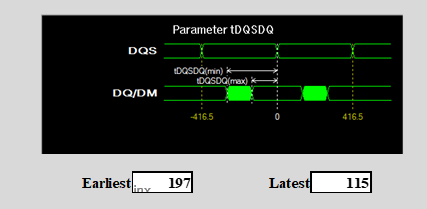
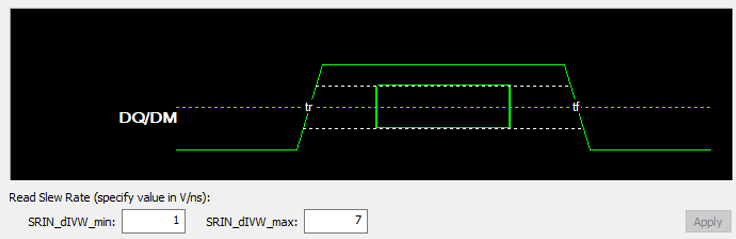

<table>
 <tr>
   <td align="center"><h1>DDR4 and LPDDR4 Timing Models for Hyperlynx DDRx Wizard in Versal ACAPs</h1>
   </td>
 </tr>
 <tr>
 <td align="center"><h1>A Tutorial for Signal Integrity Simulations</h1>
 </td>
 </tr>
</table>

# Introduction
The Mentor Graphics Hyperlynx DDRx Wizard is a tool which allows signal integrity engineers to quickly simulate memory interfaces at the PCB level.   While timing parameters for memory vendors are covered by JEDEC specifications, the input and output timing parameters for the controller device can vary from vendor to vendor.

This tutorial provides the Hyperlynx DDRx Wizard timing parameter numbers for Xilinx&reg; Versal&trade; devices. The numbers are provided via premade files which can imported directly into the Hyperlynx DDRx Wizard. The premade files cover DDR4 @ 3200 Mb/s, LPDDR4 @ 3733 Mb/s, and LPDDR4 @ 4266 Mb/s.

Explanations are also provided for each of the timing parameters for better understanding of how they are used.

**NOTE:**    This guide assumes the user has access to an installed version of Mentor Graphics Hyperlynx and appropriate license(s) to run the DDRx Wizard.     For information regarding Installation and Licensing, refer to http://www.mentor.com.

# Importing Timing Parameters

Save the provided timing files to a convenient location, then open the Hyperlynx DDRx Wizard and follow the steps until reaching the **Timing Models** tab.   

**NOTE:**  The Timing Wizard can also be invoked stand-alone from **Models > Run DDRx Controller Timing Model Wizard.**</i>

1. In the Hyperlynx DDRx Wizard at the **Timing Models** tab, click **TM Wizard**.

  

2. At *Choose Style for the TM Wizard*, select the intended interface (**DDR4** or **LPDDR4**) and click **OK**.

  

3. At the **Introduction** tab, change the Data Rate to the intended speed and click **Import**.

4. Navigate to and select the file.

5. After the file has been imported, click **Next** to navigate through the various timing parameters.   Explanations are given for each one for better understanding.

6. At the **Save Model** tab, click **Save & Exit**.

7. On the file select window, re-select the file and click **Yes** to replace.

  The Timing Model window will close and you will be returned to the DDRx Wizard window.

# DDR4 Parameters
**NOTE:**   The timing numbers shown in this section do not assume any particular interface speed.   Ensure to import  the proper timing model file for the intended interface and speed.

## Parameter tCKAC for Address/Command Timing
Ideally, the ACAP memory controller will output both the falling edge of the clock and the Address and Command signals at the same time.   However, due to channel variabilities, there will be some offset between the clock and those signals.    This parameter tells Hyperlynx how much sooner or later the address and command signals might be offset from the clock.   The numbers provided are in reference to the subsequent rising edge of the clock and will thus vary depending on interface/clock speed.   The time units specified are in picoseconds.

## Parameter tCKCTL for Control Timing
This parameter is similar to tCKAC, except that it specifies the clock to control signals offset.  The time units specified are in picoseconds.

## Parameter tCKDQS for Write Strobe Timing
Ideally, the ACAP memory controller will output the DQS signal at the same time as the clock during a write operation.   However, due to channel variabilities, there will be some offset between the clock and DQS.   This parameter tells Hyperlynx how much sooner or later the DQS signal will be offset from the clock.  The time units specified are in picoseconds.

## Parameter tDQSDQ for Write Data Timing
Ideally, the ACAP memory controller will output the DQ/DM signals to be about 180 degrees out of phase with DQS during a write operation.   However, due to channel variabilities, there will be some additional offset between the DQ/DM signals and DQS.   This parameter tells Hyperlynx the range of time to which the DQ/DM signals will be output from the ACAP before the corresponding DQS.  The time units specified are in picoseconds.

## Parameters VdIVW and TdIVW for Read Data Eye Mask
These parameters describe the read data eye mask for DQ/DM signals.   VdIVW specifies the eye height around the center point, in mV (half above, half below), while TdIVW describes the percentage of the UI needed for a valid read, measured from the center of the UI (half to the left, half to the right).  

## Parameter TdIPW for Read Data Pulse Width
This parameter describes the minimum required pulse width for a valid DQ/DM signal as a percentage of the UI.

## Parameter VIHL_AC_DQ for Read Data Eye Height
This parameter specifies the minimum offset voltage level for DQ/DM relative to the center point for read operations.    The value entered, in mV, will be divided by two to define the minimum voltage from the center point to the high level, and to define the minimum voltage from the center point to the low level.

## Parameters SRIN_dIVW_min and SRIN_dIVW_max for Read Slew Rate
These parameters define the minimum and maximum slew rates for read DQ/DM signals in V/ns.

## Data Pulse Width Uncertainty
This parameter specifies the uncertainty of DQ/DM pulse width, in pS.

# LPDDR4 Parameters
**NOTE:**   The timing numbers shown in this section do not assume any particular interface speed.   Ensure to import  the proper timing model file for the intended interface and speed.

## Parameter tCKCA for Command/Address Timing
Ideally, the ACAP memory controller will output both the falling edge of the clock and the Address and Command signals at the same time.   However, due to channel variabilities, there will be some offset between the clock and those signals.    This parameter tells Hyperlynx how much sooner or later the address and command signals might be offset from the clock.   The numbers provided are in reference to the subsequent rising edge of the clock, and will thus vary depending on interface/clock speed.   The time units specified are in picoseconds.

## Parameter tCKCS for Chip Select Timing
This parameter is similar to tCKCA, except that it specifies the clock to chip select offset.  The time units specified are in picoseconds.

## Parameter tCKCKE for Clock Enable Timing
This parameter is similar to tCKCA, except that it specifies the clock to clock enable offset.  The time units specified are in picoseconds.

## Parameter tCKDQS for Write Strobe Timing
Ideally, the ACAP memory controller will output the DQS signal at the same time as the clock during a write operation.   However, due to channel variabilities, there will be some offset between the clock and DQS.   This parameter tells Hyperlynx how much sooner or later the DQS signal will be offset from the clock.  The time units specified are in picoseconds.

## Parameters VdIVW and TdIVW for Read Data Eye Mask
These parameters describe the read data eye mask for DQ/DM signals.   VdIVW specifies the eye height around the center point in mV (half above, half below), while TdIVW describes the percentage of the UI needed for a valid read, measured from the center of the UI (half to the left, half to the right).  

## Parameter TdIPW for Read Data Pulse Width
This parameter describes the minimum required pulse width for a valid DQ/DM signal as a percentage of the UI.

## Parameter VIHL_AC_DQ for Read Data Eye Height
This parameter specifies the minimum offset voltage level for DQ/DM relative to the center point for read operations.    The value entered in mV is divided by two to define the minimum voltage from the center point to the high level, and the minimum voltage from the center point to the low level.

## Parameters SRIN_dIVW_min and SRIN_dIVW_max for Read Slew Rate
These parameters define the minimum and maximum slew rates for read DQ/DM signals in V/ns.

## Data Pulse Width Uncertainty
This parameter specifies the uncertainty of DQ/DM pulse width in ps.

Licensed under the Apache License, Version 2.0 (the "License");
you may not use this file except in compliance with the License.

You may obtain a copy of the License at

    http://www.apache.org/licenses/LICENSE-2.0

Unless required by applicable law or agreed to in writing, software
distributed under the License is distributed on an "AS IS" BASIS,
WITHOUT WARRANTIES OR CONDITIONS OF ANY KIND, either express or implied.
See the License for the specific language governing permissions and
limitations under the License.

XD032 | Copyright&copy; 2021 Xilinx, Inc.

