<table>
 <tr>
   <td align="center"><h1>Obtaining and Verifying Versal ACAP Memory Pinouts</h1>
   </td>
 </tr>
 <tr>
 <td align="center"><h1>A Tutorial for Schematic Designers</h1>
 </td>
 </tr>
</table>

# Introduction
The role of a schematic designer is in some cases separated from the system design, and as such, there may be a level of non-familiarity with system-level design tools such as the Vivado&reg; Design Suite, which are geared towards higher levels of system design.

However, there is often a need for a schematic designer to obtain pinouts for various elements of the design, such as memory interfaces.    For example, in the beginning stages of a design cycle, schematics are often begun before many of the full system designs are complete.   The schematic designer will need to obtain pinouts as soon as possible to facilitate the design process and will also sometimes need to change pinouts due to PCB layout constraints (such as pin swapping) as the design matures.

This document guides the schematic designer, or anyone with a lower level of familiarity with the Vivado Design Suite, to obtain and verify memory pinouts for Versal&trade; devices.    The steps shown are detailed, yet minimal, as the primarily goal is to obtain and verify pinouts without concern for the higher-level design flows that the Vivado tools offer.

It is also important to note that the pinouts for the Versal ACAP hardened memory controllers are fixed, with limited pin swapping options.   This is a departure from the soft memory controllers used in prior generations of devices.   It is extremely important that the relevant options are entered correctly in Vivado and that the pin swapping rules from the *Versal ACAP Programmable Network on Chip and Integrated Memory Controller* ([PG313](https://www.xilinx.com/cgi-bin/docs/ipdoc?c=axi_noc;v=latest;d=pg313-network-on-chip.pdf)) are followed closely. [Appendix A](#appendix-a-configuring-memory-options-for-ddr4-interfaces) and [Appendix B](#appendix-b-configuring-memory-options-for-lpddr4-interfaces) in this tutorial provide thorough guidance for selecting the appropriate options.

**NOTE:**    This tutorial assumes the user has access to an installed version of the Vivado Design Suite and appropriate licenses. For information regarding Installation and Licensing, refer to the* Vivado Design Suite User Guide: Release Notes, Installation, and Licensing ([UG973](https://www.xilinx.com/cgi-bin/docs/rdoc?v=latest;t=vivado+install+guide)).

 # Table of Contents

 [Obtaining Versal Memory Pinouts in Vivado](#obtaining-versal-memory-pinouts-in-vivado)

 [Modifying XDC Pinouts and DRC Checking](#modifying-xdc-pinouts-and-drc-checking)

 [Appendix A Configuring Memory Options for DDR4 Interfaces](#appendix-a-configuring-memory-options-for-ddr4-interfaces)

 [Appendix B Configuring Memory Options for LPDDR4 Interfaces](#appendix-b-configuring-memory-options-for-lpddr4-interfaces)

# Obtaining Versal Memory Pinouts in Vivado
This portion of the tutorial is geared towards the creation of one memory interface.   However, it is possible to add multiple memory interfaces in one project by repeating these steps for each desired interface.

1. Open the Vivado Design Suite.

2. Click **Create Project>**.

  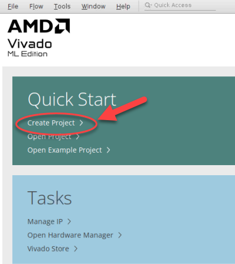

3. At Create a New Vivado Project, click **Next>**.

4. At Project Name, enter a project name and directory location, then click **Next>**.
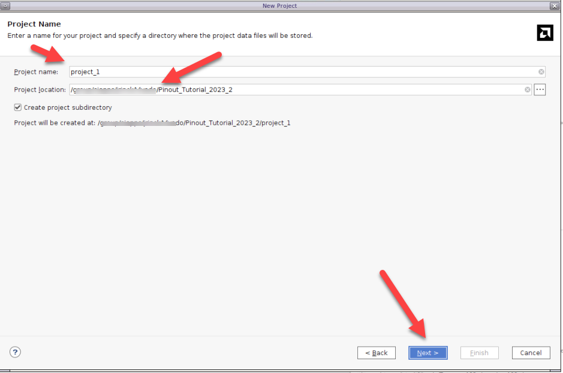

5. At Project Type, click **RTL Project** and **Do not specify sources at this time**, then click **Next>**.
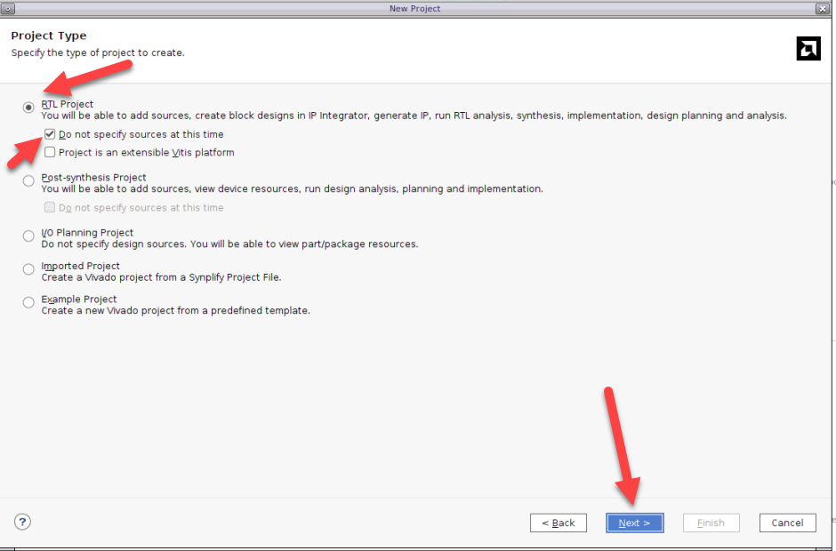

6. At Default Part, select the Xilinx device you will be creating the pinout for, then click **Next>**.

7. At New Project Summary, click **Finish**.
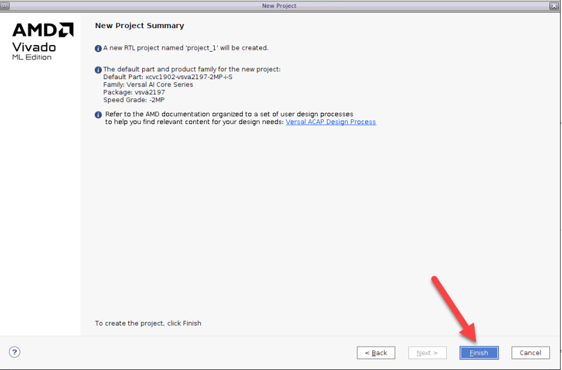

 After a few moments, the project will open in a new window.

8. Under Project Manager on the left, under IP INTEGRATOR, click **Create Block Design**.

9. At the window that pops up, change the Design Name (if desired) and click **OK**.
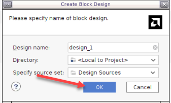

10. After a few moments a Diagram window will appear.   Click on the **+** sign to **add IP**.

 **NOTE:**  If creating multiple memory interfaces in one block diagram, the **+** sign might not appear if there are already items in the block diagram.   In those cases, right-click in an open area and select **Add IP**.

 A search window will appear with various IP items listed.

 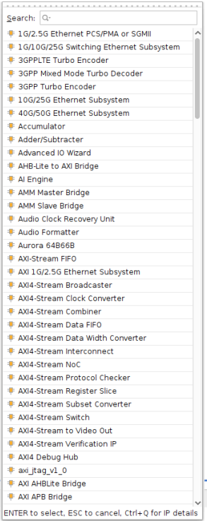

11. In the search field type `AXI_NOC` and hit **ENTER** (or double-click **AXI NoC**).

 After a few moments, the Diagram window will show a symbol for the AXI NoC.
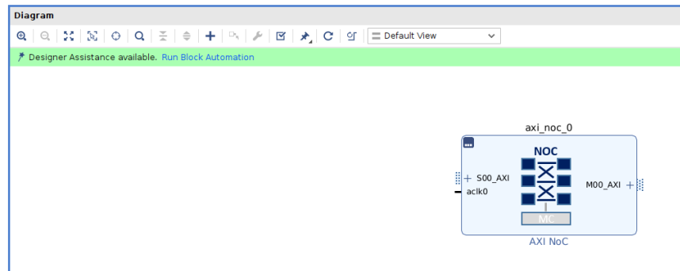

12. Double-click the AXI NoC symbol. After a few moments, a Re-customize IP window will appear.

13. In the **General** tab, under AXI Interfaces, select **0** for Number of AXI Slave Interfaces, Number of AXI Master Interfaces, and Number of AXI Clocks.

 

14. In the **General** tab, under Memory Controllers, select **Single Memory Controller** for Memory Controller.

  You will then notice four new tabs to the right of the QoS tab.

15. In the **DDR Basic** tab, under Controller Selection, select the Controller Type. For this tutorial, you will use **DDR4 SDRAM**. (See [Appendix A](#appendix-a-configuring-memory-options-for-ddr4-interfaces) and [Appendix B](#appendix-b-configuring-memory-options-for-lpddr4-interfaces) for a complete guide to the memory tabs.)

16. In the **DDR Memory** tab,  select the particular characteristics of the desired interface, then click **OK**. (See [Appendix A](#appendix-a-configuring-memory-options-for-ddr4-interfaces) and [Appendix B](#appendix-b-configuring-memory-options-for-lpddr4-interfaces) for a complete guide to the memory tabs.)
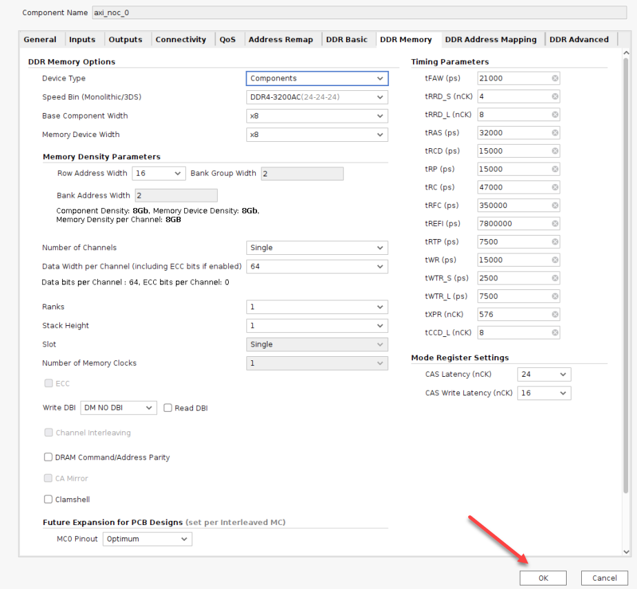

 After a few moments, the Diagram window will reappear.

17. In turn, click on each bus/pin segment and then click the **Make External** button.   This will create Input/Output ports for the memory signals.
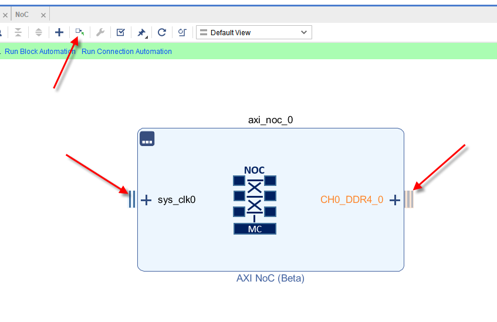

 After creating external ports for each, the block should look as follows.

18. Click the **Validate** button to run a quick check of the block.
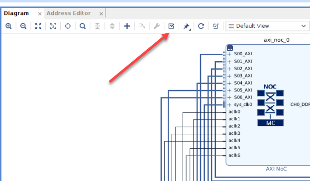

 A Critical Message window may appear stating that the input system clock does not match the connected clock frequency.

19. Click **OK**.    

20. Double-click the **sys_clk0_0** pin in the Diagram window.

21. In the window that appears, change the Frequency (MHz) entry to match the Input System Clock Frequency as stated in the Critical Messages window above. In this case, **100** should be manually changed to **400**.  

22. After the Frequency change is made, click **OK**.

23. Once again, click the **Validate** button in the Diagram window.
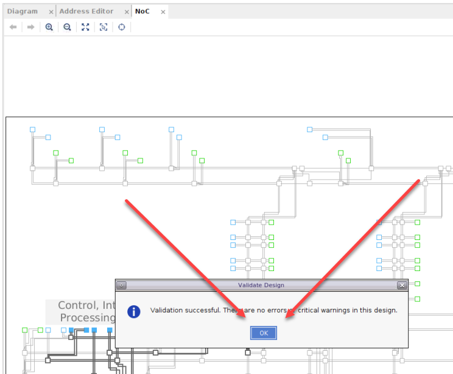

  There should now be no errors or critical warnings in the design.  
24. Click **OK**.
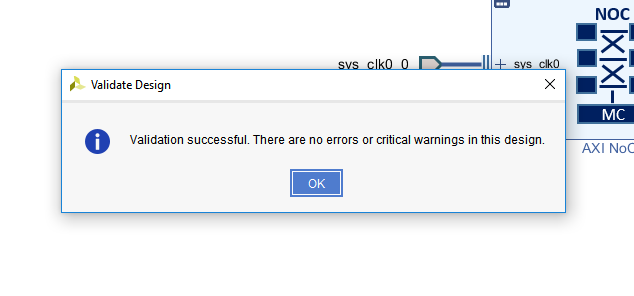

25. Click on the **Sources** tab.

26. Double-click **Design Sources** to expose the .bd file for the design.

27. Right-click on the design source and select **Create HDL Wrapper**.

28. In the Create HDL Wrapper window that appears, click **Let Vivado manage wrapper and auto-update** and click **OK**.
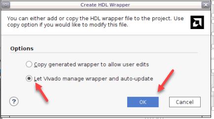

29. After the wrapper is created, under the Flow Navigator panel click **Open Elaborated Design**.

30. In the Elaborate Design window that appears, click **OK**.

  The Open Elaborated Design step will take a few minutes to complete.   You will see a status window and various messages appear in the TCL console while it is working.

  **NOTE:**   You may see a message about a missing top-level design.   If so, hit **Cancel** and click **Open Elaborated Design** again.
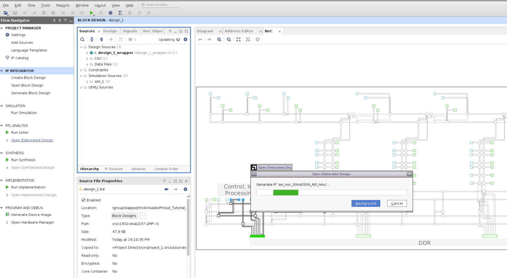

 After the Elaborated Design is opened, a Package floorplan will appear.
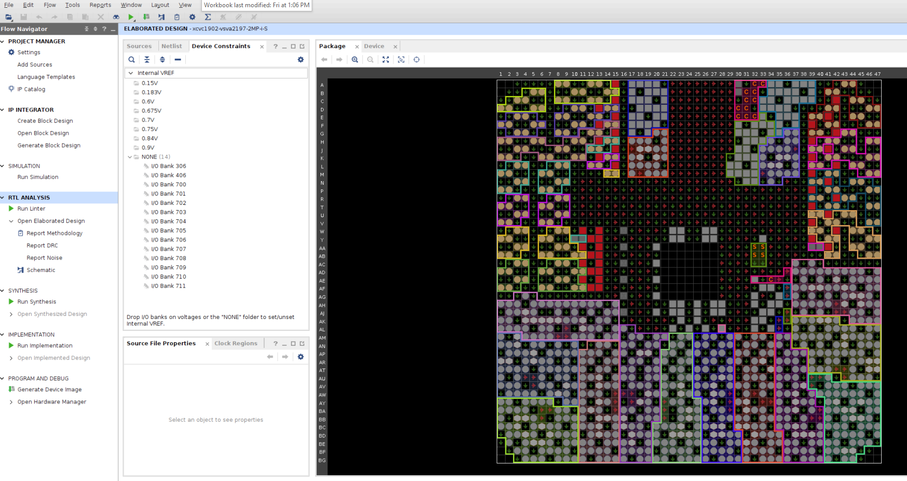

31. Under the Tools menu, select **I/O Planning-Advanced I/O Planner**.
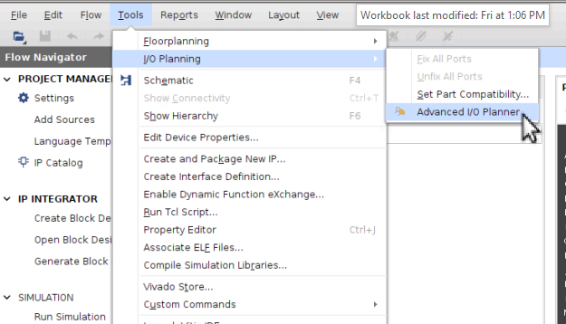

 The Advanced I/O Planner window will appear.  This is where the I/O banks can be chosen for the memory interface.

32. Under IO Bank, click the three dots.
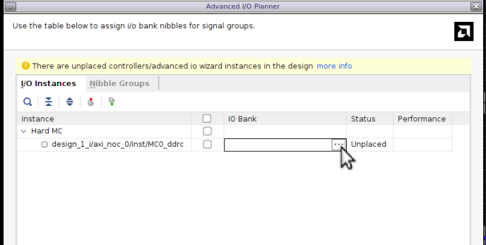

 An IO Banks window will appear.

33. Click on the **DDRMC_X#Y#** tab that corresponds to the banks where the memory interface is desired (in this example, the DDRMC chosen will contain banks 700, 701, and 702).   After selection, click **OK**.
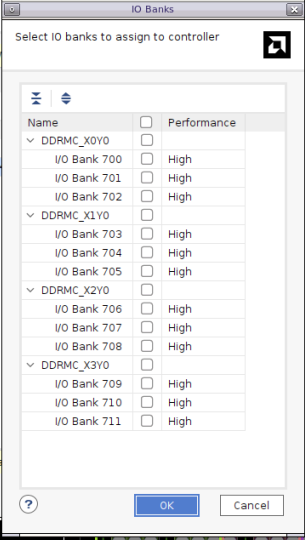
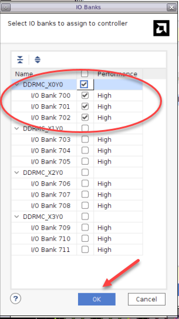

 The Advanced I/O Planner window will now show the selected banks.

34. Click **OK**.

 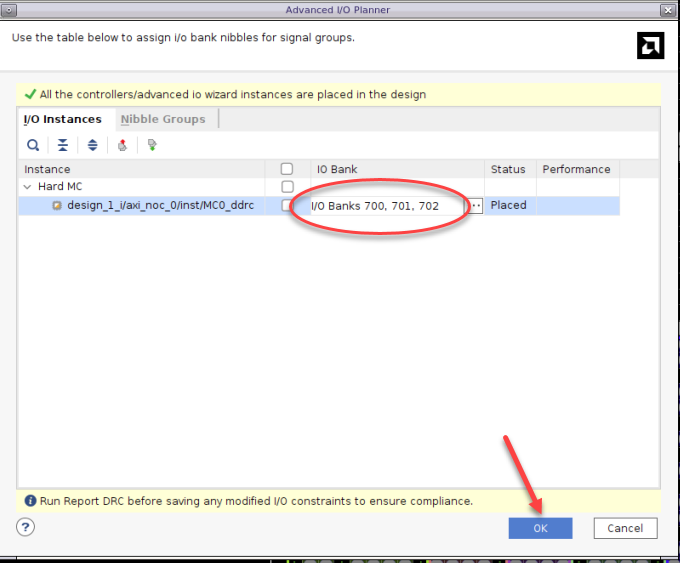

35. To export the I/O Pin assignments to an XDC file, under the File menu, select **Export -> Export I/O Ports**.
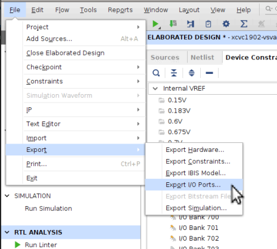

36. In the Export I/O Ports window, select **XDC**, alter the output name and location (if desired), and click **OK**.
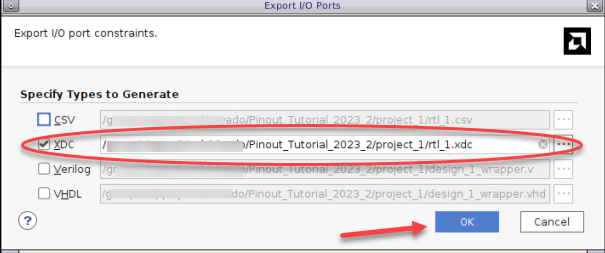

  The XDC file will be created in the directory chosen.

37. An alternate way to save the XDC constraints is to click the **Save Constraints** button…
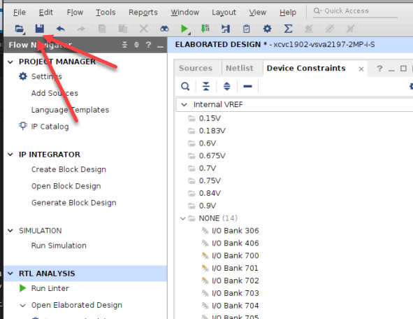

  …and then choose a filename and click **OK**.

 

# Modifying XDC Pinouts and DRC Checking
Many times, it is necessary to swap certain pin locations (such as dq bits and/or bytes), and when this is done, the new pinout must be verified in the Vivado tools to make sure it adheres to the pinout rules (as specified in the Pinout Rules section in *Versal ACAP Programmable Network on Chip and Integrated Memory Controller* ([PG313](https://www.xilinx.com/cgi-bin/docs/ipdoc?c=axi_noc;v=latest;d=pg313-network-on-chip.pdf))).
The following steps illustrate how to run a DRC on a modified pinout.
Manually edit the .xdc file to reflect the pin location changes.    The following example shows an original .xdc file portion and one that has been modified to reflect bits swap within a byte:

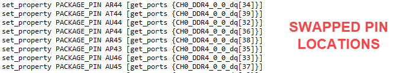

The modified .xdc file must be added to the Vivado tools.

1. In the Sources tab, click on the **Constraints** entry.

 

 The Constraints tab will open and appear as follows:

 

 **NOTE:**   If there is already a constraint file present, then it is recommended to remove it.    Right-click on the constraint file and select **Remove File from Project**, then click **OK**.

 

  The updated constraint file can be added to the project by clicking the Add Sources tab in the Flow Navigator.

 

2. In the Add Sources window, select **Add or create constraints** and click **Next>**.

3. In the following window, click **Add Files**.

4. Navigate to the modified .xdc file, select it, and click **OK**.

5. Click **Finish** in the Add Sources window.

  A message will appear saying “Elaborated Design is out-of-date.  Constraints were modified.”

6. Click **Reload**.

 

7. If a message appears asking about unsaved changes, click **OK** to reload.
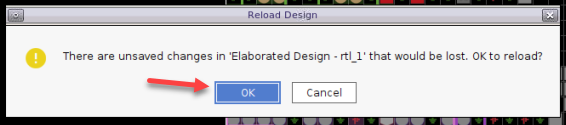

8. After the new constraints are loaded, click **Report DRC** under the **RTL ANALYSIS** tab within the Flow Navigator.

 

9. In the Report DRC window, keep all the default items checked and click **OK**.
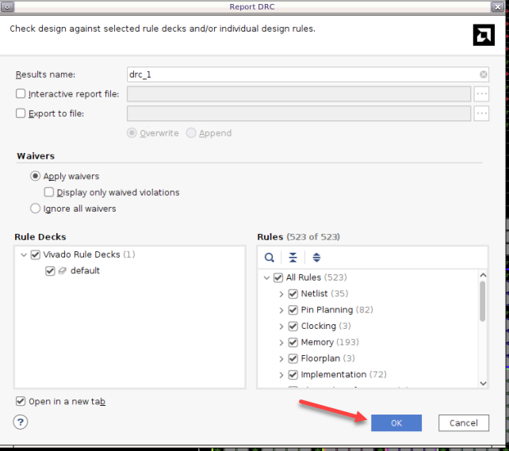

  If the DRC completes with no errors, a window indicating such will appear.

 

 If there are errors, they will be shown, and the appropriate modifications must be made to correct them.
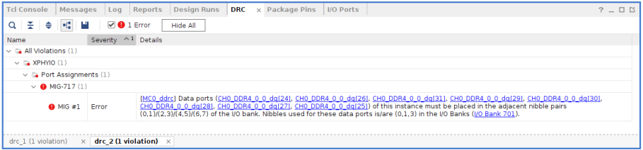
After the corrections have been made and are reflected in the .xdc file, repeat all the steps from the beginning of this section ([Modifying XDC Pinouts and DRC Checking](#modifying-xdc-pinouts-and-drc-checking)) with the modified .xdc file.

# Appendix A Configuring Memory Options for DDR4 Interfaces

## DDR Basic Tab
The primary items of concern in this tab are the **Controller Type** and **Memory Clock period (ps)** selections.    The Memory Clock period should be the period of the intended clock speed of the interface.    For example, a 3200 Mb/s interface has a clock frequency of 1600 MHz and a period of 625 ps. It is important to specify the correct memory clock period as this will affect some of the available and legal options in the DDR Memory tab. If the period is unknown at the time the pinout needs to be generated, assume **625** for the memory clock period.

## DDR Memory Tab

## Device Type
Select between discreet memory components or DIMMs.

## Speed Bin
The memory pinouts do not depend on the memory speed.   For the sake of consistency, however, it is recommended to choose any **DDR4-3200** option.   If a 3D-Silicon (3DS) device will be used, be sure to choose a device from the list with **3DS**, for example **DDR4-3200AA-3DS4A**.

## For 3D-Silicon (3DS):

## Base Component Width
Choose the data width for the selected memory device type.   The selection should represent the data width for each individual device on the component package or DIMM module.

## Memory Device Width (if present)
The data width of the full package.   This will match the Base Component Width for single-die devices and be double the Base Component Width for dual-die devices.

## Row Address Width
This is the number of address pins on each device.

## Number of Channels
This will always be **Single** for DIMM interfaces.   Some component interfaces, however, can be dual.

## Data Width
For single-channel interfaces, this will be the total number of data bits in the interface.   For dual-channel interfaces, this will be one half of the total number of bits in the interface.
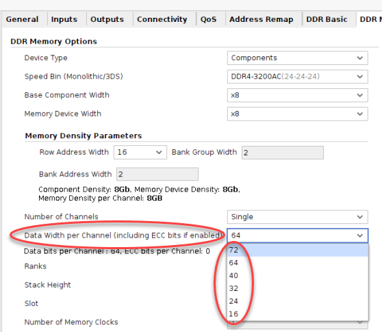

## Ranks
Choose the number of ranks in the interface.   This will be **1** for component interfaces and can be as high as **4** for DIMM interfaces.

## Stack Height
If a 3D-Silicon (3DS) device was chosen in the Speed Bin menu, the number of dies on the package can be specified here.

## Slot
This is the total number of physical slots in the interface.   This will be **Single** for all component interfaces and **Single** or **Dual** for DIMM interfaces.

## Number of Memory Clocks
This will automatically be selected depending on the memory interface configuration.   For most configurations, the number of memory clocks will be **1**.    The specific rules for the number of memory clocks is explained in the Configure the NoC IPs section, item 6: Number of Memory Clocks in *Versal ACAP Programmable Network on Chip and Integrated Memory Controller* ([PG313](https://www.xilinx.com/cgi-bin/docs/ipdoc?c=axi_noc;v=latest;d=pg313-network-on-chip.pdf)).

## ECC
This will automatically be selected depending on the configuration options.   This will be unchecked if the number of components in the interface is an even number, and will be checked if the number of components is odd.

## Write DBI
Select the Data Mask (DM) and Data Bus Inversion (DBI) options.   For purposes of pinouts, AC DBI is the same as DC DBI.   AC and DC DBI refers to the rules for inverting the data bits.  In addition, checking or unchecking the **Read DBI** checkbox will not affect the pinouts.

## Channel Interleaving
This option affects only the internal operation of the controller and does not change the pinouts.   It is only selectable in dual-channel interfaces.

## DRAM Command/Address Parity
Check to utilize the parity feature in the memory controller.    The parity pin *par* will only be present in the pinout if this box is selected.

## CA Mirror
This will be automatically selected based on the interface configuration, and only applies to multi-rank DIMM interfaces.

## Clamshell
This option will instruct the memory controller to re-map certain address signals internally and does not affect the pinout.    It only applies to single-rank, component interfaces.

## Future Expansion for PCB Designs for each Interleaved MC Instance
The options presented here are slightly different depending on the current and future expansion plans for the memory interface.   Selecting **Optimum** will provide the standard pinout for the interface and only include the necessary pins.    Other options can add extra pins to the interface so that they can be routed on the PCB and used at a later time depending on the memory devices used.     A full explanation of these options can be found in the Design Generation Flow section in *Versal ACAP Programmable Network on Chip and Integrated Memory Controller* ([PG313](https://www.xilinx.com/cgi-bin/docs/ipdoc?c=axi_noc;v=latest;d=pg313-network-on-chip.pdf)).

## Pinout Swapping for each Interleaved MC Instance
The pins in the interface can be reversed in the triplet of banks depending on PCB layout needs and also to account for *shadowed* banks in the chosen device.     A full explanation of this option can be found in the Design Generation Flow and Pinout Rules sections in *Versal ACAP Programmable Network on Chip and Integrated Memory Controller* ([PG313](https://www.xilinx.com/cgi-bin/docs/ipdoc?c=axi_noc;v=latest;d=pg313-network-on-chip.pdf)).

## Timing Parameters and Mode Register Settings
It is recommended to not change the entries in these fields as they will not affect the pinout.
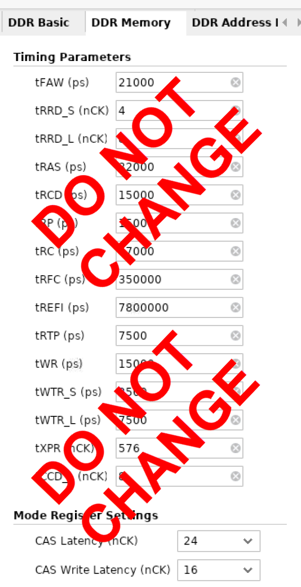

## DDR Address Mapping & DDR Advanced Tabs
Do not change any entries in these tabs as they do not affect the memory pinouts.

# Appendix B Configuring Memory Options for LPDDR4 Interfaces

## DDR Basic Tab
The primary items of concern in this tab are the **Controller Type** and **Memory Clock period (ps)** selections.    The Memory Clock period should be the period of the intended clock speed of the interface.    For example, a 3733 Mb/s interface has a clock frequency of 1866.5 MHz and a period of 536 ps. It is important to specify the correct memory clock period as this will affect some of the available and legal options in the DDR Memory tab.    If the period is unknown at the time the pinout needs to be generated, assume **536** for the memory clock period.

## DDR Memory Tab

## Device Type
There is only one type of device for LPDDR4 devices, so this selection will be automatically selected as **Components**.

## Speed Bin
The memory pinouts do not depend on the memory speed.   For the sake of consistency, however, it is recommended to choose either **LPDDR4-3733** or **LPDDR4X-3733**.    There are no pinout differences between LPDDR4 and LPDDR4X.

## Base Component Width
As of Vivado Design Suite 2020.2, only x32 devices are supported, so **x32** is the only option.   LPDDR4 x32 devices are comprised of two independent 16-bit channels per device.

## Row Address Width
This number is used by the memory controller and does not affect the pinout, so any value can be used.

## Bank Address Width
This value is calculated automatically and does not affect the pinout.

## Component Density
This number is used by the memory controller and does not affect the pinout, so any value can be used.

## Number of Channels
Single channels are comprised of x32 bits across one device (two x16 channels).   Dual channels are comprised of two independent single-channel interfaces across two devices (four total x16 channels).
    

## Data Width
For single-channel designs, this is the total number of bits in the interface.   An interface can have 16 bits (one channel), 32 bits (two channels), and 48 bits (two channels in one device and 16 bits as ECC in another device.    Dual-channel designs can be either 16 bits each or 32 bits each.
    

## LP4 Pin Efficient
Dual-channel LPDDR4 interfaces can share certain address buses between devices, reducing the overall pin count.    Select **true** to share pins or **false** to keep all channels completely independent.
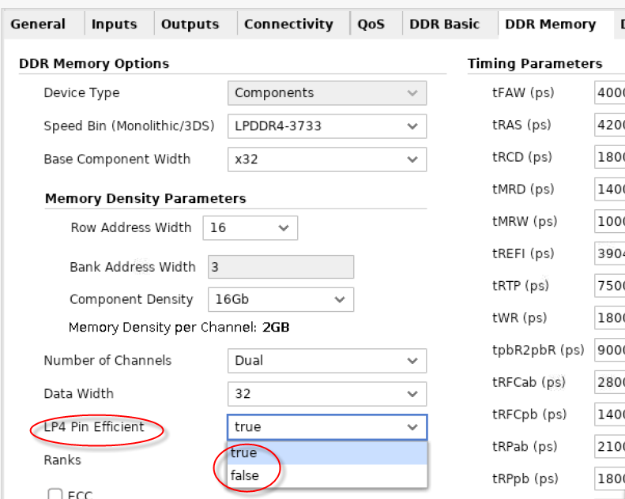    

## Ranks
Single Die Package (SDP) devices will allow for one rank, while two ranks can be supported for Dual Die Package (DDP) devices.
    

## ECC
When selectable, a channel can be utilized as an ECC channel.   Selecting **ECC** will reduce the amount of available memory to access, but it will not change the pinout.
  

## Write DBI
Select the Data Mask (DM) and Data Bus Inversion (DBI) options.   For purposes of pinouts, AC DBI is the same as DC DBI.   AC and DC DBI refers to the rules for inverting the data bits.  In addition, checking or unchecking the **Read DBI** checkbox will not affect the pinouts.
  

## Channel Interleaving
This option affects only the internal operation of the controller and does not change the pinouts.   It is only selectable in dual-channel interfaces.
  

## Clamshell
This will always be greyed out and not selectable for LPDDR4 interfaces.
  

## Future Expansion for PCB Designs for each Interleaved MC Instance
The options presented here are slightly different depending on the current and future expansion plans for the memory interface.   Selecting **Optimum** will provide the standard pinout for the interface and only include the necessary pins.    Other options can add extra pins to the interface so that they can be routed on the PCB and used at a later time depending on the devices used.     A full explanation of these options can be found in the Design Generation Flow section in *Versal ACAP Programmable Network on Chip and Integrated Memory Controller* ([PG313](https://www.xilinx.com/cgi-bin/docs/ipdoc?c=axi_noc;v=latest;d=pg313-network-on-chip.pdf)).
  

## Pinout Swapping for each Interleaved MC Instance
The pins in the interface can be reversed in the triplet of banks depending on PCB layout needs and also to account for *shadowed* banks in the chosen device.     A full explanation of is option can be found in the Design Generation Flow and Pinout Rules sections in *Versal ACAP Programmable Network on Chip and Integrated Memory Controller* ([PG313](https://www.xilinx.com/cgi-bin/docs/ipdoc?c=axi_noc;v=latest;d=pg313-network-on-chip.pdf)).
  

## Operating Temperature
This option does not affect the pinout.
  

## Timing Parameters and Mode Register Settings
It is recommended to not change the entries in these fields as they will not affect the pinout.
  

## DDR Address Mapping & DDR Advanced Tabs
Do not change any entries in these tabs as they do not affect the memory pinouts.

# Xilinx Support
The Vitis tutorials are supported only for the versions and specific steps and conditions outlined in the tutorials.  If you have any technical questions on the subjects contained in these tutorials, please post on the boards located at Xilinx Community Forums.

# License

Licensed under the Apache License, Version 2.0 (the "License");
you may not use this file except in compliance with the License.

You may obtain a copy of the License at

    http://www.apache.org/licenses/LICENSE-2.0

Unless required by applicable law or agreed to in writing, software
distributed under the License is distributed on an "AS IS" BASIS,
WITHOUT WARRANTIES OR CONDITIONS OF ANY KIND, either express or implied.
See the License for the specific language governing permissions and
limitations under the License.

XD031 | Copyright&copy; 2020 Xilinx, Inc.

