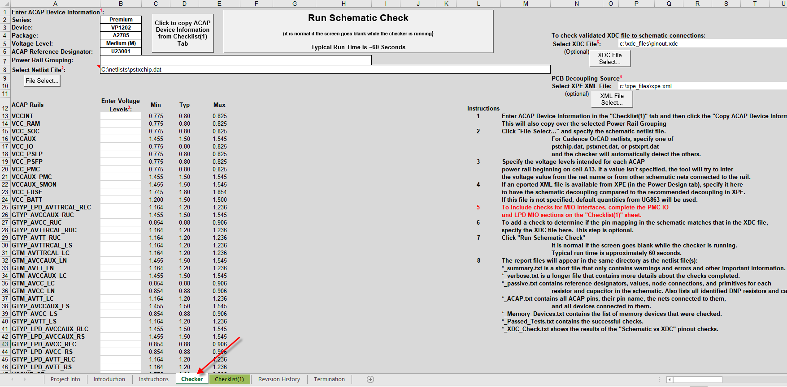
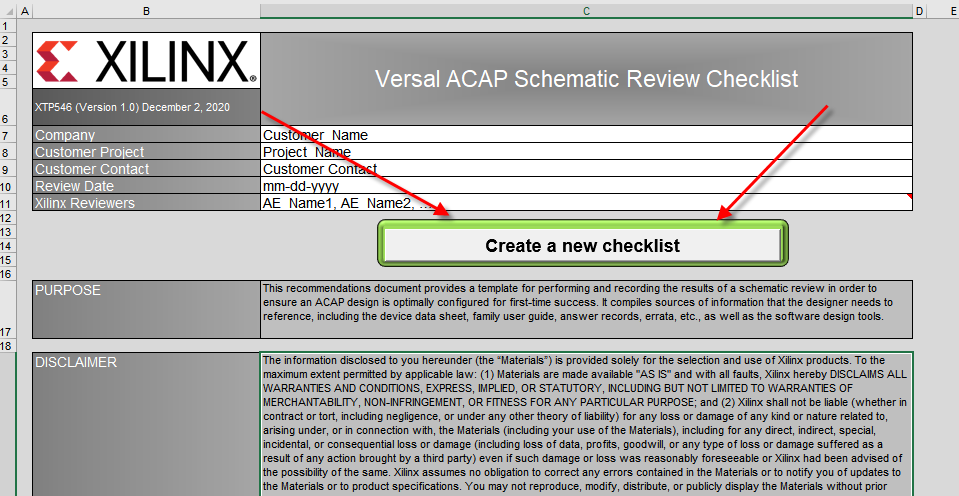
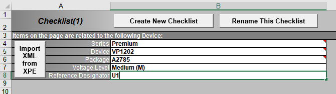
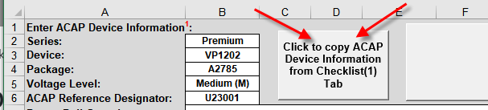
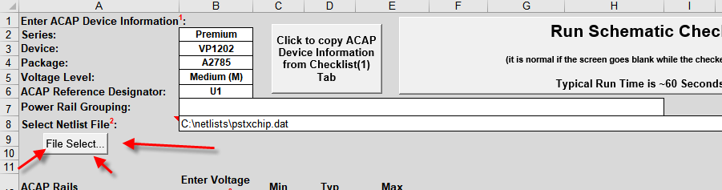
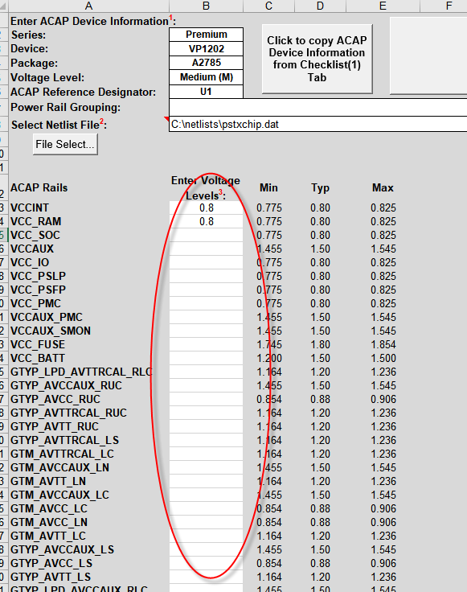
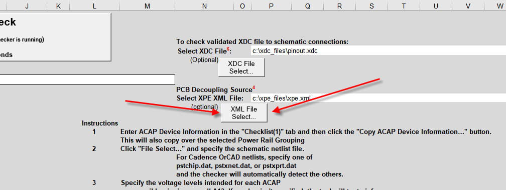
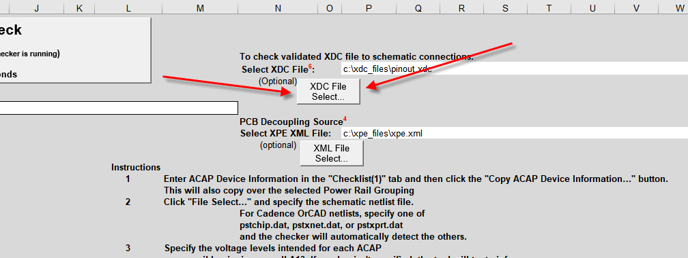
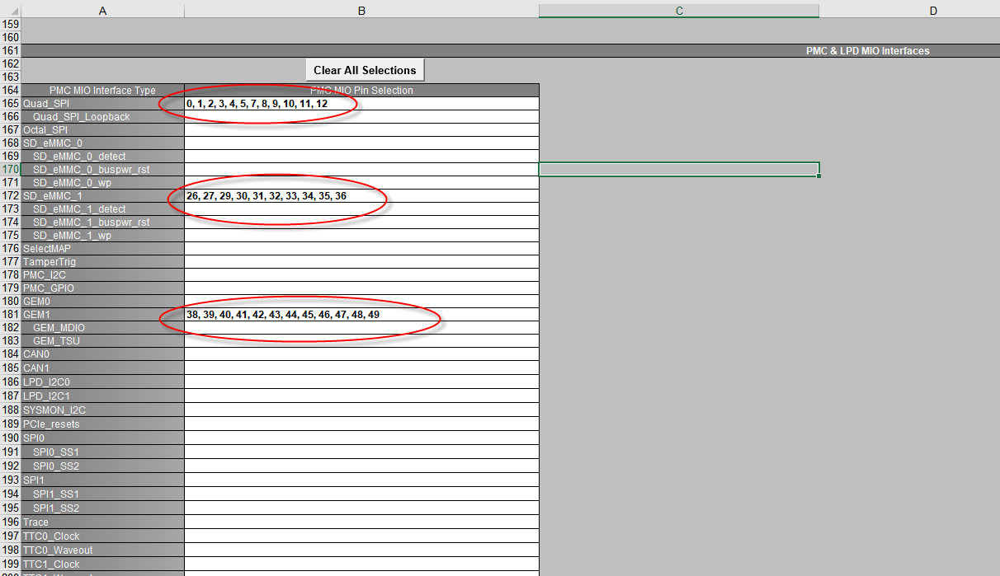
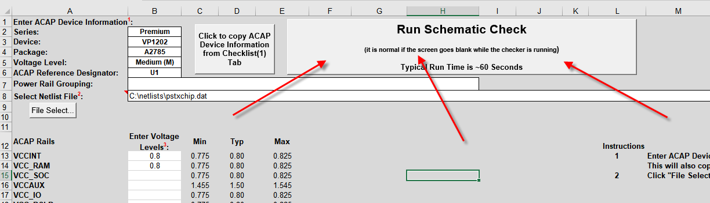

<table>
 <tr>
   <td align="center"><h1>Versal ACAP Schematic Checker Tool</h1>
   </td>
 </tr>
 <tr>
 <td align="center"><h1>A Tutorial for Automated Versal ACAP Schematic Checking</h1>
 </td>
 </tr>
</table>

# Introduction
The Versal&trade; schematic checker tool is a subset of the Versal ACAP Schematic Review Checklist ([XTP546](https://www.xilinx.com/member/forms/download/design-license.html?cid=90f995d8-c517-4adc-a95c-13a8994d6618&filename=xtp546-versal-schematic-review-checklist.zip)).   It appears as a separate tab in which the user can specify the netlist and optionally specify voltage values, a Vivado XDC file, and Xilinx Power Estimator (XPE) export file.
The checker outputs a suite of report files, including a summary file with all of the most pertinent notes, warnings, and errors.

 

The currently supported netlist types are:

<li>Cadence OrCAD (pstchip.dat, pstxnet.dat, pstxprt.dat)
<li>Cadence Allegro (.tel)
<li>Mentor Graphics Pads (.asc)
<li>Intel Schematic Connectivity Format (.iscf)

The checker will output six text-based report files:

<li>*_summary.txt is a short file that only contains warnings and errors and other important information
<li>*_verbose.txt is a longer file that contains more details about the checks completed
<li>*_passive.txt contains reference designators, values, node connections, and primitives for each resistor, capacitor, and inductor in the schematic. Also lists all identified DNP components
<li>*_ACAP.txt contains all ACAP pins, their pin name, the nets connected to them, and all devices connected to them
<li>*_Memory_Devices.txt contains the list of memory devices that were checked
<li>*_Passed_Tests.txt contains the list of successful checks
<li>*_XDC_Check.txt contains the results of the "Schematic vs XDC" pinout checks

# Obtaining the Schematic Checklist and Checker

Download the Versal ACAP Schematic Review Checklist ([XTP546](https://www.xilinx.com/member/forms/download/design-license.html?cid=90f995d8-c517-4adc-a95c-13a8994d6618&filename=xtp546-versal-schematic-review-checklist.zip)).

**NOTE!**   The current public version has a few bugs in the checker that are addressed in the internal version.   The internal version is attached in this design directory.    Please use this attached version until all of the fixes become public.

# Running the Checker

Open the Schematic Checklist
On the Project Info tab and click **Create New Checklist**.

 

- A new "Checklist(1)" tab will open.

# Device Details

In the "Checklist(1)" tab, enter the device details beginning in cell B4.
- Ensure to enter the reference designator used for the ACAP in the schematic.
- Optional:   If you have an exported XML file from the Xilinx Power Estimator tool (XPE), you can use the **Import XML from XPE** button to automatically fill in the device details.   You will, however, still need to enter the ACAP reference designator.

 

On the "Checker" tab, in the upper-left click the **Click to copy ACAP Device Information from Checklist(1) Tab**.
- This will copy the ACAP information from the "Checklist(1)" tab, along with the reference designator.

 

# Specify Netlist

Enter the location of the netlist file(s) on row 8.   Click the **File Select...** button to navigate to the netlist file.   For Cadence OrCAD schematics where there are three .dat files, just select one of the files, but ensure that all three are present in the same directory.

 

# Enter Voltage Levels (Optional)

This step is optional, but can help the checker determine if the proper voltage levels are present on each ACAP rail.

Beginning in cell B13, enter the specific voltage values intended for each ACAP rail.   If values are not entered here, the tool  tries to infer the voltage value from the net name (for example,   VCC_0V70 will be inferred as 0.70V).    If the voltage value is not specified here, or cannot be inferred from the net name, a warning is issued that the voltage level cannot be checked.

# Specify PCB Decoupling Source (Optional)

The checker lists all of the decoupling capacitors found on each ACAP rail in the schematic.   If you would like the script to compare these quantities with the recommended decoupling quantities from the Xilinx Power Estimator (XPE) tool, specify the exported XPE XML file in cell P10, or via the **XML File Select...** button.    

# Specify a validated XDC Pinout file (Optional)

The checker can check all memory signals in the schematic to see if they are connected properly to their respective ACAP pins.   To do this, an XDC file that has been validated with the Vivado® tools can be specified.     Enter the XDC file name in cell P5 or via the **XDC File Select...** button.

# Specify MIO Interfaces (Optional)

The checker can determine if the MIO interface pins are connected properly in the schematic (for pull-ups/downs/series resistors, etc).   In order to do this, the interfaces must be defined in the "Checklist(1)" tab.   Navigate to the "PMC & LPD MIO Interfaces" section in the "Checklist(1)" tab and specify the MIO pin locations for each interface (QSPI, OSPI, eMMC, SD, etc.)

# Run the Checker

After the device information, netlist location, and other optional files, voltages, and interfaces have been specified, click the big **Run Schematic Check** button at the top of the "Checker" tab. The checker will take ~60 seconds to run, but in some cases this could be as short as 20 seconds or as long as two minutes.

When the checker is completed, a window appears stating the run time.   Click **OK**.

# Versal ACAP Schematic Checker Feature List

<b>Pin Count Match:</b>   Checks that the number of package pins in the ACAP schematic matches the pin count of the corresponding package.   This can uncover any errors in the schematic symbol creation.

<b>Voltage Values Within Datasheet Spec:</b>     Checks reported or inferred voltage values to be within datasheet specifications for each ACAP rail.

<b>Voltage rail value mismatch/power rail shorts:</b>   Checks to see if any reported or inferred ACAP rails are at different voltage levels despite being connected to the same schematic rail net.

<b>ACAP Power/Ground Pin Match:</b>   Checks to see if the number of voltage and ground pins for the ACAP in the schematic matches the number of corresponding power/ground pins in the ACAP package file.

<b>All ACAP power/ground pins connect to same net:</b>    Checks to see that all power/ground pins on the ACAP connect to one single net name.   While it is not an error if they are not all connected to the same net (i.e., sense lines), any warnings are still valuable.

<b>VCCAUX_SMON/GND_SMON filters:</b>    Checks to see if there is a filter between VCCAUX and VCCAUX_SMON.  Checks to see if there is a filter between GND and GND_SMON.

<b>Decoupling/Power Scenario Evaluation:</b>    Determines power scenario (as defined in The Xilinx Power Estimator (XPE)) and lists required  versus found decoupling capacitors connected to each rail group.    This works best when an XPE file is specified.

**NOTE**:   The checker does not check to see if quantities match... it only places the quantities side-by-side for comparison.

<b>IO_VR properly connected:</b>    Checks each IO_VR pin for proper connection of 240Ω to IO_700/IO_800.

<b>GTY RREF connection:</b>    Checks for 100Ω resistor between GTY_RREF and GTY_AVTTRCAL.

<b>GTY signals AC Coupling Check:</b>   Checks for proper series AC capacitor on each GTY TX/RX/CLK pin.

<b>Dedication Pin Connection Check:</b>
Checks all dedicated pins (Bank 503) for proper terminations.
<li><b>MODE pins:</b> Tied directly or 4.7 kΩ to VCC_503 or < 1 kΩ to GND
<li><b>ERROR_OUT:</b> Pull-up to VCCO_503
<li><b>PUDC_B:</b> Tied directly or by < 1 kΩ to GND or VCCO_503
<li><b>DONE:</b> 4.7 kΩ to VCCO_503
<li><b>JTAG pins:</b> TCK/TMS/TDI connected to header and/or to ground
<li><b>POR_B:</b> 4.7 kΩ to VCCO_503

<b>MIO Pin check:</b>   
Checks to see if MIO pins are properly connected/termination based on how they are defined in the checklist:
<li><b>QSPI:</b> clock, cs, loop, IO_pull-up/down
<li><b>OSPI:</b> clock, data, strobe, cs, reset
<li><b>SD_eMMC:</b> clock, cmd, data
<li><b>SelectMap:</b> clock, IO, cs, rdwr, busy
<li><b>Tamper Trigger</b>
<li><b>I2C:</b> scl, sda
<li><b>GEM Ethernet:</b> clock, ctl, data
<li><b>CAN:</b> tx, rx
<li><b>PCIe Reset</b>
<li><b>SPI:</b> clock, cs, so, mo
<li><b>Trace:</b> clock, ctl, data
<li><b>Triple-Time Counter (TTC):</b> clock, out
<li><b>UART:</b> tx, rx
<li><b>USB2:</b> clock, data, reset
<li><b>Windowed-Watchdog Timer (WWDT):</b> clock, reset, int, ws

<b>Memory Pin Check:</b>   
Checks all supported memory types for proper terminations (address to VTT, clock to RC, etc.,) based on how they are defined in the checklist.

**NOTE**: This tool will not verify legal pinouts.   For pinout validations, it is highly recommended to verify the pinouts through the Vivado tools.   Vivado is the only trusted source for up-to-date pinout verifications.

<b>DDR4</b> 
<li><b>Data:</b> point-to-point
<li><b>Strobe:</b> point-to-point
<li><b>Address:</b> With VTT check (as appropriate)
<li><b>Clock:</b> With R/R/C check
<li><b>Reset:</b> 4.7 kΩ to GND

<b>LPDDR4:</b>
<li><b>Data:</b>  point-to-point
<li><b>Strobe:</b>  point-to-point
<li><b>Address:</b>  point-to-point
<li><b>CKE:</b>  Totem-Pole Termination
<li><b>Clock:</b>  point-to-point
<li><b>Reset:</b> 4.7 kΩ to GND

<b>RLD3:</b> data, DK, QK, QVLD, Reset (4.7 kΩ to GND)

<b>QDR-IV:</b> address, command, reset (4.7 kΩ to GND)

<b>ALL:</b>  Will check address pins to see if the net name matches the memory device pin name (for example, C0_DDR4_A10 matches pin A10 on the memory device).

<li>VTT pins/termination is checked or sees if it connects to an IC that also connects to VCCO (assumed VTT regulator).
<li>VREFCA pins (as applicable) on each memory device are checked for proper connection (including resistor divide) and voltage.
<li>ZQ pins (as applicable) on each memory device are checked for proper resistor value and connection to either ground or power (as required).

Automatic memory interface pin checking using a user-specified XDC file. This is optional.

<b>Signal Polarity Check:</b>   Checks for P/N swaps based on ACAP package file and known  external device pinout.    Also attempts to determine potential swaps based on net names.

<b>NoC Pinout Check:</b>   If an XDC file is specified, the schematic pinout is checked against the pinouts in the XDC file.

Licensed under the Apache License, Version 2.0 (the "License");
you may not use this file except in compliance with the License.

You may obtain a copy of the License at

    http://www.apache.org/licenses/LICENSE-2.0

Unless required by applicable law or agreed to in writing, software
distributed under the License is distributed on an "AS IS" BASIS,
WITHOUT WARRANTIES OR CONDITIONS OF ANY KIND, either express or implied.
See the License for the specific language governing permissions and
limitations under the License.

XD057 | Copyright&copy; 2021 Xilinx, Inc.

