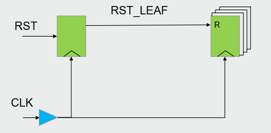
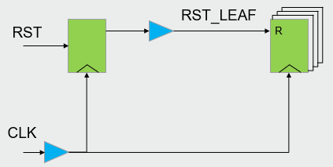
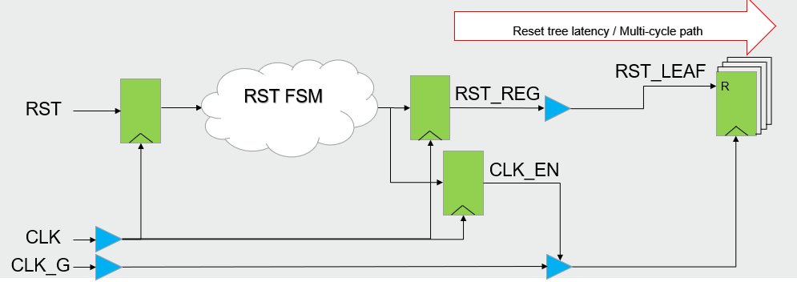
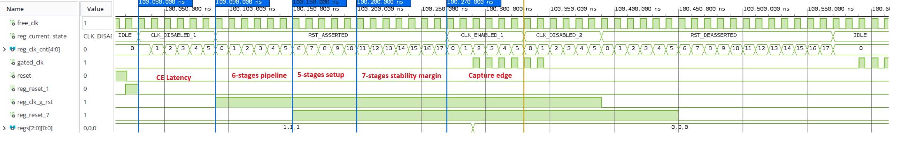
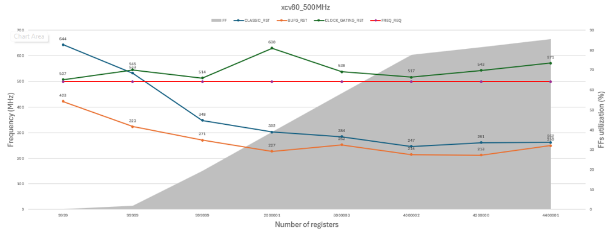

<table class="sphinxhide" width="100%">
 <tr width="100%">
    <td align="center"><h1>Versal™ Design Optimization Techniques</h1>
    <a href="https://www.amd.com/en/products/software/adaptive-socs-and-fpgas/vivado.html">See Vivado™ Development Environment on amd.com</a>
    </td>
 </tr>
</table>

# Reset Architecture Assessment Design

***Version: AMD Vivado&trade; 2025.2***

## 1. Overview

This repository contains an evaluation of reset‑distribution architectures implemented on an AMD Versal device.  

This work originated from a collaboration with [Zama](https://www.zama.org). They develop privacy‑preserving computation technologies, enabling data to remain encrypted **while being processed**.  

To achieve this, they developed a custom **Homomorphic Processing Unit (HPU)** designed to accelerate **Fully Homomorphic Encryption (FHE)** operations.

During their FPGA prototyping work, Zama implemented a complete FHE pipeline on a Versal device.

During this process, they proposed a reset‑distribution architecture optimized for large fabrics with high logic density which improve routing and timing efficiency  

The HPU IP core (including the reset code) is published under a BSD3-Clause Clear license on their Github repository:

- [Zama main public repository](https://github.com/zama-ai/hpu_fpga)
- [Reset module](https://github.com/zama-ai/hpu_fpga/tree/main/hw/module/fpga_clock_reset/rtl)

Implementing the reset efficiently on Versal devices was critical for managing routing congestion and timing closure of this design. 

This project reproduces, evaluates, and compares the Zama‑proposed architecture against two traditional reset strategies.  

The repository includes:
- A description of all reset architectures  
- The implementation methodology  
- Measured results and interpretation  
- All design sources so that users can reproduce or extend the evaluation

This page outlines the conceptual design and high-level architecture of the proposed solution. 
It describes the general design approach rather than serve as a finalized implementation specification. 
Certain aspects (particularly related to hardware-integration) might require refinement or modification.

---

## 2. Reset Architectures Assessed

This work compares three reset‑distribution strategies for a **single reset domain** in a Versal‑based design.  

All three architectures drive the same logical reset domain, but the method of distributing the reset signal differs.  

The goal is to evaluate timings at high resource utilization.

---

### 2.1 Classic Reset Direct to Leaf Registers

#### Description

The reset signal is routed directly to all leaf registers.  

#### Architecture Diagram

  
*Figure 1—Classic reset routed directly to leaf registers.*

#### Observations
- Reset paths are often the most timing critical paths
- Load on the routing utilization due to high-fanout signal being omni-present 

---

### 2.2 Classic Reset with BUFG 

#### Description

The reset passes through a **BUFG** to use the global, low-skew clock network before reaching the leaf registers.
In Versal devices, the BUFG is physically implemented as BUFG_FABRIC primitives throughout the device near the NoC columns. Vivado replicates the BUFG depending on the amount and location of the loads.

#### Architecture Diagram

  
*Figure 2—Reset distributed globally using BUFG before reaching leaf registers.*

#### Observations
- Reduced routing congestion (migration from data routing resources to clock routing resources) 
- Increased insertion delay due to the path to the BUFG_FABRIC resulting in greater difficulty to close timing at higher speeds or larger designs

---

### 2.3 Reset Clock‑Gating Architecture

#### Description

The clock‑gated reset architecture integrates a **synchronous reset mechanism** with a **dedicated FSM** that explicitly controls clock gating across the design.

The reset sequence operates as follows:

  
*Figure 3—Clock‑gating reset architecture.*

1. **Reset Request Phase**  
   Upon a reset request, the FSM gates the clock and waits for a few cycles to ensure that the clock is fully stopped.

2. **Reset Assertion Phase**  
   The FSM asserts **RST_REG**.  
   the reset propagation to all flip‑flops requires multiple cycles to relax timings so The **RST_LEAF** tree is assumed to be imbalanced. 
   During this phase, the clock remains gated to prevent timing violations and partial reset behavior.

3. **Synchronous Reset Phase**  
   Once the reset propagation is complete, the FSM reenables the clock.  
   All flip‑flops are synchronously reset while the clock is running.

4. **Reset De‑assertion Preparation Phase**  
   The FSM gates the clock again and waits for a few cycles to ensure that the reset de‑assertion can safely propagate through the **RST_LEAF** tree.

5. **Normal Operation Phase**  
   The FSM reenables the clock, and the design resumes to normal operation.

This control sequencing guarantees that **reset assertion and reset de-assertion always occur on well‑defined clock edges**.

With this architecture, **RST_LEAF paths are constrained as multi‑cycle paths aligned with the FSM’s internal counter**.

Because the FSM counter threshold can be arbitrarily large, the multi‑cycle constraint is easily satisfied, resulting in **very robust timing closure**, even at high utilization and frequency.

An additional benefit is that because timing is no longer critical, the **RST_LEAF network can be connected to a BUFG**, significantly relaxing routing utilization and improving overall Quality Of Result (QoR).

#### Timing and Waveform

The following waveform shows how the clock gating occurs:

  
*Figure 4—Waveform showing reset with gated clock.*

1. **Phase 1—Clock Stop**  
   "set_max_delay" constraint applied: Relaxes the BUFGCE CE path 5 cycles. The FSM manages the risk by waiting in the CLK_DISABLED_1 state for 5 cycles (+1 capture cycle) to ensure the clock has stopped before the reset toggles.

2. **Phase 2—Pipeline Phase**  
   Reset travels through the 6-stages pipeline to reach out all the flip-flops to reset.

3. **Phase 3—Fabric Propagation**  
   "set_multicycle_path 5 -setup": 5 cycles margin to propagate after exiting the 6-stage pipeline. This prevents Vivado spending effort on optimizing placement and routing of the reset paths.

4. **Phase 3—Stability Margin**  
   "set_multicycle_path 7 -hold": This constraint defines an "Easy Hold" window by pushing the hold requirement 3 cycles into the "past".
   We instruct the tool to ignore up to 3 full cycles of clock skew and resolve it with the FSM logic. It prevents router spending effort on fixing hold timing.

5. **Phase 3—Restart**  
    Clock is re-enabled after reset has been stable beyond a safe margin.

#### Observations
- Reduced routing congestion  
- Complete elimination of critical reset paths timing  

---

## 3. Results Summary

  
*Figure 5—Reset architectures assessment and results.*

As a comparison, the clock‑gated reset architecture was evaluated against the two baseline reset architectures.

Implementation runs were executed targeting **500 MHz** in a 3-SLR Versal HBM gen 1 device with a -2M speedgrade.

- Each point corresponds to a run  with a specific number of registers
- Achieved frequency is derived from the **Worst Negative Slack (WNS)**
- The **red line** indicates the target frequency set in Vivado
- The **grey area** represents flip‑flop utilization

The **clock‑gated reset architecture delivered the best results**.  
At approximately **85% flip‑flop utilization**, it reached a **higher frequency** compared to the other reset architectures.

---

## 4. Conclusion

For large and high frequency FPGA designs, the clock-gating reset architecture provides the best QoR.

This architecture:
 - Reduces routing congestion
 - Increases achievable frequency

Copyright © 2026 Advanced Micro Devices, Inc.

<a href="https://www.amd.com/en/corporate/copyright">Terms and Conditions</a>

