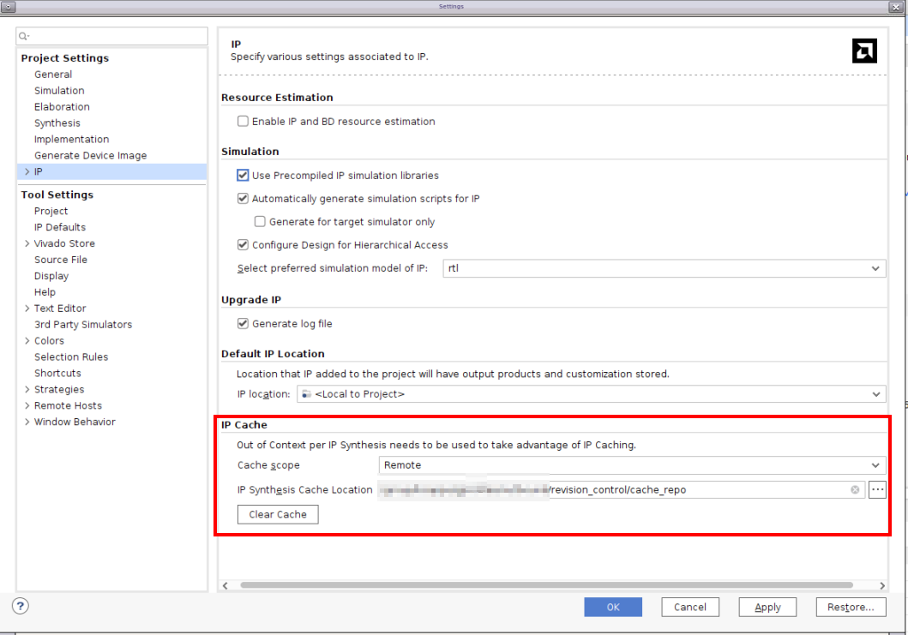
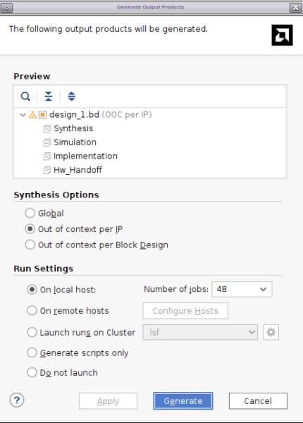
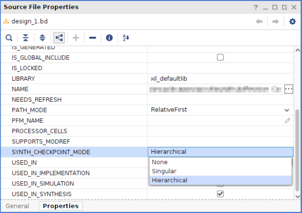
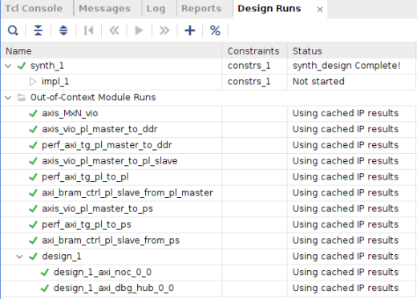

 <table class="sphinxhide" width="100%">
 <tr width="100%">
    <td align="center"><h1>AMD Vivado™ Design Suite Tutorials</h1>
    <a href="https://www.amd.com/en/products/software/adaptive-socs-and-fpgas/vivado.html">See Vivado™ Development Environment on amd.com</a>
    </td>
 </tr>
</table>

# Revision Control Tutorial : IP Cache flow to improve compile time

***Version: AMD Vivado&trade; 2025.2***

## Introduction 

This tutorial builds on the foundational revision control methodology introduced in the previous tutorial, focusing on how to leverage the **IP Cache** feature in AMD Vivado™ to improve compile times across projects. By enabling a remote cache for your Vivado™ builds, users can effectively reuse synthesized IP outputs across different project builds, as long as the original configuration of the IP remains unchanged.

A key benefit of utilizing remote cache is its persistence; unlike local project caches, remote cache directories remain intact even if the Vivado™ project directory is deleted. It is essential that this remote cache is located in a filesystem directory accessible by all team members, fostering collaboration and efficiency across teams.

In this tutorial, the design will be run twice: an **Initial Run** and a **Rerun**. This deliberate approach demonstrates how the initial run populates the remote cache, while the subsequent rerun showcases the advantages of reusing cached results. Both runs reference the same remote cache directory, highlighting the effectiveness and convenience of this methodology in managing IP builds. This process is run for both project and non-project flows. For project mode the IP generation and top level build are done in the same project. In the non-project flow, the IP and BD are generated in project mode and then read into the non-project top level build using read_bd and read_ip.

By following this tutorial, you will learn how to enable remote cache and implement it within your projects to optimize compile times and improve overall design workflow.

## Focus
- Learn how to enable remote cache for your Vivado™ project
- Leverage Remote Cache mechanism for Vivado™ IPs to improve compile time
- Maintain a remote cache directory in filesystem that is accessible by all teams.
- IP Integrator can  leverage the cache by keeping the target generation mode to OOC per IP.

## Read More about IP Cache flow
- Please read this [link](https://docs.amd.com/r/en-US/ug896-vivado-ip/Setting-the-IP-Cache) to read more about enabling and disabling IP cache in Vivado™ Project mode.

## Pros
- Cache hit can be achieved even if the teams are building IPs from source TCL files as long as original configuration of IP used for building cache is not changed.
- No need to revision control the generated and synthesized IP outputs if teams can identify and share a location in filesystem that is accessible by all teams.
- The remote IP cache does not need to be placed in revision control. If the cache is lost, it only effects compile time until the cache has been populated again. 

## Cons
- IP Cache flow does not work in Non-Project Mode. But, user can still generate the IP in project mode then read_ip/read_bd in non-project flow.

## Launch the tutorial

- Run ```make all``` to launch initial run where cache is populated and rerun where cache results are reused.
- Notice that same ```cache_repo```  is passed to both initial and rerun compiles so that they share the same remote cache.

## Design Flow

### Execute ``` build_design_prj_mode.tcl ``` in initial_run folder

### Enable Remote Cache for Vivado™ Project

```
config_ip_cache -use_cache_location ../cache_repo/   
```


#### Sourcing the ip.tcl to create the IPs
#### Sourcing the bd.tcl to create the block diagram
- Please note that BD is generated in OOC per IP mode, so that IPs can leverage the cache.
- Please read the [link](https://docs.amd.com/r/en-US/ug912-vivado-properties/SYNTH_CHECKPOINT_MODE) on how to enable BD in OOC per IP mode. This is the default in Project mode.
- Following image shows how to enable OOC per IP during Generate Targets of BD. This UI will be available when user clicks "Generate Block Design" in Flow Navigator.


- User can also change the property to change target generation mode in Properties tab of BD source as shown below.




### Rerun ``build_top_prj_mode.tcl``  in ``rerun``  folder
- Rerun flow is essentially recreating the same project using same script. This can be done from any location or any machine as long as they have access to the remote cache directory. 

### Enable Remote Cache to same location that was used in initial run 

```config_ip_cache -use_cache_location ../cache_repo/ ```


### Following Message in vivado.log after launch_runs ensures that Cache is used 

```
INFO: [IP_Flow 19-4838] Using cached IP synthesis design for IP axis_MxN_vio, cache-ID = 6bc78551346a53a5.
INFO: [Vivado 12-4149] The synthesis checkpoint for IP 'IP_Cache_Compile_Time_Speedup/rerun/vivado_prj_from_tcl.srcs/sources_1/ip/axis_MxN_vio/axis_MxN_vio.xci' is already up-to-date

```
#### Rerun project will not have separate synthesis runs of IPs that get cache hit. Instead it will reuse Cache results



