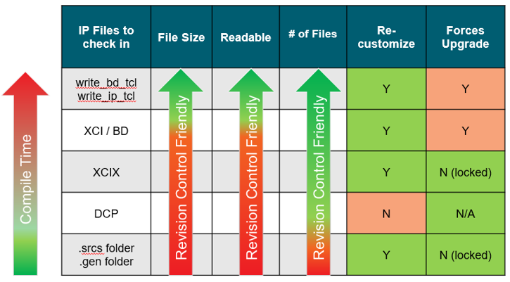

<table class="sphinxhide" width="100%">
 <tr width="100%">
    <td align="center"><h1>AMD Vivado™ Design Suite Tutorials</h1>
    <a href="https://www.amd.com/en/products/software/adaptive-socs-and-fpgas/vivado.html">See Vivado™ Development Environment on amd.com</a>
    </td>
 </tr>
</table>

# Introduction

As hardware design complexity grows, effective revision control becomes essential, particularly when using AMD Vivado™. This tutorial focuses on revision control for Block Designs and AMD IPs, highlighting the advantages and trade-offs for managing them in different formats.

Users of AMD Vivado™ may encounter various scenarios such as single-user or team-based environments. Additionally, design strategies can make differences. Some users prefer to build from source (includes resynthesize all IP and block designs) to maintain complete control over their designs, while others aim to reduce compile times by leveraging previously synthesized sources.
When considering a revision control method in this context, there are several important choices to make:

1.	**Project Creation**: Deciding whether to let Vivado™ automatically generate scripts for project creation or to manage the project setup manually. Note that tool-generated scripts can be more verbose.

2.	**Project vs. Non-Project Mode**: Choosing between project mode, which offers more structured management, or non-project mode, which offer greater flexibility.

3.	**Compile Time vs. Revision Control Friendly**: Weighing the trade-offs between longer compile times for simplified revision control versus not having to upgrade IP by checking in IP with generated output products (IP that has RTL generated and synthesized into a DCP).

4.	**Sharing Sources**: Considering how to effectively share and manage Block Designs (BD) and AMD IP cores (XCI) among different teams, facilitating collaboration and consistency across design iterations.

This tutorial focuses on two approaches of managing the block design and IP. The first approach is building the IP and block design from source files. The recommended flow to use the write_bd_tcl and write_ip_tcl scripts since they can be sourced from any location, work for project and non-project flows, are a single file, and contain Vivado™ project generation that simplifies the IP upgrade process when going to a newer version of Vivado™. Try to avoid revision control of only the .BD and .XCI files, as these files contain hard coded relative paths for the .gen directory location. The second approach is where the IP and block design already have the output products generated. This flow assumes that all source files for the IP have been generated, a synthesized DCP for the IP has been generated, and the .srcs and .gen folder or .XCIX are placed in revision control. The benefit of the output products already being generated is that the IP/BD does not have to be upgraded when the Vivado™ project is upgraded and reduced compile time.  

Each approach comes with its trade-offs, and it is important for users to consciously select a workflow that aligns with their specific environment and scalability needs. This tutorial aims to establish adaptable workflows that cater to diverse use cases, from individual design processes to collaborative environments, while effectively managing both BD and IP files.

<p align="center">
  
</p>

By understanding the various strategies and their implications, you can enhance collaboration, optimize compile times, and ensure consistency throughout your design process in Vivado™, ultimately choosing a revision control approach that best suits your unique requirements.


# Revision Control Recommendation Tutorials

| Build | Name | Focus | Revision Control Sources | Pros | Cons | Vivado™ Version |
|-------|------|--------|---------------------------|------|------|----------------|
| 1 | [User Managed vs Tool Managed Scripting](./User_Managed_vs_Tool_Managed/) | Demonstrates two approaches to script Vivado™ Project creation and compare pros/cons | 1. User-managed TCL script that adds relevant sources | 1. Flexible automation<br>2. Less verbose and customizable<br>3. Easier to read and diff | 1. Changes made in GUI must be manually added to user managed script | 2025.2 |
| 2 | [Revision Control Foundational](./Foundational/) | Rebuild the IP and BD using TCL generated from `write_ip_tcl` and `write_bd_tcl`. | 1. `bd.tcl` (from `write_bd_tcl`)<br>2. `ip.tcl` (from `write_ip_tcl`)<br>3. User-managed TCL that sources `ip.tcl` and `bd.tcl` | 1. User-readable TCL commands contained in a single file that is suitable for diff.<br>2. TCL files can be sourced from any directory | 1. BD and IP output products must be regenerated and resynthesized  unless cache is used. | 2025.2 |
| 3 | [Achieve Compile Time speed up using IP Cache](./IP_Cache_Compile_Time_Speedup/) | Demonstrates remote cache for IP and BD that multiple builds can leverage to reduce synthesis time | 1. `ip.tcl` or `bd.tcl` that recreates the same IP/BD | 1. Speeds up compile time by reusing cache for unmodified IPs | 1. Not supported in Non-Project Mode. | 2025.2 |
| 4 | [Check In Generated Outputs](./Check_In_Generated_Outputs/) | Revision control methodology that works for all source types (XCI, BD) while revision controlling sources and generated outputs | 1. `.srcs` directory for `.xci` and `.bd`<br>2. `.gen` directory for generated outputs<br>3. `.xpr` file | 1. No requirement to upgrade BD and IP with Vivado™ release. <br> 2. Does not have to be resynthesized<br>3. Works for all IPs including BDs | 1. Revision control includes `.xpr`, `.srcs`, and `.gen`, which can be cumbersome | 2025.2 |
| 5 | [Manage IP Vivado™ Project](./Manage_IP/) | Single project to manage all AMD IPs (XCIs) instantiated in RTL | 1. Manage IP project file (xpr) and its folder containing IP and output products | 1. Each IP is self-contained in one directory (XCI + outputs) | 1. BDs are not supported in this flow | 2025.2 |
| 6 | [Package IP outputs in one binary file](./Package_IP_Outputs_in_One_File/) | Demonstrates Core Container Technology (XCIX) | 1. `.xcix` file containing XCI and synthesized output outputs | 1. Single file <br> 2. No upgrade required <br> 3. Does not have to be resynthesized <br> 4. Can be placed in any directory<br> | 1. Larger binary size<br>2. Not supported for BDs | 2025.2 |

# Launch the Tutorials
Execute ```make all``` from the root directory of project to run all revision control tutorials at once.

<hr class="sphinxhide"></hr>

<p class="sphinxhide" align="center"><sub>Copyright © 2024 Advanced Micro Devices, Inc.</sub></p>

<p class="sphinxhide" align="center"><sup><a href="https://www.amd.com/en/corporate/copyright">Terms and Conditions</a></sup></p>
