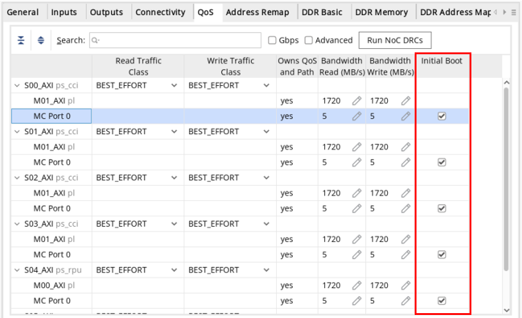
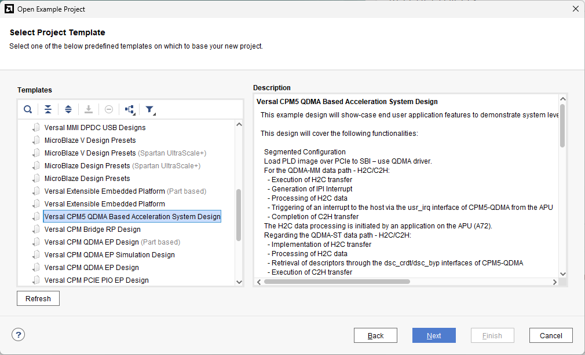
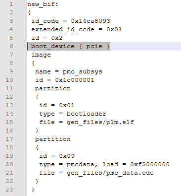
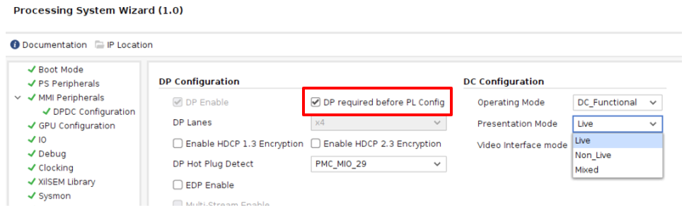
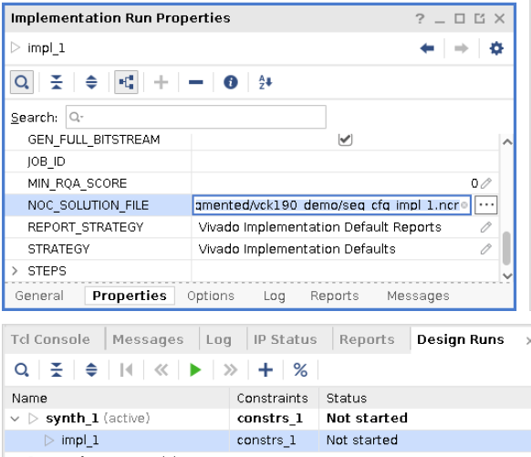
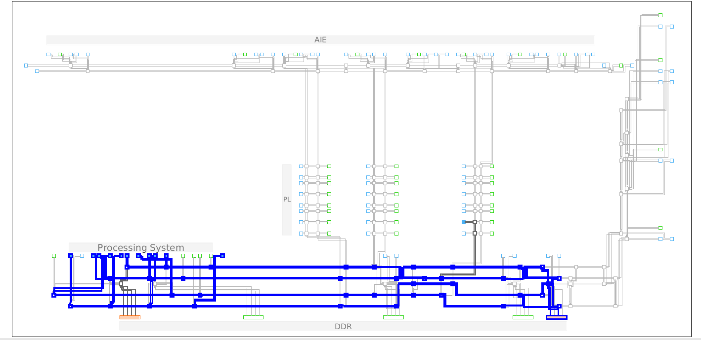

<table>
 <tr>
   <td align="center"><h1>Versal Tutorial</h1>
   <a href="https://www.amd.com/en/products/software/adaptive-socs-and-fpgas/vivado.html">See Vivado™ Development Environment on amd.com</a>
   </td>
 </tr>
 <tr>
 <td align="center"><h1>Segmented Configuration for AMD Versal™ devices</h1>
 </td>
 </tr>
</table>

***Version: 2025.1***<br>

This tutorial covers an overview of the new Segmented Configuration solution in Vivado™ 2025.1. This release is considered a <b>production release</b> for this Versal feature. This document illustrates the basic path through the Vivado tools, Linux build processes, and deployment in hardware.

<details>
<summary>Click to expand for device support in Vivado 2025.1</summary>
Segmented Configuration in Vivado 2025.1 supports the following devices:

The following devices are available with production status:
- AMD Versal™ Prime Series: VM1102, VM1302, VM1402, VM1502, VM1802, VM2202, VM2302, VM2502, VM2902
- AMD Versal™ AI Core Series: VC1502, VC1702, VC1802, VC1902, VC2602, VC2802
- AMD Versal™ AI Edge Series: VE1752, VE2002, VE2102, VE2202, VE2302, VE2602, VE2802
- AMD Versal™ Premium Series: VP1002, VP1052, VP1102, VP1202, VP1402, VP1502, VP1552, VP1702, VP1802, VP1902, VP2502, VP2802
- AMD Versal™ HBM Series: VH1522, VH1542, VH1582, VH1742, VH1782
- Development Kits: Alveo™ V70, Alveo V80, VCK190, VEK280, VHK158, VMK180, VPK120, VPK180

Segmented Configuration is an optional solution, off by default, for these devices and boards.

The following devices are available with early access status:
- AMD Versal™ AI Edge Series Gen 2: 2VE3804, 2VE3858 
- AMD Versal™ Prime Series Gen 2: 2VM3858

Segmented Configuration is always enabled for these devices. The feature cannot be disabled.

Support does NOT include Versal Prime VM2152 or remaining Versal AI Edge Series Gen 2, Versal Prime Series Gen 2 or Versal Premium Series Gen 2 devices in this release.
</details>

## Purpose
The Segmented Configuration solution has a number of key goals, including:
* Quickly booting processors and memory to load an operating system as quickly as possible
* Deferring PL configuration
* Enabling delivery of the PL image over a secondary boot interface
* Dynamically reloading the entire PL configuration


## Table of Contents
[Segmented Configuration Tool Flow in Vivado](#segmented-configuration-tool-flow-in-vivado)

[Use Cases](#use-cases)

[Vivado Design Considerations](#vivado-design-considerations)

[Dynamic Reload of a PL Image](#dynamic-reload-of-a-pl-image)

[Known Issues and Limitations](#known-issues-and-limitations)

[Linux Software Development using Yocto](#linux-software-development-using-yocto)

[Generating PetaLinux Images](#generating-petalinux-images)

[Testing Boot and PLD PDIs without PetaLinux](#testing-boot-and-pld-pdis-without-petalinux)

[Booting Linux and Downloading PLD PDI](#booting-linux-and-downloading-pld-pdi)

[Delivering PL images via U-boot](#delivering-pl-images-via-u-boot)

[Additional Resources](#additional-resources)

# Segmented Configuration Tool Flow in Vivado

The fundamental goal of the **Segmented Configuration** feature is to split programming images to allow for incrementally configuring the sections of the device, much like one can do with Zynq MPSoC devices. 
This enables users to quickly boot to an operating system with as much DDR or HBM memory access as needed. Programming of the entirety of the programmable logic (PL) domain (including AIE, if utilized) is deferred until the user needs it. 
Delivery of the PL programming image can be delivered via any primary or secondary boot path that does not require programmable logic to implement. These paths include PCIe end points implemented in CPM (images transferred via QDMA) and gigabit Ethernet connections.

A presentation summarizing the Segmented Configuration solution has been posted by AMD on [YouTube](https://www.youtube.com/watch?v=CXjffHOMXg8).


The enclosed example script (vck190_seg_cfg_pl_demo.tcl) will process a simple design from Vivado project creation to PDI generation, stopping before exporting hardware in an XSA. All the details for a single pass through Vivado place and route as described below are automated. PL reload use cases are not considered.

## Enable the Segmented Configuration project property

Within an open Versal design, set a project property that initiate Segmented Configuration process. 
This is done by selecting Tools > Settings > General, then check the option labeled <b>Project is a Segmented Configuration project</b>.<p>


Setting this property can be done via Tcl as well:
```
set_property segmented_configuration true [current_project]
```

**IMPORTANT: This property is optional, off by default, for the first-generation Versal adaptive SoCs. This property is always enabled for second-generation Versal adaptive SoCs. See the explicit device support list above to determine if Segmented Configuration is always enabled or optional for your target device.**

## Process the Design

When creating and implementing the Versal design, a standard design flow is used. The Segmented Configuration solution is intended to support any 
silicon feature, with specific caveats for usage noted below.<p>

One additional piece of information is required by the tools prior to PDI generation: the identification of NoC connectivity needed for the 
initial boot image. All NoC paths that must exist prior to PL configuration must be declared. This is done within the AXI NoC IP, under the QoS tab.  
In the <b>Initial Boot</b> column, all paths completely contained within the PS domain (FPD, LPD, etc.) or that access DDR or HBM memory will be selected by default. If any must be omitted, the box for that connection can be deselected, but note that these connections would then not be available until the PL domain is loaded. Any path that exists within or connects to the PL domain cannot be checked, as these are not viable options for the initial boot image. This information is passed through implementation tools (running through DRCs along the way) to be stored in the database for PDI generation decisions.<p>


This column will be populated regardless of the design's segmented_configuration project property status. If the project property is not enabled, the initial_boot properties are ignored. If the project property is enabled, the initial_boot properties are considered during PDI generation.

Within the design, this action is setting a property on these path segments for identification during write_device_image. This initial_boot property 
can be directly applied if necessary:
```
set_property initial_boot true [get_noc_logical_paths <...>] ; 
```

Do not apply the Initial Boot property on any NoC paths that are entirely within the PL domain or connect to or from the PL domain. The NoC IP GUI 
will prevent these connections from being selectable, and DRCs will prevent direct application of the initial_boot property on unsupported connections. <!-- CR-1156666 -->

While working within Vivado, you may call Report DRC to validate your design across a broad set of criteria. Some of these DRCs are specifically targeted to Segmented Configuration requirements. 
* <a href="./details/segmented_drcs.md">Click here</a> to see a list of interactive DRCs available in this release.
 

## Generate Programming Images

After the design has been implemented, create programming images as usual. The call to <code>write_device_image</code> will produce two PDI images:
 * <b>&lt;design&gt;_boot.pdi</b> – this image is used for the initial boot image and is used to bring up the PMC, processors, DDR memory and all other hard blocks 
 in the FPD and PLD domains
* <b>&lt;design&gt;_pld.pdi</b> – this image is used to program the entire programmable logic domain

<i>Note: when working with Versal AI Edge Gen 2 and Versal Prime Gen 2 devices, the Video Codec Unit (VCU) and Image Signal Processor (ISP) tiles are bundled with the programmable logic. This is due to the fact these hard blocks cannot operate at full mission capability without clock resources that are located and programmed in the PL domain.</i>

The final step in Vivado is to export the hardware for Vitis. The call to <code>write_hw_platform</code> includes both PDI images within the single generated XSA. 
This can be done directly in the project directory via Tcl (with the -include_bit option) or within a project by selecting <b>File > Export > Export Hardware</b> 
and choosing the "Include device image" option. Inclusion of final PDI images and system level information is supported for project modes only.

## Addtional Design Flows

While this tutorial highlights the Vivado flow through IP Integrator for block design centric designs, other paths through place and route are equally viable. 

* IDE vs. Tcl -- Compiling designs through Vivado project mode can be done either interactively in the IDE or scripted in a Tcl console or in batch mode. These are simply different entry points for the same design type and have no bearing on Segmented Configuration.
* Non-project mode -- Users may choose to forgo the GUI and process designs by calling individual commands for synthesis, place and route. After the in-memory project has been created, the segmented_configuration project property can be applied; subsequent processing will be done to apply this feature.
* RTL vs. Block Design -- In addition to IP Integrator for block design centric flows, the use of RTL centric flows are supported via the use of Modular NoC. This solution still includes a block design for the CIPS and NoC, which is where the contents of boot.pdi are defined, so the use of Modular NoC is effectively orthogonal to the application of Segmented Configuration.
  * Learn more about about NoC design flows using the [NoC Design Flows](../../Memory_and_NoC/NoC_Design_Flows) tutorials in this GitHub repository.

## Which flow will meet my needs?

Segmented Configuration is one methodology available for AMD Versal adaptive SoCs.  
<details>
<summary> Click here to see a comparison of related solutions </summary>

The following solutions enable staged configuration and/or on-the-fly reconfiguration of Versal devices.

<table>
  <tr>
    <th>Feature</th>
    <th>Goals / Capabilities</th>
    <th>When it Applies</th>
  </tr>
  <tr>
    <td><nobr>Segmented Configuration</nobr></td>
    <td>
    <li> Split device configuration between PS and PL domains
    <li> Quickly boot operating system with access to DDR
    <li> Defer load of PL domain; load with new application image if desired
    </td>
    <td>Initial device boot and during device operation</td>
  </tr>
  <tr>
    <td><nobr>Tandem Configuration</nobr></td>
    <td>
    <li>Load PCIe® end point in CPM-type hard block to meet PCIe link training goal of 120ms
    <li>Deliver remaining device configuration over PCIe link using QDMA (Tandem PCIe only)
    </td>
    <td>Initial device boot only</td>
  </tr>
  <tr>
    <td><nobr>Dynamic Function eXchange (DFX)</nobr></td>
    <td>
    <li>Dynamic reconfiguration of a portion of the PL to load new functionality without disrupting remainder of device
    <li>One or more dynamic regions can be independently defined
    </td>
    <td>During device operation only</td>
  </tr>
</table>

These solutions can be used together in a single design in specific combinations:

- Segmented Configuration automatically enables Tandem Configuration for all Versal devices with CPM5 resources when the CPM5 is configured as a PCIe end point. Support for Versal devices with CPM4 or MMI resources is planned for a future Vivado release.
- Tandem Configuration and DFX can both be enabled for any first-generation Versal device when Segmented Configuration is not enabled. The PCIe end point can be used to deliver the Tandem stage 2 PDI as well as any partial PDI.
- Segmented Configuration and DFX is not yet supported for any Versal device. This support is planned for a future Vivado release

For more information on Tandem Configuration, please consult the [Versal Adaptive SoC CPM DMA and Bridge Mode for PCI Express Product Guide (PG347)](https://docs.amd.com/r/en-US/pg347-cpm-dma-bridge/Tandem-Configuration).

For more information on Dynamic Function eXchange, please consult the [Vivado Design Suite User Guide: Dynamic Function eXchange (UG909)](https://docs.amd.com/r/en-US/ug909-vivado-partial-reconfiguration).

</details>
<p>

# Use Cases

**PL load via PCIe**. For Versal devices containing CPM blocks (CPM4 or CPM5), PCIe end points can be used for loading and reloading the PLD image via QDMA. A configurable example design (CED) is available, showing this approach. This design is found within the Vivado Example Designs list (Open Example Project) as "Versal CPM5 QDMA Based Acceleration System Design."  Documentation for running the design through Vivado and on hardware can be found in the <a href="https://github.com/Xilinx/XilinxCEDStore/tree/2025.1/ced/Xilinx/IPI/Versal_CPM_QDMA_Accel_Sys_Design">CEDStore on GitHub</a>.




Additional use cases and examples will be linked here when complete.


# Vivado Design Considerations

Special considerations must be understood when using Segmented Configuration, especially when a feature straddles PS and PL domains. 

**Mixed IO Banks.** The boot image will program the PS domain as well as all DDRMC sites defined by initial_boot settings. This initial image will also include XPIO or X5IO banks to connect to DDR or LPDDR memory. The programming granularity of IO banks is the entire bank (in this release), so all IO in any bank required for DDR access will be programmed and become active when the boot.pdi is loaded. If any IO pins are used to connect to PL logic, they will be active prior to the PL domain loading. This is supported behavior, but may lead to limitations if the PL Reload feature is used, as noted below.

**CPM Use Cases.** The CPM enables a host of functions for PCIe use cases. Some restrictions exist, including:
- Root Port mode within the CPM: this mode will not be ready until the PL has finished loading, so the CPM itself must be held in reset until the PLD PDI has been delivered. 
Likewise, the CPM must be held in reset for the duration of a dynamic reload of the PL region.<p>
- In order to load PLD PDI images over the CPM QDMA interface, PCIe must be declared as a secondary boot interface. In the <design>_boot.bif generated by the Vivado flow (found in the implmementation runs directory), add a single line.  Insert `boot_device { pcie }` after line 5 (id = 0x2).<br> 
  
   - If this command is missing, PLD loading over QDMA will fail. The resulting PLM error may look like this:
   ```
   /dev/qdma01000-MM-0, W off 0x102100000, 0x578730 failed -1. write file: Input/output error.
   ```
- Segmented Configuration will structure the boot image to meet the 120ms link training goal for CPM5 devices by default when one or more controllers are set to end point mode. The <design>_boot.pdi is built much like a Tandem PROM image so that the CPM and other required elements are programmed and released first, followed by the rest of the boot image.
  - Do not select a Tandem Configuration option during CPM customization; an error will be given during write_device_image if both features are selected.
  - CPM4 devices are not yet supported with this capability; the full boot PDI must be loaded before the end point(s) can begin link training. This capability is scheduled for a future Vivado release.
  
- Some PCIe features for CPM4 and CPM5 are not accessible until the programmable logic is configured. The following features must be withheld from initial driver load:
  - PCIe Extended Configuration Space as this requires programmable logic.
  - QDMA multi-function is not supported. This feature uses PL mailbox which is probed during driver load.
  - These capabilities will be examined for full support in a future version of driver updates.

**CIPS-inferred PL logic.** Even though many IP are customized within CIPS which appears to be independent of the programmable logic domain, some features are not entirely implemented within hard blocks. These features are not restricted but must be understood that they will not be available until PL configuration has completed. For example: 
 - SYSMON auxillary ports. While the System Monitor block itself resides in the PMC, the SYSMON can leverage multiplexed I/O (MIO) or high-density I/O (HDIO) pins to access external pins that can monitor external channels in the wider system. Measurements from these external pins will not be possible until the pins are configured.

 **DPDC Use Cases.** Certain use modes of the Display Controller in Versal AI Edge Gen 2 and Versal Prime Gen 2 devices rely on clocks originating from the PL domain. When working with Live or Mixed or mixed modes a PL-driven clock will be required for full opeeration. Selecting the "DP required before PL Config" checkbox in the DPDC Configuration in the PS Wizard will instruct the hardware to begin operation using a PS-based GPU_CLK before switching to the PL-based clock after the PL has been loaded. Driver support for this switchover is scheduled for a future release. Note that a momentary glitch in video output will occur due to DisplayPort retraining.

 

For more information on the Display Controller, please consult the [Versal AI Edge Series Gen 2 and Prime Series Gen 2 Technical Reference Manual (AM026)](https://docs.amd.com/r/en-US/am026-versal-ai-edge-prime-gen2-trm/Display-Controller).


# Dynamic Reload of a PL Image

The Segmented Configuration approach enables users to delay delivery of the programmable logic programming image. Moreover, users can dynamically reload the 
configuration of the PL on the fly, changing the functionality of the design in the PL domain. This **PL Reload** capability effectively provides simplified entry point to a DFX-like 
solution without requiring the use of the full DFX design flow within Vivado. 

**IMPORTANT:** PL Reload is not yet supported for Versal AI Edge Gen 2 or Versal Prime Gen 2 devices. While the entire design flow may be run through pr_verify and PDI generation, different PLD PDI images must not be delivered on the fly with the current toolset. 

Even though the full DFX design flow is not used, there are specific flow details and requirements to note: 
* The solution involves the use of multiple independent projects or multiple independent implementation runs to produce multiple implemented design results. These projects and runs must be constructed and compiled in such a way as to create consistency between each boot (static) image.

* The use of <code>pr_verify</code> is **required**, as it is for DFX designs, to ensure compatibility between images, leading to a safe programming environment.
    * Use <code>pr_verify</code> to compare routed checkpoints from different design runs within a project or between projects to check if the NoC solution is identical. 
    * These checks in place will be modified in future releases to align to new flexibility possible, and expanded to confirm consistency on PL interfaces as needed. In the current release it is advised to keep the boot image configuration identical between runs.
    * <a href="./details/pr_verify_checks.md">Click here</a> to see a list of checks performed in this release.

* While isolation on the PS-PL boundary is automatically enabled (and then disabled upon completion), it is the user's responsibility to manage activity in the processing 
domain. Activity must be paused during the transition and drivers may need to be unloaded/reloaded to account for any change in the mapping of the new image.

* Mixed IO Banks -- banks containing IO for PS and PL domain usage -- are supported but should be avoided as much as possible. When using Segmented Configuration, if an IO bank contains any IO for the PS domain, the entire bank will be configured during the boot image delivery stage and will not be reconfigured when the PL image is loaded. This means that PL-connected IO will become active before the programmable logic it connects to, and these IO cannot change functionality during PL Reload, as they must remain active until a full-device reconfiguration.

## Supported Design Flows

Segmented Configuration does not require a DFX design flow. However, it is critical to establish consistency between multiple runs so NoC usage and interfaces match. 
Supported use cases in this Vivado release are narrow in scope. Different PL images are expected to be subtle variations of a base design (if not completely identical), at least in terms of the boundary 
conditions. The initial "golden" design run must be a superset of all connectivity required for any PL variant that is to be connected to this fixed boot image, and all 
characteristics of the interface -- pin usage, address apertures, NoC connectivity (number and types of connections), etc. must not exceed this initial image. Subsets of 
connectivity are permitted (tie off unused ports) but users may not introduce new PS-PL boundary connections. This golden design does not have to be the design that is initially used for device configuration, but it does need to be the first processed through Vivado to set the PS-PL boundary solution and NoC connectivity context that all subsequent designs adhere to.

For example, if you plan to insert Debug cores (such as ILA) in the PL, these will connect via NoC to the HSDP in the CIPS. This NoC connection between CIPS and PL must be established in the golden design so that the HSDP itself as well as its connection to the fabric exists, then you have the choice to use it or not in any subsequent versions of the design.

### Recommended Methodologies

The recommended approach to establish consistency from one project to the next is to create a golden design and spawn all new variations from this source. This can be done in multiple ways:
* By saving a copy of the golden project using <code>save_project_as</code> (File > Project > Save As...), or by sourcing the same project Tcl script that created the golden project (likely generated by `write_project_tcl`). This is the heaviest solution as it brings an entire project forward, but could be the least amount of effort if the PL changes are expected to be minimal or focused in a very specific portion of the design.
* By passing the generated block design from the golden project to a new project. This can be done by importing the .bd file itself using the `import_files` command (which would require the regeneration of output products in the new project), or by importing the .gen/sources_1/bd folder to bring in the block design and resulting output files.
  * Be careful if using the `read_bd` command, as that simply creates a reference to the original source rather than copying a copy of the source into the new project. This means you might accidentally modify the golden .bd source if you use this command. 
* By generating a Tcl script for the golden block design using `write_bd_tcl` and then using this script as the foundation of the block design in a new project. The PS domain (CIPS, NoC, DDR, connections to/from PL) must not be altered in the new project; only changes in the PL are permitted.
  * A more focused version of this approach is to enclose the PS domain in a level of hierarchy within the BD, then use `write_bd_tcl -hier_blks` to only create a Tcl script for the portion of the design that contributes to the boot.pdi.

These approaches are necessary as they ensure the same PS domain consistency, from the top-level block design name to NoC IP configuration and NoC connectivity. Flexibility in adjusting the connections between PS and PL domains is under consideration for a future release of Vivado.

If designers expect to modify NoC usage within the PL domain (either entirely in the PL domain, or PL NMU connecting to PS NSU), it is advised to separate this "dynamic" portion of the NoC into one or more unique NoC IP instances. This allows the PS NoC (connected to CIPS and DDR) to more easily remain untouched from one run/project to the next. A secondary NoC IP instance that is modified will receive the uniquification noted below and will not disrupt consistency for the PS domain.

### Ensure Consistency Across PL Designs

To ensure consistency between implementation runs and their corresponding PDI images, the NoC solution can be exported from one run and imported into another. This is done with a pair of Tcl commands: <code>write_noc_solution</code> and <code>read_noc_solution</code> behind the scenes. Each of these commands has a single option, -file, to reference the JSON 
formatted .ncr file that is exported and imported, respectively. When using Segmented Configuration, an .ncr file is automatically written in the run directory alongside the routed design checkpoint after route_design completes. 

 A new design variation, in the same project or a new project, can be used to create a new PLD programming image. To replicate the NoC solution in the boot image (ensuring all NoC paths tagged "initial_boot" for Segmented Configuration are replicated), read in this .ncr file by setting the NOC_SOLUTION_FILE option within the Implementation 
 Run Properties.<p>
 
 
 
 Behind the scenes, this option calls the `read_noc_solution` Tcl command prior to running `place_design` to apply the NoC solution from the initial run.  
 
 Once the second design image is completely implemented, a call to `pr_verify` will confirm that the NoC solutions are identical and the PLD images may be interchanged.  This must be done directly on the Tcl Console to identify the two routed checkpoints to compare. 
 The first design checkpoint to be listed must be the "golden" design that has established the NoC solution reused in subsequent projects/runs. This parent run must contain the greatest usage of PS/PL and NoC boundary connections to establish the superset of connectivity possible.
 ```
 pr_verify -initial <first_design>_routed.dcp -additional <second_design>_routed.dcp
 ```

### Design Compatibility Checking

In addition to checks within the Vivado flow, a runtime check is done whenever the PL image is loaded or reloaded onto the target device. Unique Identifiers (UID) are 
inserted in the PDI to ensure compatibility of the boot image with any incoming PL image. This feature is also native to DFX and Tandem Configuration -- for more details, 
please see the "Design Version Compatibility Checks" section of [UG909](https://docs.amd.com/r/en-US/ug909-vivado-partial-reconfiguration/Design-Version-Compatibility-Checks).<p>
Versal devices have safeguards in the form of Unique Identifiers (UID) that are checked by the PLM when programming images are delivered. Three 32-bit fields are embedded 
in the PDI as described here:<p>

| ID Name	| Description	| Defined by | PDI Mapping |
| --- | --- | --- | --- |
| Node ID	| Defines the configuration node in the PL or AIE	| Vivado | id (0x18) |
| Unique ID |	A unique hash value to identify the module | Vivado | unique_id (0x24) |
| Parent ID	| A reference to the Unique ID of the module above the target module | Vivado | parent_unique_id (0x28) |
| Function ID |	Identification of the function residing in the target module | User | function_id (0x2c) |

These first three IDs are automatically generated by Vivado tools. The fourth (Function ID) will be defined by the user but is not supported within this Vivado release.

The <b>Node ID</b> is a fixed value that is incremented for each partition in the design.  The boot image represents the initial configuration of the device and is given 
an ID of 0x18700000. A value of 0x18700001 is assigned to the PLD image. This value is useful in differentiating the partitions in the design.<p>
The <b>Unique ID</b> is a hash value automatically generated by Vivado.  The value is deterministic, calculated by a number of factors within the design, so any change to 
a module’s results (code change, new synthesis or implementation options, design constraints, etc.) will produce a new Unique ID.  If the boot design modified in any way, 
a new Unique ID will be issued. This means it is critical to carry forward the PS design from the golden project if PL reload is desired.<p>
The <b>Parent ID</b> is a reference to the Unique ID of the image prior to the current one. The Parent ID of the boot image will always be zero (0x00000000) as it is the 
first image loaded in any Segmented Configuration design. The Parent ID of a PLD image will be the Unique ID of the boot image it was compiled with. This is the comparison 
done in PLM to ensure compatibility between images.<p>

You can read these values in a number of ways, but the easiest is to parse them using bootgen. Call bootgen with the -read option to see the details of the PDI contents. 
Find the four UID fields in the pl_cfi portion of the output.
```
bootgen -arch versal -read <pdi_file>
```
The boot image will contain information like this within the pl_cfi portion of the results:
```
--------------------------------------------------------------------------------
   IMAGE HEADER (pl_cfi)
--------------------------------------------------------------------------------
          pht_offset (0x00) : 0x00015f8c       section_count (0x04) : 0x00000001
      mHdr_revoke_id (0x08) : 0x00000000          attributes (0x0c) : 0x00001800
                name (0x10) : pl_cfi
                  id (0x18) : 0x18700000           unique_id (0x24) : 0x86bd4f86
    parent_unique_id (0x28) : 0x00000000         function_id (0x2c) : 0x00000000
   memcpy_address_lo (0x30) : 0x00000000   memcpy_address_hi (0x34) : 0x00000000
            checksum (0x3c) : 0xfd716316
 attribute list -
                   owner [plm]               memcpy [no]           
                    load [now]              handoff [now]          
   dependentPowerDomains [spd][pld]  
```
The PLD image will contain similar information: 
```
--------------------------------------------------------------------------------
   IMAGE HEADER (pl_cfi)
--------------------------------------------------------------------------------
          pht_offset (0x00) : 0x00000034       section_count (0x04) : 0x00000008
      mHdr_revoke_id (0x08) : 0x00000000          attributes (0x0c) : 0x00001800
                name (0x10) : pl_cfi
                  id (0x18) : 0x18700001           unique_id (0x24) : 0x34c4043e
    parent_unique_id (0x28) : 0x86bd4f86         function_id (0x2c) : 0x00000000
   memcpy_address_lo (0x30) : 0x00000000   memcpy_address_hi (0x34) : 0x00000000
            checksum (0x3c) : 0xc8aebe28
 attribute list -
                   owner [plm]               memcpy [no]           
                    load [now]              handoff [now]          
   dependentPowerDomains [spd][pld]  
```
Note how the parent_unique_id of the PLD image matches the unique_id of the boot image: 0x86bd4f86. These images are therefore compatible.

Because the Unique ID of the Boot PDI is based on the construction of the design in the PS domain, users are advised to not make changes to this part of the design to 
have the greatest possibility of not changing that UID. By compartmentalizing changes to the PL domain, only the UID of the PLD PDI should change. AMD is continuing 
to expand use case examples to provide further guidance in upcoming releases. For example, one approach is to separate the NoC IP into PS/boundary and PL 
instances, where only the latter is modified if PL iterations require updates to the NoC solution.

# Known Issues and Limitations

Device support in Vivado 2025.1 includes all Versal devices currently in production. This includes Versal Premium and Versal HBM devices utilizing SSI technology, as well as Versal AI Core, Versal AI Edge and Versal Prime devices. Select Versal AI Core Gen 2 and Versal Prime Gen 2 devices are available in early access for customers with licensed access to these devices.<p>

## Known Issues

Some known issues exist within the current tools:
 - pr_verify does not look for all possible mismatches in the processor domain, by design. Users are advised, in addition to importing the NoC solution from the primary design run, to be sure to use the same CIPS customization and non-PL NoC connectivity when using the PL reload feature. In this release, pr_verify is only checking NoC paths tagged with "initial_boot" and nothing within the core of the CIPS.
   - For example, an NMU included in an initial_boot path could have different destIDs between configurations. This mismatch can lead to a PLM error when loading a PLD PDI from a design other than the one that generated the resident Boot PDI.

- For Versal AI Edge Gen 2 or Versal Prime Gen 2 devices, if the boot partition includes any DDRMC X5PHIO banks, the master bank is recommended to be one of them. The master bank (bank 700) is the left-most bank along the bottom of the device and is used for the left-most DDRMC instance. If the master bank is NOT used for a DDRMC in the boot partition, this is permissible if the PLD partition also does not use it.<br>
The image below shows an unsupported scenario in this release. The connection from PS to right-most DDRMC is not permitted because left-most DDRMC and the master X5PHIO bank are connected to the PL domain. A fix is planned for a future Vivado release to remove this restriction. <!-- CR-1240717 -->



- **PL Reload** is not yet supported for Versal AI Edge Gen 2 or Versal Prime Gen 2 devices. While the entire design flow may be run through pr_verify and PDI generation, different PLD PDI images must not be delivered on the fly with the current toolset. This capability will be supported in a future Vivado release. <!-- VIVADO-19320 -->

- `read_noc_solution` does not report an error if there are changes to NSU addresses connected to boot path NMU instances. If changes have been made between designs expected to be in sync, `pr_verify` will report <code>[Dfx 88-139] SegConfig-Validation-12</code>. If this error is reported review the NoC boot path connectivity to ensure all NSU instances have the same addresses and IDs. <!-- CR-1237373 -->

- The AXI Lite interface is not currently supported for XRAM in Versal AI Edge devices. <!-- CR-1192384 -->

- PL Reload use cases are supported within only this single release. The long term goal for Segmented Configuration is to permit forward migration of boot images: lock a boot.pdi from a particular Vivado release in boot flash and use the NoC solution file (.ncr) to help produce compatible PLD images in newer versions of Vivado software. This capability is not in place during the transition from early access (2024.x) releases to 2025.1. When using PL Reload in Vivado 2025.1, ensure that the parent image is compiled in this tool version so that compatibility using the NoC solution file can be achieved.

## Known Limitations

In this release, there are some limitations in place:
* Tandem Configuration embedded within the Segmented Configuration flow is not yet supported for CPM4 devices, only for CPM5 devices. Tandem options must not be selected during CPM customization for any device when Segmented Configuration is enabled.
* DFX (dynamic reconfiguration within the PL) is not yet supported and must not be enabled on Block Design Containers. 
* Some advanced Versal features and IP, such as the Soft Error Mitigation (SEM) IP and NoC system isolation have not been fully tested.

The goal is to ultimately support all these capabilities. These current limitations will be considered for support in upcoming releases. If any feature is not yet ready for general access (e.g. DFX) then access to that feature will be disabled when Segmented Configuration is enabled.

---


# Linux Software Development using Yocto

To create Versal Segmented Configuration build recipes, please follow the posted build instructions on GitHub:<br>
[https://github.com/Xilinx/meta-xilinx-tools/blob/rel-v2025.1/docs/README.dfx.dtg.versal.full.md](https://github.com/Xilinx/meta-xilinx-tools/blob/rel-v2025.1/docs/README.dfx.dtg.versal.full.md)


# Generating PetaLinux Images

This section shows the PetaLinux build process tailored to the segmented configuration solution.  For more information on this general topic, please refer to the PetaLinux Tool Reference Guide UG1144. A section dedicated to Segmented Configuration has been added recently, [here](https://docs.amd.com/r/en-US/ug1144-petalinux-tools-reference-guide/Versal-Segmented-Configuration-Flow).

IMPORTANT: The PetaLinux instructions here are for first-generation Versal devices only. To create firmware recipes for second-generation devices (Versal AI Edge Gen 2, Prime Gen 2 or Premium Gen 2), please refer to the Yocto build instructions noted immediately above this section.

These instructions assume that an XSA called *vck190_seg_cfg_pl_demo.xsa* has been generated from the example design and resides above the Vivado and PetaLinux projects. Adjust any paths or file names accordingly if this is not the case.

1.	Set up the PetaLinux environment for 2025.1.
```
$ source <path_to_installed_petalinux>/settings.sh
```

2.	Create a PetaLinux Versal temple project.
```
#Name of the project
$ petalinux-create -t project -n vck190-seg --template versal  
$ cd vck190-seg
```

3.	Configure the project using the XSA created from the Vivado build flow. 
 Set board dtsi files and Enable Device Tree Overlays in the PetaLinux project. This can be done either by using menu options or via the command line.<p>

a. 	
Menuconfig method:
```
$ petalinux-config --get-hw-description=../vck190_seg_cfg_pl_demo.xsa
```
```
$ petalinux-config ---> DTG Settings ---> (versal-vck190-reva-x-ebm-01-reva) MACHINE_NAME
$ petalinux-config ---> FPGA Manager ---> [*] Fpga Manager
$ petalinux-config -c rootfs ---> Filesystem Packages   ---> base   ---> dfx-mgr  ---> [*] dfx-mgr
```
b. 
Command line method:
```
$ sed -i '/CONFIG_SUBSYSTEM_MACHINE_NAME/ c\CONFIG_SUBSYSTEM_MACHINE_NAME="versal-vck190-reva-x-ebm-01-reva"' project-spec/configs/config
$ sed -i '/CONFIG_SUBSYSTEM_FPGA_MANAGER/ c\CONFIG_SUBSYSTEM_FPGA_MANAGER=y' project-spec/configs/config
$ sed -i '/CONFIG_dfx-mgr/ c\CONFIG_dfx-mgr=y' project-spec/configs/rootfs_config
$ petalinux-config --silentconfig --get-hw-description=../vck190_seg_cfg_pl_demo.xsa
```

4. Create a PLD firmware app 
```
$ petalinux-create -t apps --template dfx_dtg_versal_full --enable -n <pld-firmware-app-name> --srcuri "../vck190_seg_cfg_pl_demo.xsa"
```
Note: the firmware app name cannot contain underscores

5.	Build the images and package the boot.bin
```
$ petalinux-build
$ petalinux-package --boot --format BIN --plm --psmfw --u-boot --dtb --force
```

Output/Build images are available within the images/linux directory.

<table>
  <tr>
    <th>File Name</th>
    <th>Description</th>
  </tr>
  <tr>
    <td>boot.bin</td>
    <td>Boot image with boot PDI & u-boot (also includes other required images, like atf, plm, etc)</td>
  </tr>
  <tr>
    <td>boot.scr</td>
    <td>Boot script used by u-boot for various boot modes</td>
  </tr>
  <tr>
    <td>image.ub</td>
    <td>Flatten Linux kernel image packing: Kernel, dtb and rootfs</td>
  </tr>
  <tr>
    <td>system.dtb</td>
    <td rowspan="3">Separate images for Kernel, dtb and rootfs</td>
  </tr>
  <tr>
    <td>rootfs.cpio.gz.u-boot</td>
  </tr>
</table>

# Testing Boot and PLD PDIs without PetaLinux

To check if the segmented configuration design has been built properly before building the Linux images, a quick check can be done by downloading the PDI files from XSDB and checking for access to the PL memory locations.
 
1.	Connect to a VCK190, locally or remotely.
 
2.	Open an Serial console window and use this for UART console.  In the serial console, select the serial interface connected to UART0 terminal, and set the Baudrate as 115200. 

3.	Set another serial terminal for the system controller serial console, by selecting an appropriate serial interface. 
 
4.	Start an XSDB console if not open already. This can be done using Vivado or Vitis tools.
```
 $ xsdb
xsdb% connect
```
 
5. In the XSDB console, set the target using following command:
```
 xsdb% ta 1
```

6.	In the XSDB console, change directory to the Vivado project location.  Download the boot PDI by typing:
```
xsdb% device program project_1.runs/impl_1/<design>_boot.pdi
```

You should see text scrolling on the UART console with no errors.<p>

7.	Next verify that the BRAM is NOT accessible when only the initial boot portion of Versal loaded:
```
xsdb% mrd -force 0xa4000000
Memory read error at 0xA4000000.  AP transaction timeout
```

At this point you have confirmed that the memory location does not yet exist.  Plus Linux has hung.<p>

8.	Power cycle the board.  
<!-- If using the board farm, type the following in the systest console:
```
Systest# power 0
Systest# power 1
```
-->

9.	Wait for the system controller to boot up before moving on.  <!-- You will also need to restart the UART console again, by executing the 'connect com0' command again.  Up arrow will also bring up the last command. --> <p>

10.	Download the boot image again (step 4), then program the PL image:
```
xsdb% device program project_1.runs/impl_1/<design>_boot.pdi
xsdb% device program project_1.runs/impl_1/<design>_pld.pdi
```

11.	Now you should be able to access the BRAM:
```
xsdb% mrd -force 0xa4000000
A4000000:    00000000
xsdb% mwr -force 0xa4000000 0xdeadbeef
xsdb% mrd -force 0xa4000000
A4000000:    DEADBEEF
```

You have now verified that the boot PDI does not contain the BRAM portion of the PL, and the PLD PDI does contain the BRAM.<p>

# Booting Linux and Downloading PLD PDI
Ultimately the desired flow (for most use cases using this solution) will be to load the boot PDI from a primary boot interface, boot Linux, then later deliver the PLD PDI image.<p>

1.	Connect to a VCK190 board, either locally or remotely. Refer to steps in  <a href="https://docs.xilinx.com/r/en-US/ug1400-vitis-embedded">UG1400</a> to connect the board remotely.
<!-- ```
~$ /proj/systest/bin/systest vck190
``` -->

2.	Start the Hardware Server (note the hw server address, normally <MachineName>:3121)
```
xsdb% hw_server
```

3.	Add the TFTP root path to the Linux images repository within the project area.
```
$ tftpd "<path_to_example>/my_petalinux_project/images/linux"
```

<!-- 4.	Connect to the com port.
```
Systest 2# connect com0
``` -->
4. Open an Serial console window and use this for the UART console. In the serial console, select the serial interface connected to the UART0 terminal, and set the Baudrate as 115200.

5.	Back in the primary terminal (in the example directory), run following make command:
```
$ petalinux-boot --jtag --u-boot --hw_server-url <MachineName>:3121
```
You can see Linux boot up on the serial console connected to UART0.<p>

6. Enter your username as <b>petalinux</b> and pick a password. Refer to [UG1144](https://docs.xilinx.com/r/en-US/ug1144-petalinux-tools-reference-guide) for more details.
 
7. At the Linux prompt, program the PLD PDI file using the fpgautil command.
```
$ sudo fpgautil -b /lib/firmware/<test-app-name>.pdi -o /lib/firmware/<dtbo-name>.dtbo
```

At this point, Linux has been booted and the memory location in the PL is accessible.  You can use an XSDB console to read from and write to the memory location as was done in the prior section of this tutorial.  Or you can interact with memory directly via Linux:
```
devmem 0xa4000000

   0x00000000

devmem 0xa4000000 32 0xdeadbeef
devmem 0xa4000000

   0xDEADBEEF
```

8.	If you have created a second PL image, you can load this in now. If not you can reload the same PLD PDI, emulating a full PL reconfiguration.
```
#Remove the existing PL image (required for reprogramming a new image)
$ sudo fpgautil -R

#Program the new PL image
$ sudo fpgautil -b /lib/firmware/<second_design>_pld.pdi -o /lib/firmware/<dtbo-name>.dtbo
```

Verify that reading 0xa4000000 returns 0x0 instead of whatever was written to the BRAM. The results here will depend on what functionality is is the PL image that was just loaded. For example:
```
$ sudo devmem 0xa4000000
0x00000000
```
<!-- If a timer application is created...
Then enable the timer, and check that the write was successful.
```
devmem 0xa4000000 32 0xD0
devmem 0xa4000000
```
Read the timer register which should change each time it is read.
```
devmem 0xa4000008
```

You should be able to read and write to the AXI Timer registers now.
-->

# Delivering PL images via U-boot
Alternatively to Linux, loading PDI images can also be achieved in U-Boot. This is a desirable alternative since U-Boot comes before Linux in the boot sequence, meaning you can load your PL faster at boot and proceed to Linux with a full PL design already loaded. In our current flow where the boot PDI is handled by the primary boot interface, you can use U-Boot to load the PLD PDI.<p>
1.	Place your pld.pdi file(s) on the SD card along with the rest of the PetaLinux boot files.
2.	Boot the board:
```
petalinux-boot --jtag --u-boot --hw_server-url <MachineName>:3121
```
3.	Watch systest terminal 2 as the board boots. The boot sequence will pause with a message:
```
 “Hit any key to stop autoboot”. 
 Pressing any key will interrupt Linux boot and put you in U-Boot.
 ```

Once in U-Boot, the PLD PDI file must be moved from the SD card to on-board device memory before it can be downloaded to the FPGA.<p>
4.	Use the fatload command to move the PLD PDI file to an on-board memory location with enough space (PLD PDI files are typically multiple MB in size). In this case you will use DDR memory location 0x1000000:
```
fatload mmc 0 0x1000000 <design>_pld.pdi
```
 
Alternatively, you can do it using JTAG from XSDB using:

```
xsdb% dow -data <design>_pld.pdi 0x1000000
```

Note: the mmc 0 parameter means MultiMediaCard 0 which in this case is the SD card.<p>
Once the fatload command has been run, the size of the moved file is automatically stored in the $filesize variable which you will use in the next step.<p>
5.	Use the fpga load command to download the PDI to the FPGA. The command takes the memory location and size of the PDI data:
```
fpga load 0 0x1000000 $filesize
```

The PDI file should download to the FPGA successfully. Now that the PL is loaded, you can also use U-Boot to access the PL memory space.<p>
6.	Use the md (memory dump) command to read the unmodified BRAM memory at 0xa4000000:
```
md 0xa4000000 1
```

Note: the second parameter is the number of values to dump, in this case ‘1’.<p>
7.	Use the mm (memory modify) command to write to the BRAM memory at 0xa4000000.<p>
Once you run the command you will be prompted to type the write data. You can type the data and press enter which will execute the write and then prompt you to type more data for the next memory location, and so on. You can exit this writing mode by pressing ctrl+C:
```
mm 0xa4000000
deadbeef
(Press ctrl+C)	
```
8.	Read the BRAM memory again using the md command:
```
md 0xa4000000 1
```

You should see ‘deadbeef’.<p>
9.	To boot to Linux using the image on the SD card, use the command:
```
run bootcmd_mmc0
```
For more information on U-Boot commands, refer to the official U-Boot documentation: https://u-boot.readthedocs.io/en/latest/


# Addtional Resources

Use these links to connect to additional documentation, examples and resources regarding Segmented Configuration.

* [AMD Yocto Native Board Support Packages](https://xilinx-wiki.atlassian.net/wiki/x/GgAZuw)
* [UG1273](https://docs.amd.com/r/en-US/ug1273-versal-acap-design/Segmented-Configuration) - *Versal Adaptive SoC Design Guide*
* [UG1387](https://docs.amd.com/r/en-US/ug1387-acap-hardware-ip-platform-dev-methodology/Design-Planning-Considerations-for-Segmented-Configuration) - *Versal Development Methodology Guide*
* [UG1304](https://docs.amd.com/r/en-US/ug1304-versal-acap-ssdg/Segmented-Configuration) - *Versal System Software Developers Guide*


<hr class="sphinxhide"></hr>

<p class="sphinxhide" align="center"><sub>Copyright © 2020-2025 Advanced Micro Devices, Inc.</sub></p>

<p class="sphinxhide" align="center"><sup><a href="https://www.amd.com/en/corporate/copyright">Terms and Conditions</a></sup></p>