<table class="sphinxhide" width="100%">
 <tr width="100%">
    <td align="center"><h1>Versal™ Adaptive SoC DFX Tutorials</h1>
    <a href="https://www.amd.com/en/products/software/adaptive-socs-and-fpgas/vivado.html">See Vivado™ Development Environment on amd.com</a>
    </td>
 </tr>
</table>

# Overlap DRC and Disjoint Pblock Solutions for Versal DFX

***Version: AMD Vivado&trade; 2024.2***

## Abstract
This design demonstrates solutions for scenarios that involve overlap DRCs (two reconfigurable Pblocks interfering with each other) as well as disjoint Pblocks (a clocking resource region separated from the main reconfigurable Pblock)

### BLI Floorplan Alignment
DFX designs for Versal devices have unique challenges related to ranging Pblocks in designs with two or more reconfigurable partitions (RP). Due to the alignment of Boundary Logic Interface (BLI) tiles that are automatically ranged based on other ranged sites within an HSR clock region, the placement and routing footprints can extend farther than originally intended for a given Pblock rectangle. The extended footprints can lead to overlapping Pblock issues, reported by Design Rule Checks (DRC). 

### Disjoint Pblocks for a Reconfigurable Partition
A design may require logic that must be placed in a non-contiguous area between Fabric Super Region (FSR) and Horizontal Super Region (HSR) areas that would require a disjoint Pblock, meaning a single pblock with two (or more) non-contiguous regions. 
Only NoC and clocking resources can communicate between the disjoint Pblock sections. 
This is not necessarily because of another reconfigurable pblock between the disjoint areas (though this is shown in this example) but because the fabric between the areas is not owned by the target reconfigurable partition.

In a disjoint Pblock case, the main part of the reconfigurable Pblock in the fabric region that contains all but certain clocking resources is referred to as the Primary Region. 
The other part which includes sites of the clock sources and the fabric region adjacent to the clock sources is referred to as the Secondary Region. 
Currently Vivado supports one Primary Region and one Secondary Region in a disjoint Pblock. The following image shows a disjoint Pblock for RP1 in a two RP design on a two SLR device.

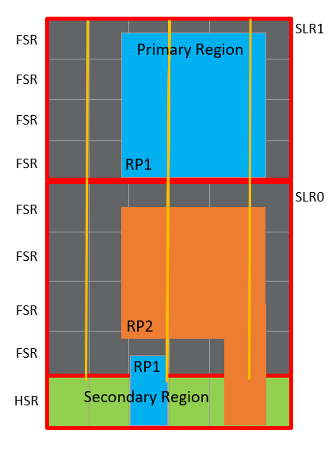

This lab will show: 
1.	The overlap DRC and suggestions for steps to analyze and fix the overlap.
2.	An analysis of routing errors due to a disjoint Pblock and the application of a guided floorplan for the disjoint pblock to fix routing errors. 

## Objectives
 After completing this lab, you will be able to:
* Understand HDPR-39 on BLI overlap error and use the `get_dfx_footprint` command to debug. 
* Understand routing issues due to a disjoint Pblock and fix them with guided floorplan. 

NOTE: This lab is only for DFX learning in Vivado and has not been validated in hardware. 

## Introduction 
You will be using a standard Vivado DFX project as the starting point for this lab. It is a BD-based design with two Reconfigurable Partitions (RP1 and RP2). The design uses NoC IP and NoC INI to connect the IPs. The design is targeted to a two SLR Versal device (VP1502) to note some issues commonly seen for multi-RP multi-SLR DFX designs.

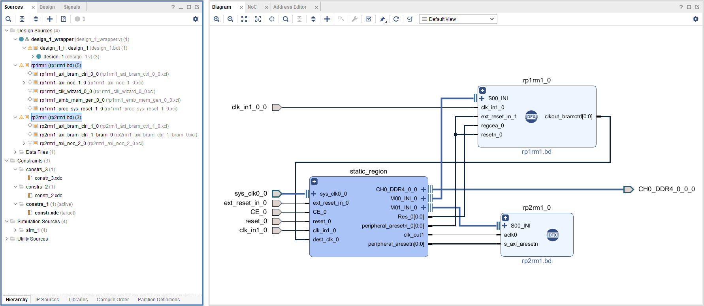

### General Flow
In this lab you will proceed through the following steps:
1. Prepare the design: Create project and run synthesis
2. Report DFX DRCs
3. Analyze the DRCs
4. Resize Pblock to resolve DRC
5. Run implementation and analyze new routing error
6. Use a guided floorplan
7. Implement the design to success!

**STEP 1: Prepare the Design**

1.	In the Tcl Console within Vivado, source the "recreate_proj.tcl" script. This will create the 2 RP DFX block design. 
2.	Click "Run Synthesis" in the Flow Navigator to process the design through synthesis.
3.	After synthesis is complete, open the synthesized design "synth_1" and examine the device view.

To match the image below, select **Layout > Floorplanning**, then individually right click on each pblock_rp1 and pblock_rp2 to select **Highlight** and then pick the appropriate color (blue for rp1, yellow for rp2).

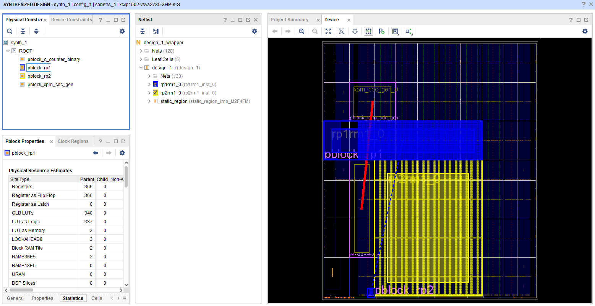

The blue highlighted Pblock is for RP "rp1rm1_0" and the yellow is for RP "rp2rm1_0." Observe that pblock_rp1 is disjoint with separate Pblock rectangles in HSR and FSR regions. The other two Pblocks are for static logic, specifically applied to create challenges for the use cases covered in this lab. The red line represents a static bus crossing the SLR boundary. 

**STEP 2: Report DFX DRCs**

Most of the floorplanning-related DRCs can be caught after synthesis by calling the report_drc command. As this lab focuses only on DFX, check only the DFX rules from report DRC as highlighted below and observe the DRC errors. Run the DFX DRCs by selecting **Reports > Report DRC**; then deselect **All Rules** and select **Dynamic Function eXchange** before clicking **OK**.

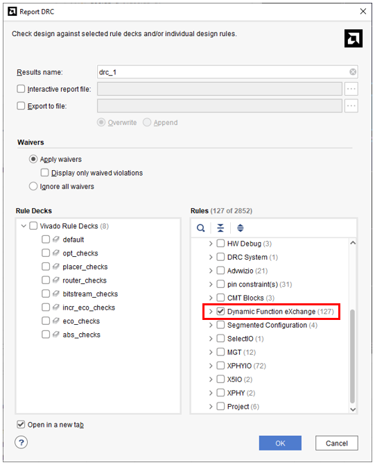

Four types of DFX DRCs are reported across seven message codes:

1-	ERROR: HDPR-66 and HDPR-156: These DRCs report a pblock overlap. A tile in the HSR region of the RP in blue highlighted Pblock is also part of the RP highlighted in yellow.

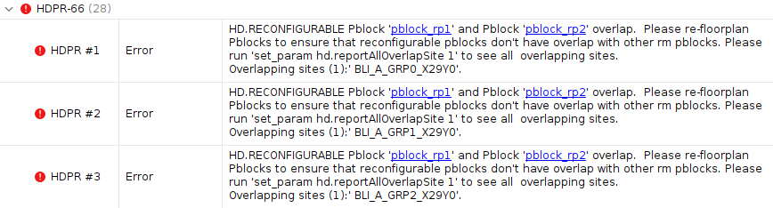
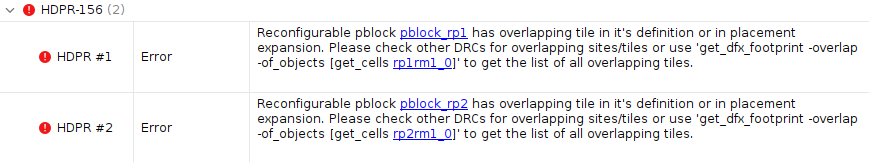

2- HDPR-61, HDPR-134 and HDPRA-63: These DRCs guide users to appropriate construction of disjoint Pblocks. The required methodology is to add a child Pblock to define the primary region. Only NoC and clocking logic can communicate between disjoint rectangles, as any other connection will require routing resources between the Pblock segments that are not owned by the Pblock. 

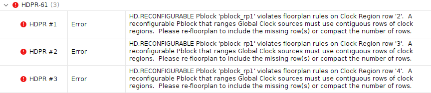
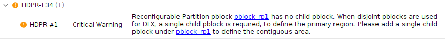


3-	HDPR-124: This DRC warning reports that IO Bank 703 is shared between static and pblock_rp1.


4-	HDPR-147: This DRC warning reports that pblock_rp1 is not aligned to fundamental DFX programmable units.

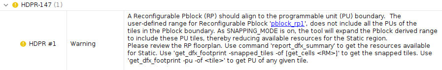

If you attempt to implement the design at this point, errors will be reported in the opt_design step. The first implementation run, impl_BLI_ERROR, shows this failure mode.

**STEP 3 : Analyze the DRCs**

**HDPR-66:** Examine the first DRC under section HDPR-66 in the DRC window. The DRC error reports the site that is shared by two RPs. BLI_A_GRP0_X29Y0 is the conflicting site. 
```
HDPR #1 HD.RECONFIGURABLE Pblock 'pblock_rp1' and Pblock 'pblock_rp2' overlap.  Please re-floorplan Pblocks to ensure that reconfigurable pblocks don't have overlap with other rm pblocks. Please run 'set_param hd.reportAllOverlapSite 1' to see all overlapping sites.
Overlapping sites (1): 'BLI_A_GRP0_X29Y0'. 
```

The message explains that "BLI_A_GRP0_X29Y0" is present in both pblock_rp1 and pblock_rp2, causing an overlap. The 28 instances of the error message show the extent of the overlap on a site by site basis.

In the device view you can visualize the overlapping tiles. To show the placement footprint for both Pblocks, use the get_dfx_footprint command:

```
highlight_objects -color blue [get_dfx_footprint -place -of_objects [get_cells design_1_i/rp1rm1_0]]
mark_objects -color yellow [get_dfx_footprint -place -of_objects [get_cells design_1_i/rp2rm1_0]]
mark_objects -color green [get_sites "BLI_A_GRP0_X29Y0"]
```

One call to get_dfx_footprint uses highlight_objects and the other uses mark_objects (and with different colors) so that any tile that belongs to each set can be more easily seen.  In the image below the overlapping tiles are circled. One of the BLI sites (BLI_A_GRP0_X29Y0) that forces this footprint for pblock_rp1 is marked in green. Zooming in further, you can see 29 instances of tiles that are both highlighted blue and contain a yellow mark, corresponding with the number of DRC messages received.

Note: At first it may appear the overlap is due to overlap of the main pblock rectangles in the middle of this image, but zooming even more closely you can see that there are no logical resources in this "overlapping" zone.

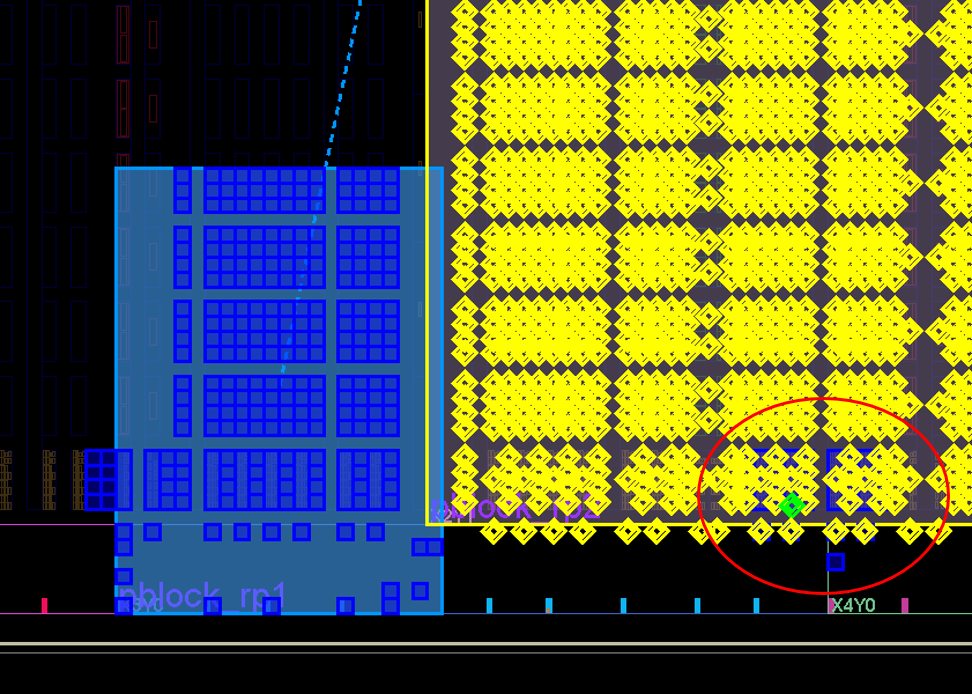

You can also use the -overlap option for the get_dfx_footprint command. This will return all tiles that overlap between the requested Pblock and any other reconfigurable Pblock.
```
#first clear existing highlighting
unhighlight_objects
unmark_objects

mark_objects -color green [get_sites "BLI_A_GRP0_X29Y0"]
highlight_objects -color red [get_dfx_footprint -overlap -of_objects [get_cells design_1_i/rp1rm1_0]]
```

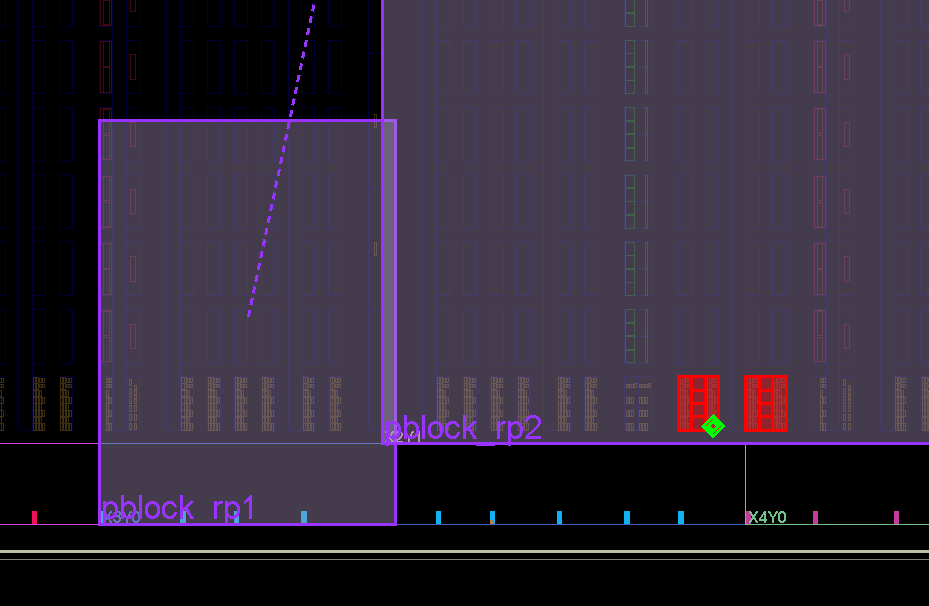


**STEP 4: Resize Pblock to resolve DRC**

To resolve the first violation, at least one Pblock must be resized. This is a design dependent decision. You can use one of these two options:

*Option 1:*  
Reduce the size of pblock_rp2 to remove the overlap.

``
resize_pblock pblock_rp2 -remove CLOCKREGION_X2Y1
``

*Option 2:*  
Move pblock_rp1 to avoid the overlap.

Each action will resolve the DRC, but consider the choice carefully. The RM netlist rp1rm1_0 requires a MMCM in that Pblock (hence the need for a disjoint region), and this MMCM may have clock pin or other clocking resource implications. Additional changes may be required if option 2 is selected. If option 1 is selected, fewer resources remain for implementing RP2 in pblock_rp2. Further adjustments (such as removing only the lower half and/or the right side of the clock region) will minimize this loss.

Note: This lab does not resolve all DRC errors individually and in every way possible. Using option 1 above will fix DRC error HDPR-66 as well as HDPR-156. HDPR-156 is a more general pblock overlap DRC that refers users to the `get_dfx_footprint -overlap` strategy rather than call out individual site overlap instances.

For this design, use option 1 above and resize a Pblock to resolve the overlaps. 

Run Report DRC for DFX rules and see the DRC errors have been fixed. (The Critical Warning and Warnings will remain.)  The constraints for option 1 are captured in "constr_2.xdc" under constraint set "constrs_2" and used for the "impl_SLL_ERROR" implementation run. 

The following image shows the new design floorplan with highlighting updated.

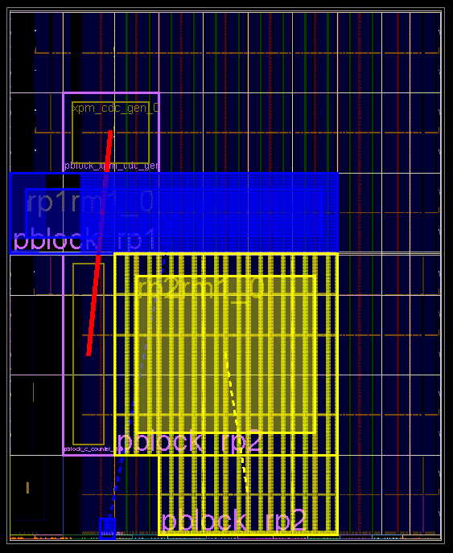

**STEP 5: Run implementation and analyze new routing error**

From the Synthesized design after fixing the DRC errors, run `opt_design`, `place_design`, and `route_design` from the TCL console. You can also launch the implementation run for impl_SLL_ERROR in the Design Runs tab. The changes in the floorplan do not have to be saved as they are already captured in constr_2.xdc.

You will see route_design has failed with the following error during the SLL assignment phase:

```
ERROR: [Route 35-3424] SLL Assignment failed. There are no SLL nodes available in SLR Cut [0-1] for net 'design_1_i/HD_PR_InsertedStaticNet_SharedDriver_design_1_i_rp1rm1_0_ext_reset_in_1'.
```

As the node name indicates, this net has been inserted by the HD (Hierarchical Design) part of the flow to support a partition pin between static and dynamic regions. The end of the log file reports that a design checkpoint representing the error state has been generated. Open this checkpoint and examine the contents. 
After the failing net is identified in the Find results, you can select the net and use the F4 key to show the schematic for that specific net. Mark both source and load to see the path that needs to be routed. You can see that the source is in the static region and the load is in the dynamic region and and SLR boundary separates them.

```
open_checkpoint ./project_1/project_1.runs/impl_SLL_ERROR/design_1_wrapper_routed_error.dcp
show_objects -name fail_net [get_nets design_1_i/HD_PR_InsertedStaticNet_SharedDriver_design_1_i_rp1rm1_0_ext_reset_in_1]
mark_objects -color green [get_cells design_1_i/HD_PR_InsertedStaticInst_SharedDriver_design_1_i_rp1rm1_0_ext_reset_in_1]
mark_objects -color orange [get_cells design_1_i/rp1rm1_0/proc_sys_reset_1/U0/EXT_LPF/ACTIVE_HIGH_EXT.ACT_HI_EXT/GENERATE_LEVEL_P_S_CDC.SINGLE_BIT.CROSS_PLEVEL_IN2SCNDRY_IN_cdc_to]
```

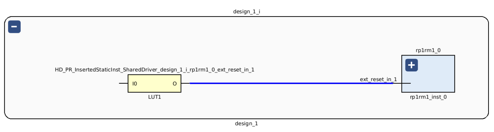
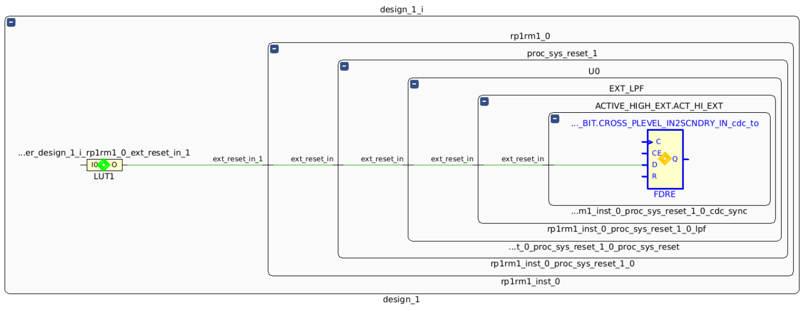
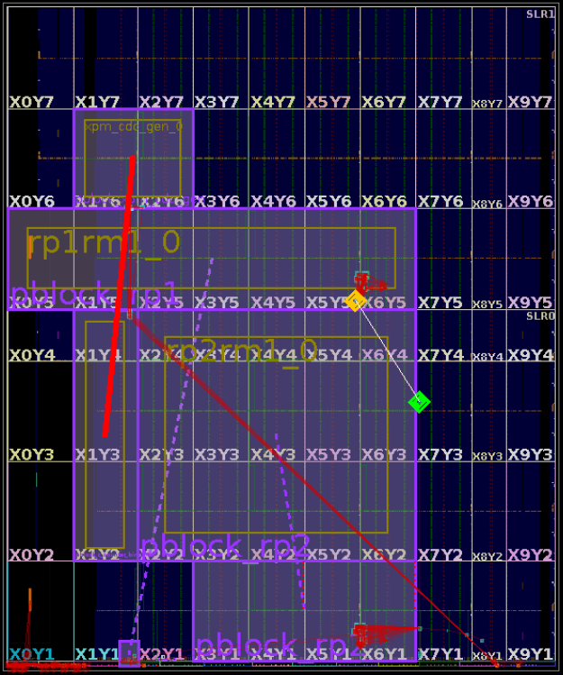

This path looks reasonable, even though it crosses an SLR boundary. So what is the reason for the routing failure?

The DFX flow inserts partition pins as intermediate nodes for reconfigurable partition boundaries. These pins have specific locations (PPLOCs) determined by the placer, typically on logical resource pins or interconnect tiles. Find PPLOCs by using the `get_pplocs` command with the `-pins` or `-nets` option. For this particular net, use this command:
```
get_pplocs -nets [get_nets design_1_i/HD_PR_InsertedStaticNet_SharedDriver_design_1_i_rp1rm1_0_ext_reset_in_1]
```

The result is a specific pin on an interconnect tile, in this case <b>INT_X32Y3/OUT_NN1_W_BEG0</b>. (Adjust subsequent instructions if a different interconnect tile is selected.) Mark this tile to see where it is located, then place that location in the context of the routing footprint of the disjoint pblock.
```
mark_objects -color red [get_tiles INT_X32Y3]
highlight_objects -color blue [get_dfx_footprint -route -of [get_cells design_1_i/rp1rm1_0]]
```

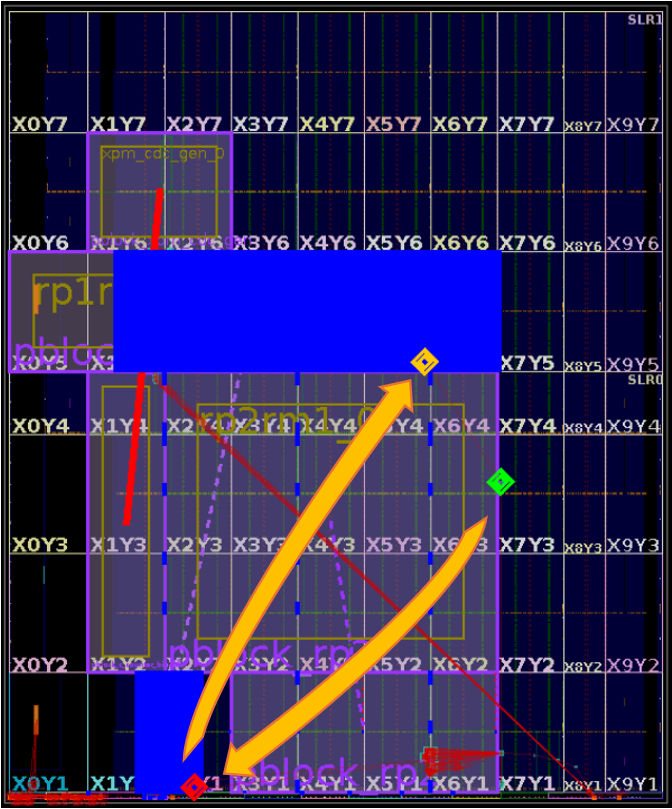

The PPLOC is within the RP pblock routing footprint as expected and required, as this is the consistent interface point for this module pin for all routing solutions for any new reconfigurable module that comes along.
The routing error occurs because the route required in not possible. To route the connection from source (green) to load (orange) through the PPLOC (red) requires routing resources owned by the reconfigurable partition pblock for the second section of the route, and the only possible connections between the disjoint regions are on dedicated clock lines. 
Therefore, routing the connection between the PPLOC (red) and load (orange) is not possible given the current PPLOC placement. To fix such routing issues and to have control over placement in Primary and Secondary regions for design logic as well as partition pins, a guided floorplan is required. 


**STEP 6: Use a guided floorplan**

Specific cell assignments must be made to the Primary region and the Secondary region. These assignments will guide the Vivado placer to not place non-clock logic in the Secondary region of a disjoint Pblock. If any non-clock logic that connects to logic in the Primary region were to be placed in the Secondary region, unroutes would certainly occur, as there are no standard (non-clock) routing resources to bridge any gap between the sections.

Use the `guide_disjoint_floorplan.tcl` file which uses the `get_dfx_footprint` command to create a recommended Pblock methodology. It creates a guided child Pblock and assigns all the non-clock cells to this child Pblock within the Primary region. It excludes assignment of the clock-control logic from the child Pblock. In this design, prepare and launch the guided floorplan Tcl proc as follows:

```
place_design -unplace
source ./guide_disjoint_floorplan.tcl -notrace
dfx_utils::guided_floorplan::create_guided_floorplan
```

This will create a guided floorplan with a Secondary region (clocking) assigned to the parent Pblock and a Primary region (FSR cells) assigned to the child Pblock. 

Note: For the purposes of this lab, the guided floorplan was created after the routing error has been reported. The best method is to create the guided floorplan before calling place and route using a Tcl script. Using the guided floorplan will fix DRC HDPR-134 which was reported earlier. 


The parent Pblock includes clocking logic in the secondary region:

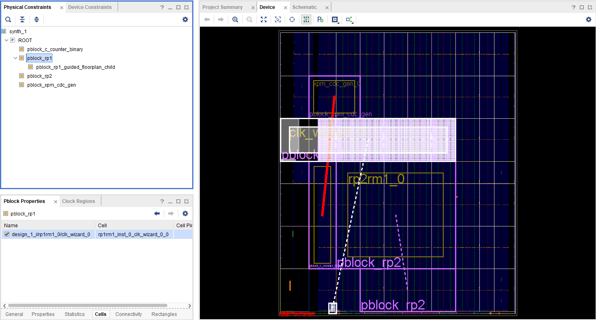

The generated guided child Pblock contains all non-clocking login in the primary region:

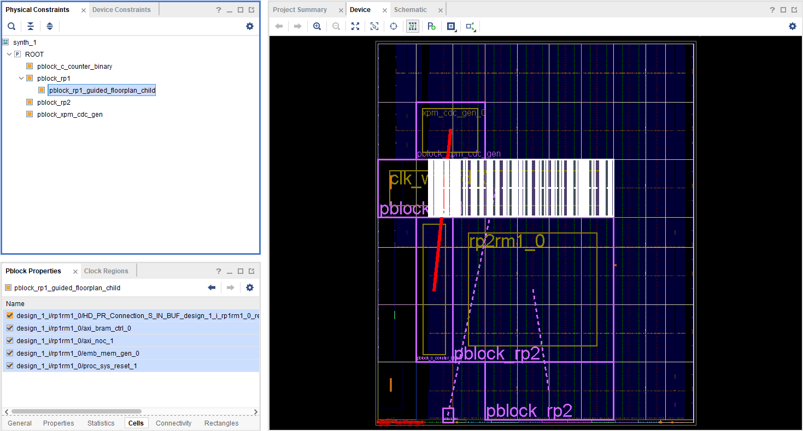

**STEP 7: Implement the design to success!**

Reset the PPLOC assignments from the previous run and rerun place and route with the new guided floorplan to see design can be successfully routed. 

```
set cells [get_cells -quiet -hier -filter HD.RECONFIGURABLE]
foreach cell $cells {
reset_property HD.PARTPIN_LOCS [get_pins $cell/*]
}

place_design
route_design
```
Upon completion of `route_design`, the implemented design can be opened. Examine the design to see the PPLOC for the reset net is now in the main section of the pblock, which is why it was able to be successfully routed.
```
mark_objects -color green [get_cells design_1_i/HD_PR_InsertedStaticInst_SharedDriver_design_1_i_rp1rm1_0_ext_reset_in_1]
mark_objects -color orange [get_cells design_1_i/rp1rm1_0/proc_sys_reset_1/U0/EXT_LPF/ACTIVE_HIGH_EXT.ACT_HI_EXT/GENERATE_LEVEL_P_S_CDC.SINGLE_BIT.CROSS_PLEVEL_IN2SCNDRY_IN_cdc_to]
get_pplocs -nets [get_nets design_1_i/HD_PR_InsertedStaticNet_SharedDriver_design_1_i_rp1rm1_0_ext_reset_in_1]
```
This time, however, the PPLOC reported is in a new location, <b>INT_X80Y341/OUT_SS1_E_BEG1</b>.
```
mark_objects -color red [get_tiles INT_X80Y341]
highlight_objects -color blue [get_dfx_footprint -route -of [get_cells design_1_i/rp1rm1_0]]
highlight_objects -color yellow [get_nets design_1_i/HD_PR_InsertedStaticNet_SharedDriver_design_1_i_rp1rm1_0_ext_reset_in_1]
```
The complete path can now be legally routed.

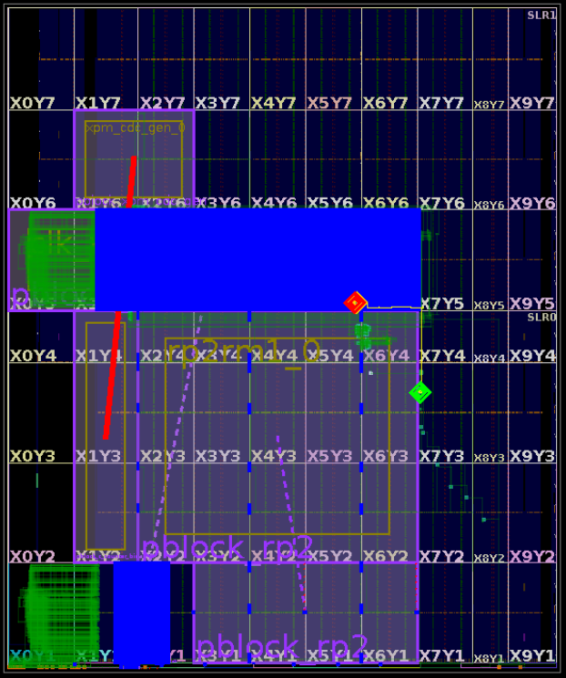
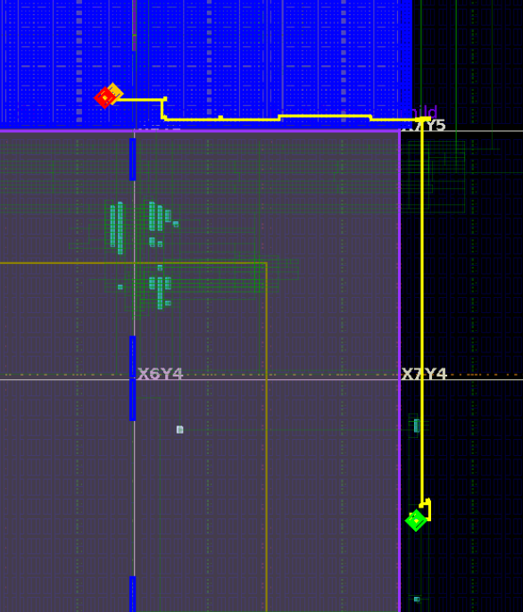

### Summary

The constraints for the guided floorplan are captured in "constr_3.xdc" under constraint set "constrs_3" and used for the "impl_GUIDE_FIX" implementation run.

Launch all implementations runs present in Design runs window:  
Run **impl_BLI_ERROR** to see the overlap DRC error during opt_design.  
Run **impl_SLL_ERROR** to fix the overlap DRC error but hit the error at route_design due to unguided disjoint Pblock.  
Run **impl_GUIDE_FIX** to fix the overlap DRC and by using a guided floorplan that completes successfully.


### Related points to note  
***Proper RP Pblock for SLL crossing***  
Below is a floorplan of an implemented design which shows the static SLR crossing nets highlighted in cyan. The SLL routing is detoured as the blue RP Pblock leaves no space for direct SLL crossing. There are derived DFX rules for Versal. 
* Static nets cannot use SLL to exit through CLE in RP
* Boundary nets cannot use SLL to exit through CLE in RP 
* Static nets can use SLL cascading through RP

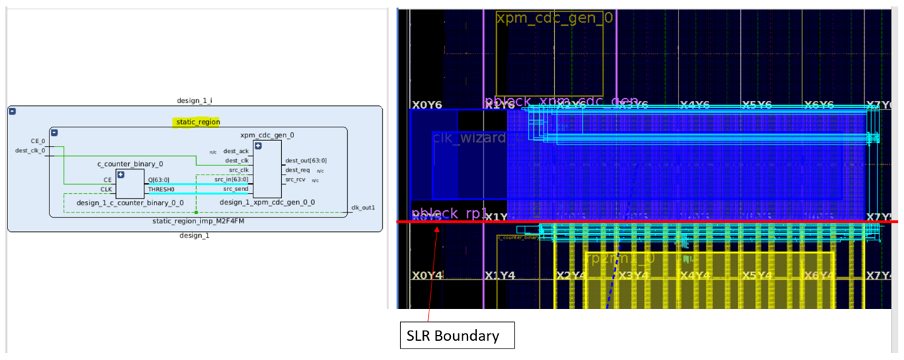

***Non-Clock net driving both Primary and Secondary region***  
In some cases, a non-clock boundary net must drive logic in both Primary and Secondary regions. For such scenarios, two separate PPLOCs are required for proper routing of the boundary net to each region. The design may initially have a single boundary pin for this boundary net. Users must split this boundary pin into two unique pins. One pin should be used by the boundary net to drive loads of the logic which is assigned to the Primary region and other for the loads in the Secondary region.

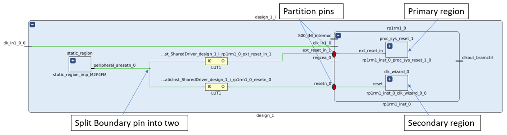

***PROHIBITS on unused XPIO sites***  
Any unused XPIO sites within an RM are tied to ground to meet silicon requirements. These tie-offs are considered static for subsequent configurations, which means these sites are unavailable for RMs in child configurations. Vivado automatically inserts prohibit constraints on the unusable sites. Therefore the recommended strategy is to build the worst case (greatest usage) scenario in the parent configuration so all subsequent RMs have equal or lesser usage. 

You can see that for HDPR-124, unused XPIOLOGIC and IOB sites present in static within I/O bank 703 are prohibited by Vivado.


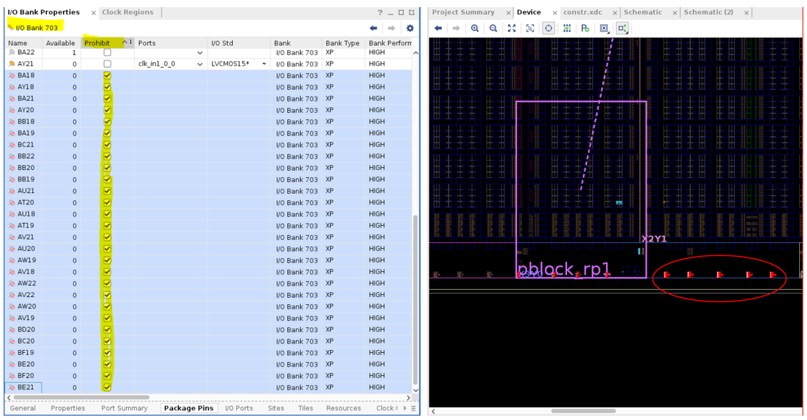

## Conclusion 
In this Lab we have covered analyzing HDPR-39 DFX DRC on BLI overlap errors and have used the `get_dfx_footprint` command to debug the errors. We have used the guided floorplan to overcome routing errors and have control over placement in Primary and Secondary regions. 


<hr class="sphinxhide"></hr>

<p class="sphinxhide" align="center"><sub>Copyright © 2020–2024 Advanced Micro Devices, Inc.</sub></p>

<p class="sphinxhide" align="center"><sup><a href="https://www.amd.com/en/corporate/copyright">Terms and Conditions</a></sup></p>
