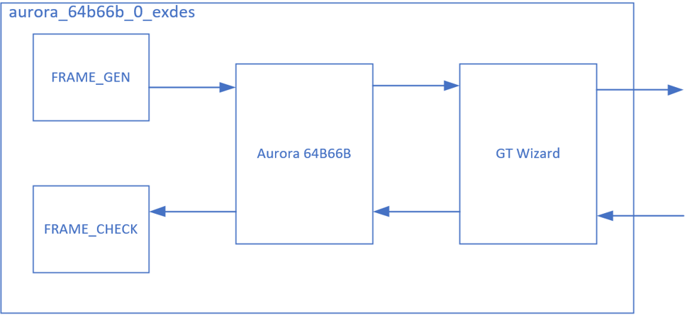
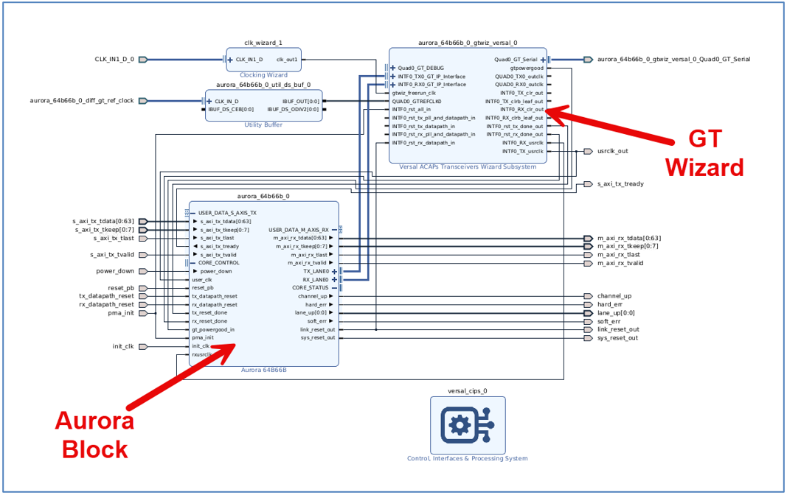
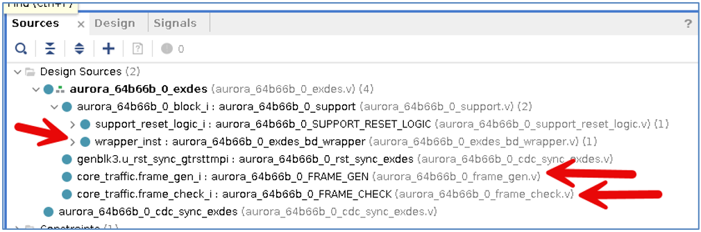
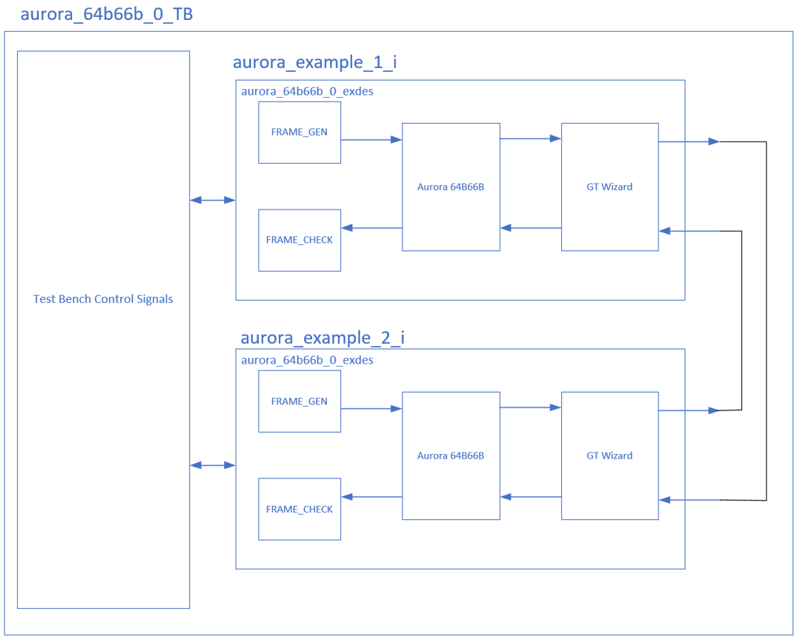
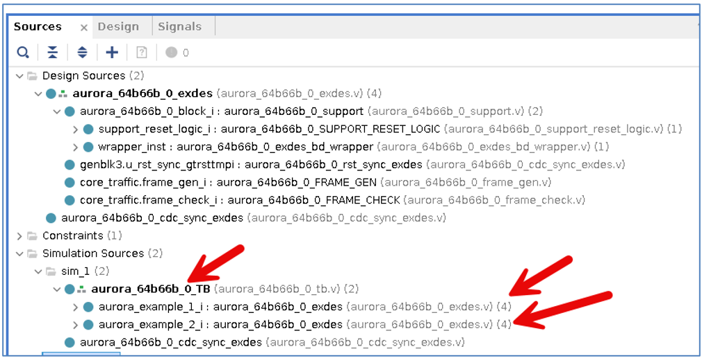
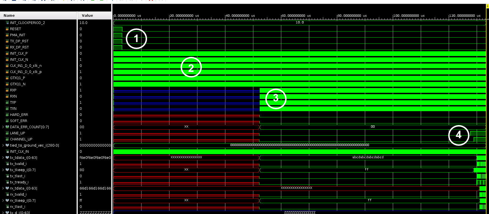
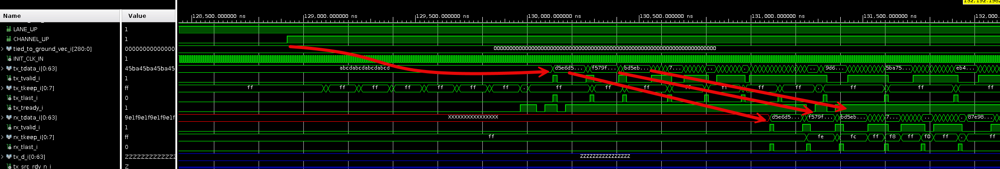
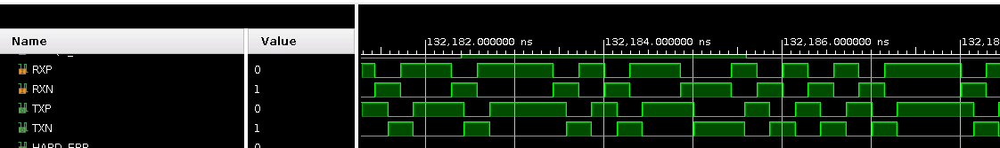
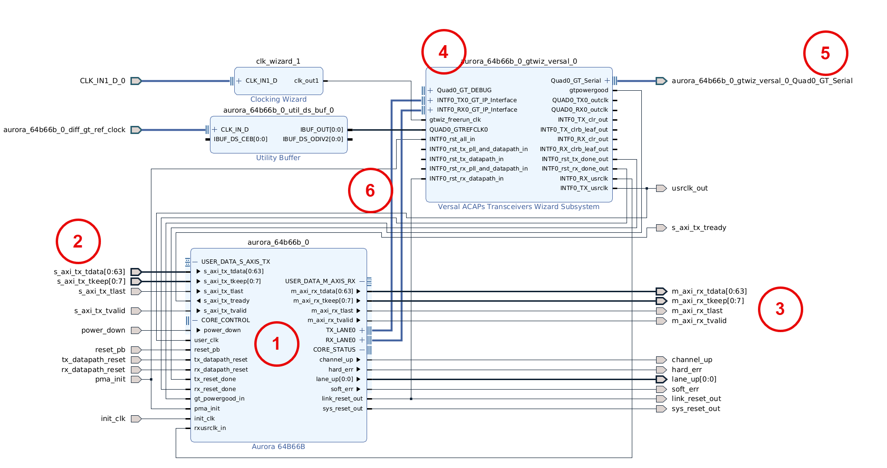

<table class="sphinxhide" width="100%">
 <tr width="100%">
    <td align="center"><h1>Versal™ Adaptive SoC High Speed Serial Tutorials</h1>
    <a href="https://www.amd.com/en/products/software/adaptive-socs-and-fpgas/vivado.html">See Vivado™ Development Environment on amd.com</a>
    </td>
 </tr>
</table>

# Aurora 64B/66B LogiCore IP Example Design Tutorial

## Introduction

This tutorial provides a high-level overview of the Aurora 64B66B IP. Please refer to [Aurora 64B/66B LogiCore IP Product Guide (PG074)](https://docs.amd.com/r/en-US/pg074-aurora-64b66b) for further lower-level detail.

## Core Overview

This tutorial describes the creation and usage of the AMD LogiCORE™ IP Aurora 64B/66B example design, including simulation.

Aurora 64B/66B is a lightweight serial communication protocol for multi-gigabit links. It facilitates data transfer between devices using one or more gigabit transceivers. Connections can be full-duplex (bi-directional data transfer) or simplex (one-directional data transfer).

The Aurora 64B/66B core supports the AMBA® protocol AXI4-Stream user interface. It implements the Aurora 64B/66B protocol using the high-speed serial gigabit transceivers and compatible with AMD Versal™, AMD UltraScale+™, AMD UltraScale™, AMD Zynq™ 7000, AMD Virtex™ 7, and AMD Kintex™ 7 devices. A single Aurora 64B/66B core instance can use up to 16 valid consecutive lanes on gigabit transceivers running at supported line rates to provide a low-cost, general-purpose, data channel with throughput from 500 Mbps to over 400 Gbps.

Aurora 64B/66B cores undergo verification for protocol compliance through automated simulation testing.

## Quick Start Example Design

The quick start instructions provide a step-by-step procedure for generating an Aurora 64B/66B core, implementing the core in hardware using the associated example design, and simulating the core with the provided demonstration test bench. For detailed information about the example design provided with the Aurora 64B/66B core, refer to the Detailed Example Design.

The quick start example design includes the following components:

1. An instance of the Aurora 64B/66B core generated using the following default parameters:
   + Full-Duplex with a single GTY transceiver
   + AXI4-Stream user interface
2. A top-level example design with an XDC file to configure the core for simple data transfer operation.
3. A demonstration test bench to simulate two instances of the example design.
4. The Aurora 64B/66B example design has been tested with the Vivado Design Suite for synthesis and the Mentor Graphics QuestaSimulator (QuestaSim) for simulation.

### Step One:  Generating the Core with Quick Start

A core instance of the Aurora 64B/66B must be created before the example design will become available.

To generate an Aurora 64B/66B core with default values using the Vivado design tools:

1. Launch the Vivado 2024.2 design tools. For guidance, refer [Vivado Design Suite User Guide: Designing with IP (UG896)](https://docs.amd.com/r/en-US/ug896-vivado-ip).
2. Under **Quick Start**, click **Create Project** and click **Next**
3. Enter a project name and location (or use default), then Click **Next**.
4. Select **RTL Project**, check **Do Not specify sources at this time**, and click **Next**.
5. Select a Versal device. For this tutorial, assume it is **xcvc1902-vsva2197-2MP-i-S**: 
a. Under **Family**, select **Versal AI Core Series**. 
b. In the **Search** field, type **xcvc1902**. 
c. Scroll down in the part list and click on **xcvc1902-vsva2197-2MP-i-S**. 
d. Click **Next**. 
6. Click **Finish**.
7. After creating the project, click **IP Catalog** in the **Project Manager** panel.
8. In the **IP Catalog** tab, search for **Aurora**, and double-click **Aurora 64B66B**.
9. In the customization window, leave all options as default and click **OK**.
10. Click **Generate** in the **Generate Output Products** window.
11. When prompted, click **OK** again.
12. Monitor the progress of core generation in the upper-right corner of the window.

### Step Two: Opening the Example Design

After generating the core, follow these steps to open the example design:

1. Double-click on **Design Sources (1)** in the **Sources** window.
2. Right-click on **aurora_64b66b_0** and select **Open IP Example Design…**.
3. In the **Open IP Example Design** dialog, leave the default options and click **OK**.
4. After a few moments, the example design will open in a new Vivado instance.

## Understanding the Example Design

The example design is composed of two main portions: Design Sources and Simulation Sources. The Design Sources consist of one Aurora example design, while the Simulation Sources contain two instances of the Aurora example design along with a test bench wrapper for simulation.

## Design Sources: Aurora Example Design Instance

The Aurora Example Design Instance (aurora_64b66b_0_exdes) comprises a combination of Block Design and Verilog components. These are detailed below, with each description indicating whether the block is implemented in Block Design, Verilog, or both.

+ A Frame Generator block (FRAME_GEN) generates frames for transmission on the TX channel (Verilog).
+ A Frame Check block (FRAME_CHECK) evaluates incoming RX data for correctness (Verilog).
+ An Aurora 64B66B IP instance interfaces with the FRAME_GEN and FRAME_CHECK blocks through a Transceivers Subsystem IP copy (Block Design).
+ Various clock, reset, and CIPs supporting block (Verilog and Block Design) (not included in the figures below)

## Simulation Sources: Aurora Example Design Instances and Test Bench

The Simulation Sources contain two instances of the Aurora Example Design, wrapped within a test bench (aurora_64b66b_0_TB) that controls input and output signals to validate the design. The two Aurora Example Design instances are looped back to each other, enabling frames generated by one instance to be validated by the other instance.

## Simulating the Example Design

A behavioral simulation can be run to understand the functionality of the Simulation Design.

1. In the **Simulation** section, right click **Run Simulation**, and select **Run Behavioral Simulation**.
2. Once prepared, the simulation waveform opens. Click **Run All** to start the simulation.
3. Zoom out to view the signals.

## Simulation Highlights

The following figures illustrate the overall system's operation, beginning from reset and proceeding until channels activate ending shortly after the channels become active and begin data transfer.

1. Reset deasserts, initiating the Aurora and transceiver blocks.
2. Free-running user clocks control system operation.
3. Data transmits as part of the linking process.
4. The Channel becomes "Up", enabling valid data transmission.

This figure shows the timing from when the channel becomes active (CHANNEL_UP) and when the AXI data begins flowing from the transmitting Aurora block (aurora_example_1_i) to the receiving Aurora block (aurora_example_2_i)

The following figure shows the encoded data looping back between **aurora_example_1_i** and **aurora_example_2_i**. The TX lines loop to the RX lines.

## Appendix: Quick Look at Aurora and GT Subsystem blocks

The following figure provides a detailed view of the Aurora 64B66B block and the Transceivers Subsystem IP Sub-system:

1. Aurora 64B66B IP Instance
2. AXI TX connections from User IP
3. AXI RX connections to User IP
4. Versal Transceiver Wizard Subsystem IP Instance
5. Serial TX and RX lines to from off-chip connections
6. TX/RX connections between the Aurora and the Transceiver Wizard Subsystem

The Aurora 64B66B IP instance (1) connects to the Transceivers Subsystem IP subsystem (4) using dedicated TX and RX pairs (6). The Aurora IP can connect up to sixteen GT channels, though in this example design, each Aurora block contains one TX and one RX pair connected to the GT subsystem. The Aurora IP in this example contains AXI transmit and receive interfaces (2 and 3) as a framing interface to connect to the user IP. The encoded transceiver signals travel off-chip to/from the transceiver subsystem through external pins (5).

## References

[1]: <https://docs.amd.com/access/sources/dita/map?isLatest=true&url=pg074-aurora-64b66b&ft:locale=en-US> "PG074"
[[1]]: Aurora 64B/66B LogiCORE IP Product Guide (PG074).

[2]: <https://docs.amd.com/access/sources/ud/document?isLatest=true&url=aurora_64b66b_ds528&ft:locale=en-US> "DS528"
[[2]]: Aurora 64B/66B v4.2 Data Sheet (DS528).

[3]: <https://docs.amd.com/access/sources/ud/document?isLatest=true&url=ds815_aurora_64b66b&ft:locale=en-US> "DS815"
[[3]]: LogiCORE IP Aurora 64B/66B v7.2 data sheet (AXI)(DS815).

[4]: <https://docs.amd.com/access/sources/ud/document?isLatest=true&url=aurora_64b66b_protocol_spec_sp011&ft:locale=en-US> "SP011"
[[4]]: Aurora 64B/66B Protocol Specification (SP011).

[5]: <https://docs.amd.com/access/sources/ud/document?isLatest=true&url=aurora_64b66b_ug237&ft:locale=en-US> "UG237"
[[5]]: Aurora 64B/66B v4.2 User Guide (UG237).

[6]: <https://docs.amd.com/access/sources/ud/document?isLatest=true&url=aurora_64b66b_gsg238&ft:locale=en-US> "UG238"
[[6]]: Aurora 64B/66B v4.1 Getting Started Guide (UG238).

[7]: <https://docs.amd.com/access/sources/ud/document?isLatest=true&url=aurora_64b66b_bfm_ug508&ft:locale=en-US> "UG508"
[[7]]: Aurora 64B/66B Bus Functional Model User Guide (UG508).

[8]: <https://docs.amd.com/access/sources/ud/document?isLatest=true&url=ug775_aurora_64b66b&ft:locale=en-US> "UG775"
[[8]]: LogiCORE IP Aurora 64B/66B v7.1 User Guide (AXI)(UG775).

Licensed under the Apache License, Version 2.0 (the "License");
you may not use this file except in compliance with the License.

You may obtain a copy of the License at

    http://www.apache.org/licenses/LICENSE-2.0

Unless required by applicable law or agreed to in writing, software distributed under the License is distributed on an "AS IS" BASIS, WITHOUT WARRANTIES OR CONDITIONS OF ANY KIND, either express or implied. See the License for the specific language governing permissions and limitations under the License.

XD306 | Copyright&copy; 2024 AMD, Inc.
