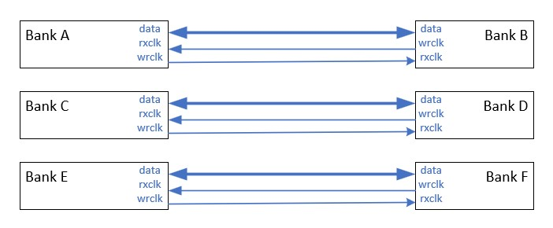
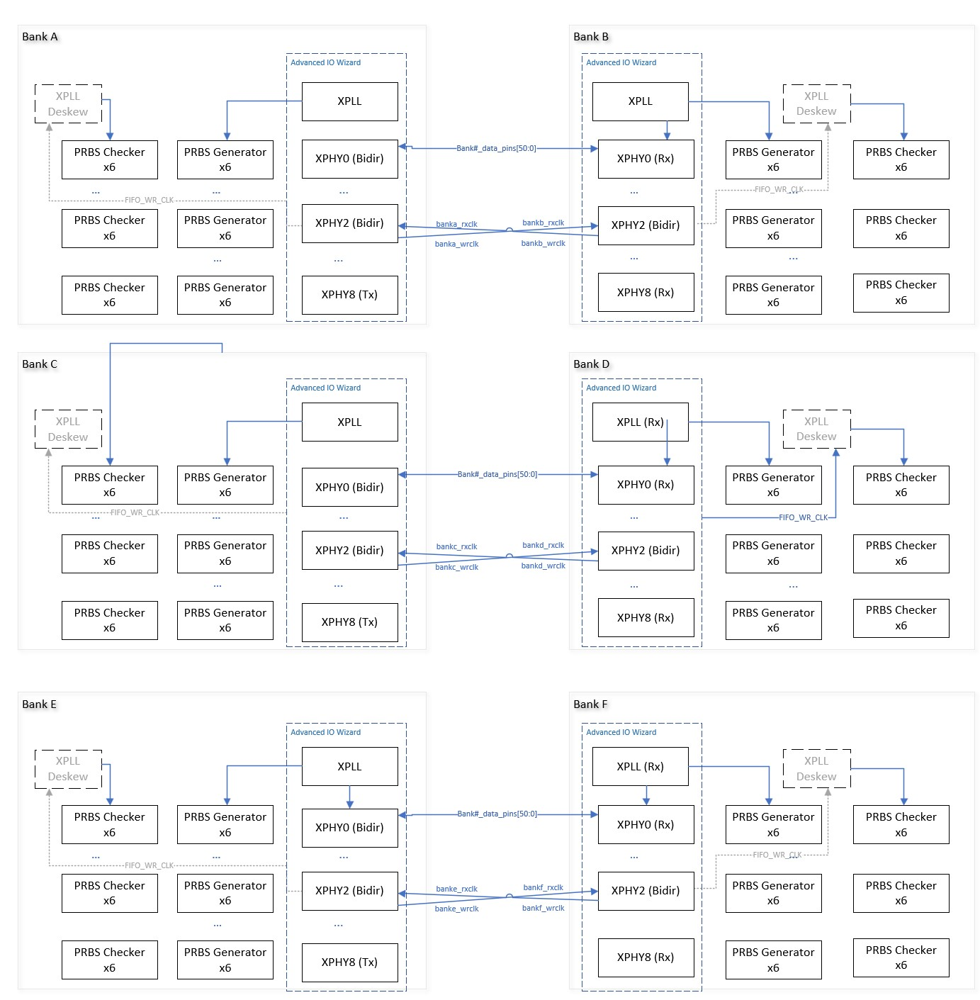
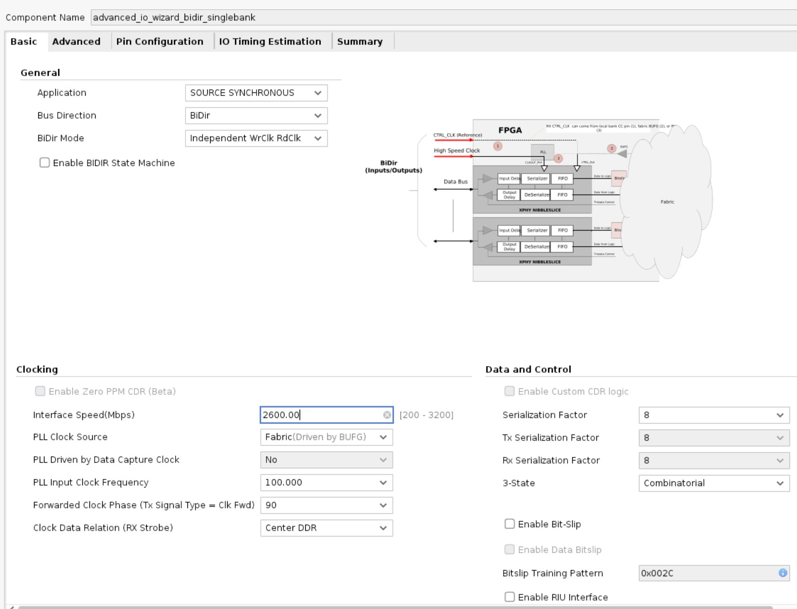
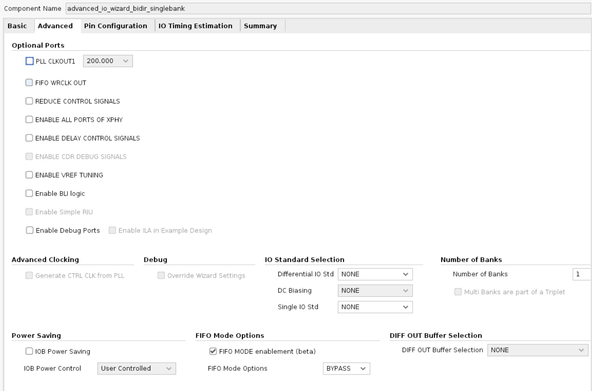
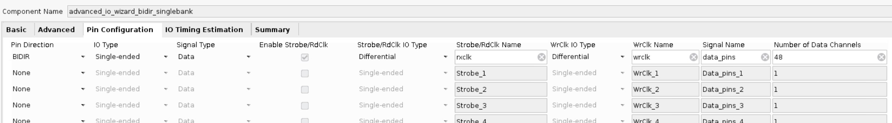
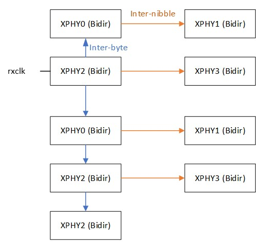
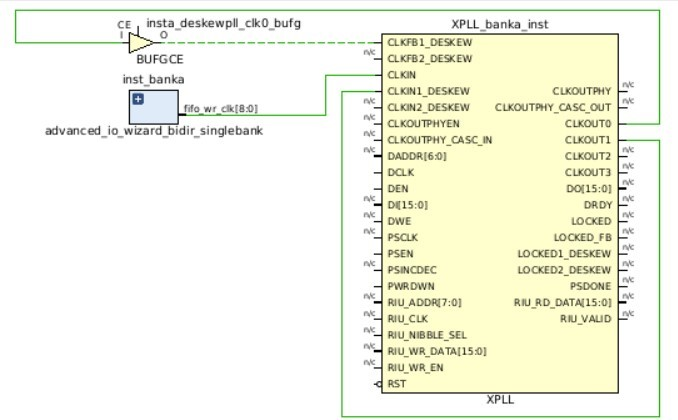
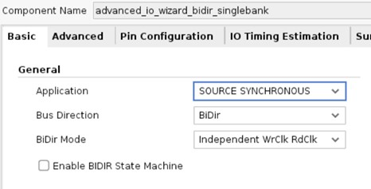
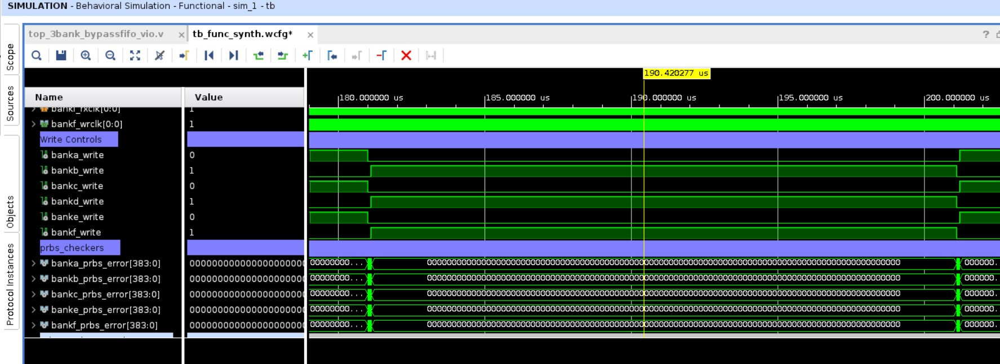

<table>
 <tr>
   <td align="center"><h1> Versal&trade; Adaptive SoCs XPHY I/O Source Synchronous Interfaces Tutorials</h1>   </td>
 </tr>
 <tr>
 <td align="center"><h1>VP1902 Emulation Tutorial - Bidirectional, Bypassed FIFO and Deskewing Tutorial</h1>
 </td>
 </tr>
</table>

## Table of Contents

- [Summary](#summary)
- [Build TCL Script](#build_tcl_script)
- [Core Setup](#core_setup)
- [Detailed Tx Description](#detailed_tx_description)
- [Detailed Rx Description](#detailed_rx_description)
- [Simulation](#simulation)

<h1>VP1902 Multi-Bank Source Synchronous Bidirectional Low Latency FIFO Bypass Design</h1>
<h2>Summary</h2>

As devices get larger, such as the VP1902, sending data between devices can be a challenge. This VP1902 emulation example design shows how the Advanced IO Wizard can be used for multibank designs for sending data between two different devices. The purpose of this tutorial is to show how the design can be setup and simulated. The main goals of the design are:

<ul>
 <li> Low latency uses FIFO_MODE = BYPASS and PLL with digital deskew
 </li>
 <li> Bidirectional data
 </li>
 <li> Multi-bank communication
 </li>
 <li> Need for deskew and constant clock
 </li>
</ul>

AMD Vivado&trade; 2024.1 is used for building a project, simualtion, and timing analysis. PDI generation is not supported.  

To represent two different devices, six banks are divided into two groups of three banks each. Banks A, C, and E represent one device and communicate to another device represented as banks B, D, F. 

 

For simulation purposes, PRBS generators provide a test pattern that is then checked using PRBS checkers.  

 

<h2>Build TCL Script</h2>

The design is built by single bank Advanced IO Wizard cores to allow for scaling.

A Tcl script has been provided to simplify the creation of the cores. In the TCL console, change directories to the location of ``github_tutorial_xcvp1902vsva6865.tcl`` and then source the script.

 ``source github_tutorial_xcvp1902vsva6865.tcl``

The TCL script automatically creates a project. The following cores are also automatically created: 

<ul>
<li> Advanced IO Wizard for Bidirectional Single Bank </li>
<li> VIO cores for simulation purposes </li>
<li> Block Design  </li>
</ul>

<h2>Core Setup</h2>

The design is built by single bank Advanced IO Wizard cores to allow for scaling.

**Basic Tab**:

- **Bus Direction** = Bidir

- **BiDir Mode** = **Independent WrClk RdClk** Continuous RdClk needed for XPLL

- **Number of Banks** = **1** for scaling purposes

  
 

  **Advanced Tab**:

- **FIFO MODE enablement** = Checked

- **FIFO Mode Options** = BYPASS

 

**Pin Configuration Tab**:

- Set **RdClk/WrClk/Signal** Name as follows

- **I/O Type** = Single-Ended

- **Pin Direction** = BIDIR

- **Strobe/RdClk IO Type** = Differential

- **Strobe/RdClk Name** = rxclk

- **WrClk IO Type** = Differential

- **WrClk Name** = wrclk

- **Signal Name** = data_pins

- **Number of Data Channels** = 48 

 

<h2>Detailed Tx Description</h2>

In the reference design, the transmitting BIDIR core sends out the transmit clock via the WrClk pins. The transmit clock is generated by feeding the pattern 01010101 to the clock forwarding pins. Data in this design is generated using the PRBS generator. The data generated by the PRBS generator is fed into the transmitting BIDIR core from the programmable logic, which follows the TX datapath through a serializer and output delay within the PHY. The serializer supports 8:1, 4:1, and 2:1 serialization. In the design, an 8:1 serialization factor is used. The data is transmitted through the BIDIR data pins of the core. To understand the data flow operation inside the transmitting BIDIR core, see [Versal Adaptive SoC SelectIO Resources Architecture Manual(AM010)](https://docs.amd.com/r/en-US/am010-versal-selectio).

The input clock (bank0_pll_clkin port) for the PLL in the transmitting BIDIR core comes from clk/clk_n differential input for all of the cores. Each bank contains a WrClk, which is centered to the data pattern using the TX_OUTPUT_PHASE_90_#=TRUE.

<h2>Detailed Rx Description</h2>

To reduce the receiver latency, the FIFO in the receiver side of the XPHY is bypassed by setting **FIFO_MODE_# = BYPASS**.

Normally, the Advanced IO Wizard designs use the FIFO, which allows a FIFO_RD_CLK to be supplied that can be provided by a known clock source such as the XPLL. If the data is read directly from the deserializer, the capture clock (Strobe/RdClk) derives the clocks used for capturing the data. Conceptually, FIFO_WR_CLK is related to this Strobe/RdClk and is the divided down version of the capture clock. As the inter-clock and inter-byte clocking is used for routing the Strobe to the different XPHYs, FIFO_WR_CLK also routes through one or more XPHYs.

As constructed, the FIFO_WR_CLK enters XPHY[2] (nibble 2) and forwards the strobe to all of the other XPHYs using inter-nibble and inter-byte clocking. For timing analysis, the source clock propagates through the different XPHYs as needed.

 

Each XPHY’s FIFO_WR_CLK is therefore different. 
 

 
While the FIFO_WR_CLK does route to clock buffers, using an XPLL helps deskew some of the routing delays to fine tune performance. Using this circuitry,
 

As a result of using the XPLL, the clock source must be continuous. Otherwise, the PLL needs to relock, which might also cause problems for the deskew logic. For a bidirectional interface, this means that the capture clock (Strobe/RdClk) must be constant. 

From the Advanced IO Wizard, the bidirectional interface is setup using an independent WrClk RdClk. 

WrClk needs to be configured to always be driving out and RdClk needs to be configured as always reading. With this configuration, this requires the 3-State = Combinatorial. 

Combinatorial means that the T[5:0] inputs control tri-state controls for each bitslice. For the XPHY, the **TBYTE_CTL_<0-5> =T**.

If 3-State=Serialized option is selected, XPHY uses the internal tri-state serializer and the PHY_WREN[3:0] ports for the tri-state controls. PHY_WREN[3:0] controls the serialized tri-state for all of the bitslices within a given XPHY where **TBYTE_CTL = PHY_WREN**.

<h2>Simulation</h2>

The tutorial includes a testbench, which controls bank#_write to change bus directions. Use the simulation and run 250 uS.

 

