<table class="sphinxhide" width="100%">
 <tr width="100%">
    <td align="center"><h1>Versal™ NoC2 and DDRMC5 Design Tutorials</h1>
    <a href="https://www.amd.com/en/products/software/adaptive-socs-and-fpgas/vivado.html">See Vivado™ Development Environment on amd.com</a>
    </td>
 </tr>
</table>

# Introduction to NoC2 and DDRMC5

***Version: Vivado 2025.1***

This tutorial introduces the programmable network on chip (NoC2) and integrated DDR5/LPDDR5/5X memory controller	
 (DDRMC5) in the latest generation of Versal devices.  We point out differences relative to the original NoC and DDRMC IP.  This tutorial assumes that you've completed the NoC Design Flows - [IPI Design Flows](../../NoC_Design_Flows/IPI) tutorials.  You will start with a basic design, walking through the design entry flow, and learning about new features in the NoC and DDR memory controllers.  You will simulate the design to measure performance, and then work through a couple of design iterations to illustrate the benefit of two new design features.  In an upcoming version of this tutorial, you will learn more about performance tuning, and you will modify the simulated design to work in hardware, then build the design and run it on hardware.  

## Description of the Design

This design uses one [Performance AXI Traffic Generator](https://www.amd.com/en/products/adaptive-socs-and-fpgas/intellectual-property/perf-axi-tg-spec.html) (TG) and one AXI NoC2 instance, with two interleaved 2x16 LPDDR5 memory controller blocks.  The TG writes then reads 256-byte transactions with a linear addressing pattern.  The NoC interleaves the traffic across the four 16-bit memory channels.

The design process consists of the following phases:
1.	Build an initial version of the design using Designer Assistance
2.  Walk through the NoC2/DDRMC5 configuration screens to see what's new.
3.  Configure the TG to generate the desired traffic pattern
4.	Simulate to establish a performance baseline.
5.	Modify the design and resimulate to illustrate relaxed write ordering.

## Building the Initial Design

1.	As described in the earlier tutorials, create a new project with the **xcvm2152-nfvd1024-2HP-i-S** part, and create a new block design.
2.	Add one **AXI NoC2** instance, and run block automation, with the following settings:
    *   Processing System Wizard: Unchecked   
        * **Note:** Previously called Control, Interface and Processing System
    *	AXI Traffic Generator: 1
    *	External Sources: None
    *	AXI BRAM Controller: None
    *   LPDDR5 Memory Controller: Checked
    *   Number of Interleaved Memory Controllers: 2
    *	AXI Performance Monitor for PL-2-NOC AXI-MM pins: Checked
    *   AXI Clk Source: New/Reuse Simulation Clock and Reset Generator
3.	Run Connection Automation twice, selecting **All Automation** both times.
4.	Regenerate the layout.

The resultant design looks like this.
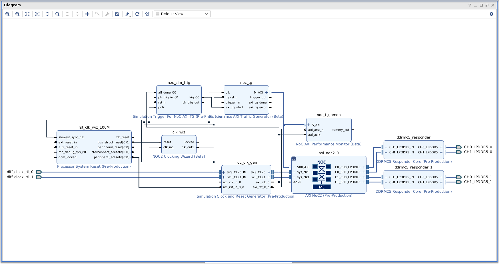

## Walk-through of New NoC2/DDRMC5 Features and Configuration

Double-click on the **axi_noc2_0** instance to edit its properties.
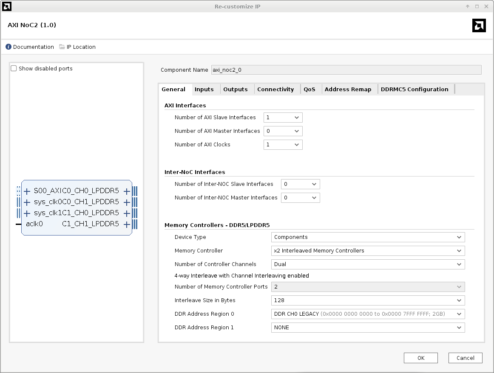

The **General** tab now has new choices to configure the DDR5/LPDDR5/5X memory controllers (DDRMC5).  AXI NoC supported DDR4, LPDDR4, and LPDDR4X.  AXI NoC2 now supports DDR5, LPDDR5, and LPDDR5X.  AXI NoC supported up to 4-way interleaving of memory controllers.  Each memory controller was also able to support 2-way channel interleaving within the controller.  In AXI NoC2, all the interleaving is done within the NoC master units (NMUs).  AXI NoC2 supports up to 8-way interleaving, and the minimum interleave size has been reduced to 64 bytes.  These differences are summarized in the following table.

| Feature                   | AXI NoC             | AXI NoC2            |
| ------------------------- | ------------------- | ------------------- |
| Memory Types              | DDR4/LPDDR4/LPDDR4x | DDR5/LPDDR5/LPDDR5x |
| NoC Interleave            | 4-way               | 8-way               |
| Memory Channel Interleave | In DDRMC            | In NMU              |
| Minimum Interleave Size   | 128 byte            | 64 byte             |

Leave the settings on the **General** tab unchanged.

Select the **QoS** tab, and check the **Advanced** box.
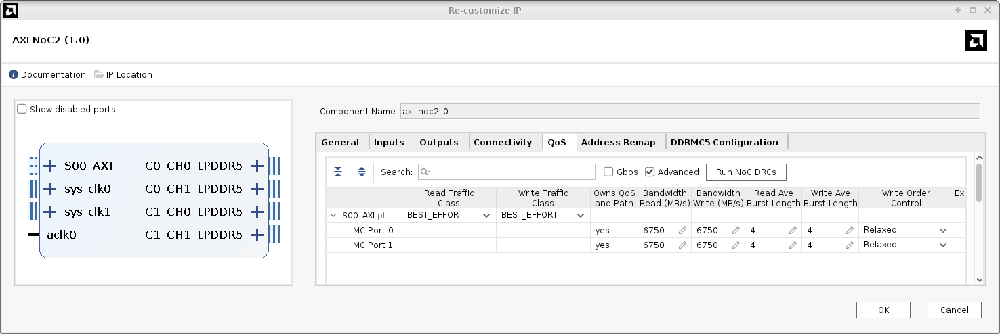
Set **Bandwidth Read** and **Bandwidth Write** to **6750**.  Take note of the new **Write Order Control** setting.  AXI NoC2 now defaults to **Relaxed** write order control, while AXI NoC only supported **Strict** ordering.  This new feature improves throughput of write traffic that would have previously been hampered by the [Single-Slave per ID Rule](https://docs.amd.com/r/en-US/pg406-network-on-chip/The-Single-Slave-per-ID-Rule) (SSID).  Later in this tutorial you will see more about this improvement, but for now leave this setting unchanged.

Select the **DDRMC5 Configuration** tab.
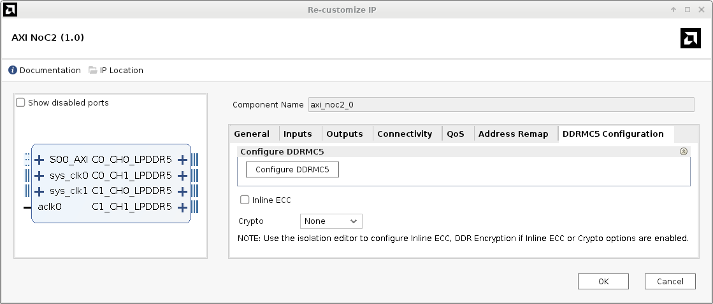
In AXI NoC, all the memory controller configuration was completed in tabs on the AXI NoC configuration dialog.  AXI NoC2 has moved these to a separate configuration window which is accessed by clicking the **Configure DDRMC5** button on this tab.  Notice two other new options on this tab.  DDRMC5 has two new features.  Where DDRMC only supported side-band ECC, DDRMC5 supports inline ECC for all memory types, or side-band ECC for DDR5.  Also, some versions of DDRMC5 support AES-XTS and AES-GCM encryption.  These features will be covered in other tutorials, so for now, don't select either one.  If you use either feature, you must check the box on this dialog, and you must also use the advanced configuration editor (ACE) to enable/configure the feature.

Click the **Configure DDRMC5** button.

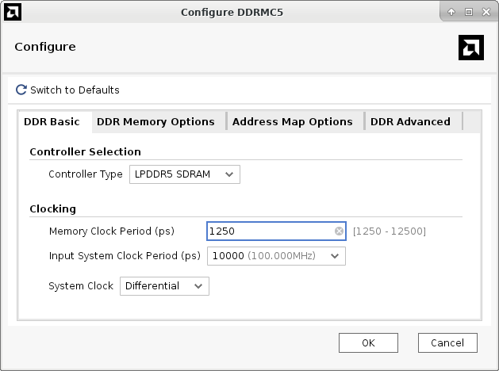

A separate dialog window opens, with the **DDR Basic** tab selected.  As before, the **DDR Basic** tab allows you to set **Memory Clock Period** and **Input System Clock Period**.  This is also the dialog where you can select between LPDDR5 and DDR5.  Keep in mind the **Controller Type** choices depend on selections in the NoC **General** tab.  For example, if you selected DIMMs as the **Device Type**, you cannot select LPDDR5 on the **DDR Basic** tab.

Select the **DDR Memory Options** tab.

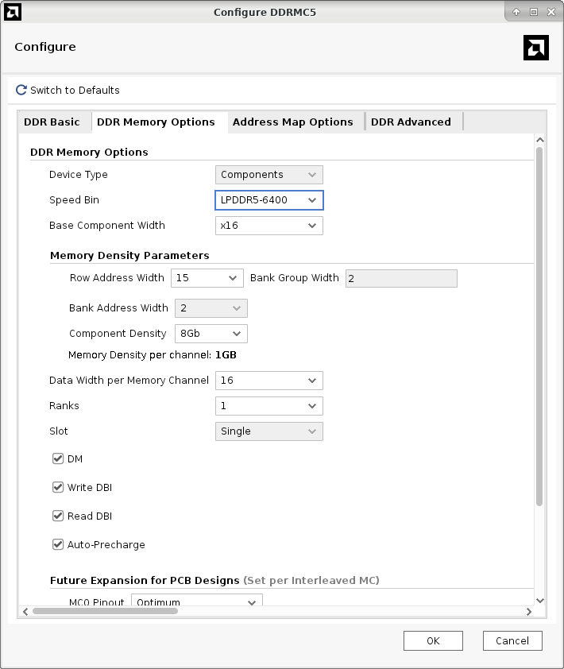

Take note of a new feature in DDRMC5.  The memory controller now supports **Auto-Precharge**, a feature which improves efficiency of random address pattern memory accesses.  Auto-precharge is enabled by default for LPDDR5 traffic.  In a future revision of this tutorial you will see more about this feature, but for now leave this setting unchanged.

Click **OK** to exit the **Configure DDRMC5** dialog, and then click **OK** to exit the AXI NoC2 configuration.

## Configuring the Traffic Generator

Double-click the **noc_tg** instance to edit the Performance AXI Traffic Generator configuration.
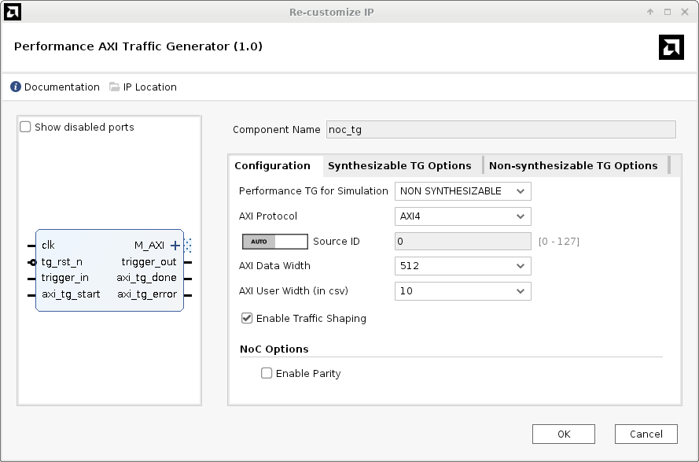

Set **Performance TG for Simulation** to **NON SYNTHESIZABLE**, and then select the **Non-synthesizable TG Options** tab.
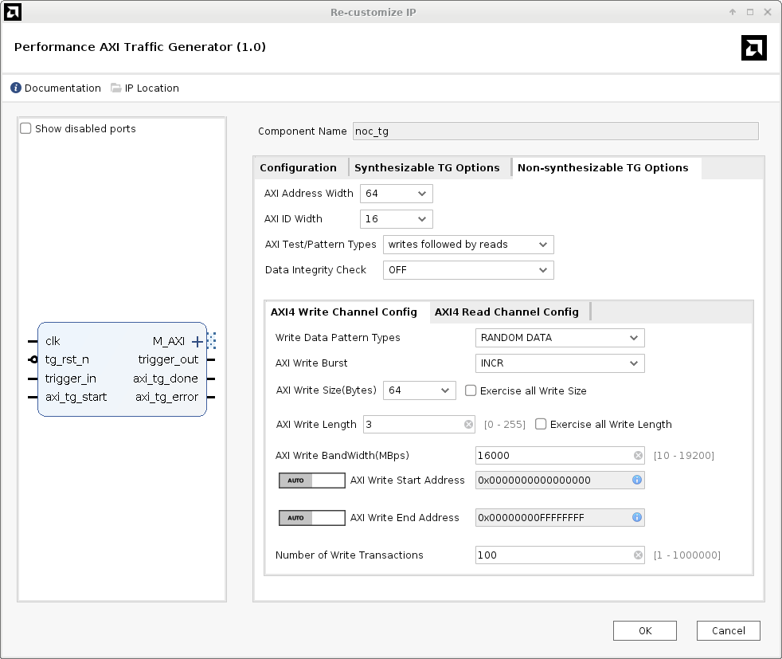

Set **AXI Test/Pattern Types** to **writes followed by reads**.  On the **AXI4 Write Channel Config** tab, set **AXI Write Length** to **3**, and set **AXI Write BandWidth(MBps)** to ***16000***.

Select the **AXI4 Read Channel Config** tab.
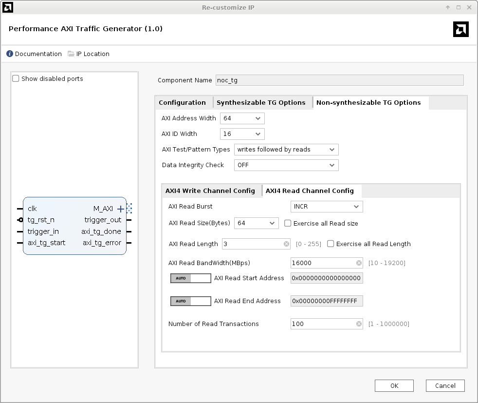

Set **AXI Read Length** to **3**, and set **AXI Read BandWidth(MBps)** to **16000**.

Click **OK** to dismiss the Performance AXI Traffic Generator dialog.

## Simulating the Initial Design

Select the **Address Editor** tab and **Assign All** addresses.  Validate the design.  The resultant NoC solution looks like this.

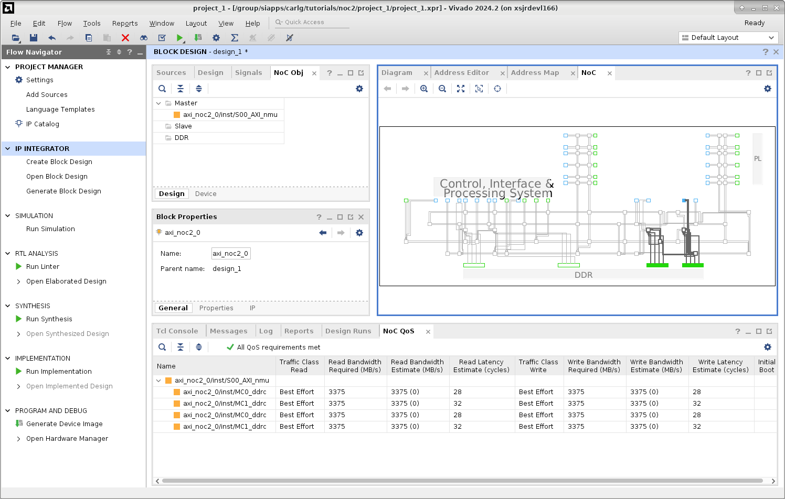

Compared to previous Versal devices, NoC2 added boundary logic interface (BLI) NMUs at the bottom of the device, close to the memory controllers.  You can see the NoC compiler used one of these to connect the Performance AXI Traffic Generator to the DDRMC5s.  These NMUs provide a more direct path from PL to memory, bypassing the vertical NoC (VNoC) lanes.

As explained in earlier tutorials, create an HDL wrapper, mark the bus from the TG to the NoC for simulation, run a behavioral simulation, and run all.

After a short time the simulation completes.  The simulation waveform looks like this:

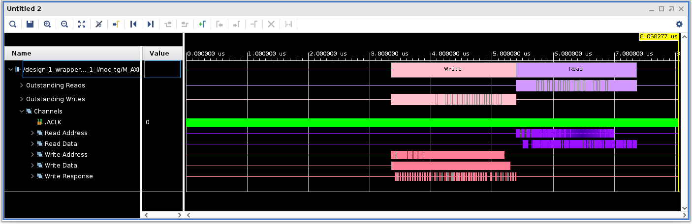

In the Tcl Console, you can see the bandwidth achieved in this simulation:

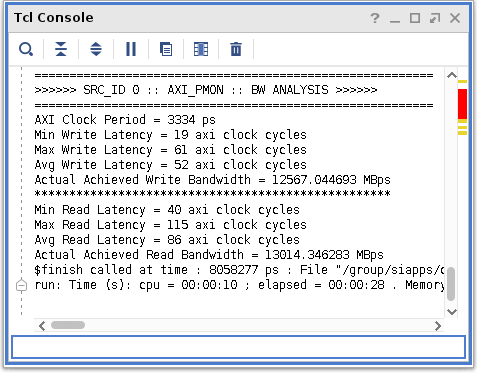

## Relaxed Write Ordering

As explained in PG313, [Write Response Tracker (Single Slave per AXI ID)](https://docs.amd.com/r/en-US/pg313-network-on-chip/Write-Response-Tracker-Single-Slave-per-AXI-ID), previous Versal devices enforced strict write ordering.  NoC2 gives additional write ordering options, and the default is relaxed write ordering.  Strict write ordering adversely affects the throughput of write traffic from a single NMU to multiple interleaved memory controllers, especially if the write burst size exceeds the interleave size.  In that case, the NMU chops the burst into multiple smaller bursts equal to the interleave size.  The first chop is sent to the first DDRMC, but because of strict ordering, the second chop cannot be sent until the write response is received from the first chop.  This introduces bubbles of dead time into the overall write burst.  With relaxed write ordering, all of the chopped burst portions can be sent, one after the other, without waiting for write response for each portion.  This way, parallel DDRMCs can respond in parallel, and the transaction completes sooner.

To illustrate this point, modify the design to choose strict write ordering.  Double click the **axi_noc2_0** instance, select the **QoS** tab, click the **Advanced** button, and change **Write Order Control** to **Strict**.

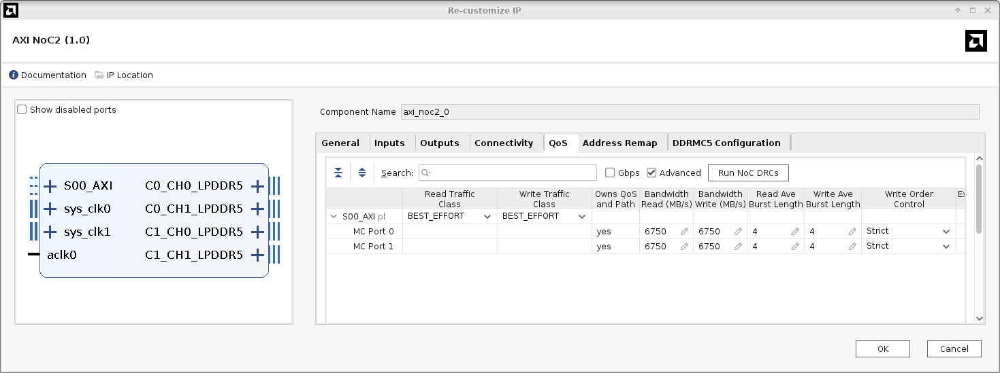

Now rerun the simulation and look at the resultant waveform and bandwidth report.

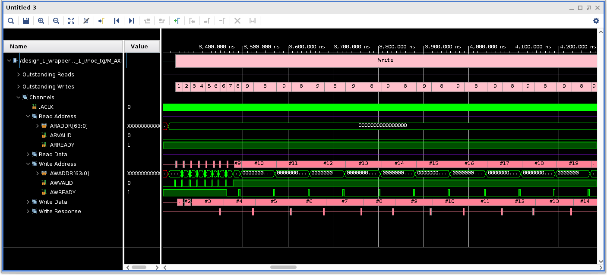

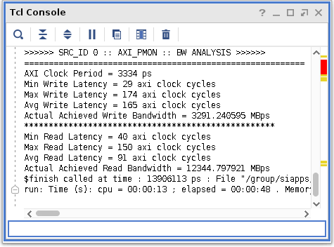

With strict write ordering, the achieved write bandwidth has dropped from 12,567 MBps to just 3,291 MBps.

## Summary

In this tutorial you were introduced to the new features of the NoC2 and DDRMC5 IP.  You learned about changes in the IP configuration process relative to NoC/DDRMC.  You also explored the relaxed write ordering feature and its impact on performance.

In a future revision of this tutorial, we will learn about performance optimization with NoC2 and DDRMC5.

Copyright © 2025 Advanced Micro Devices, Inc.

<a href="https://www.amd.com/en/corporate/copyright">Terms and Conditions</a>

