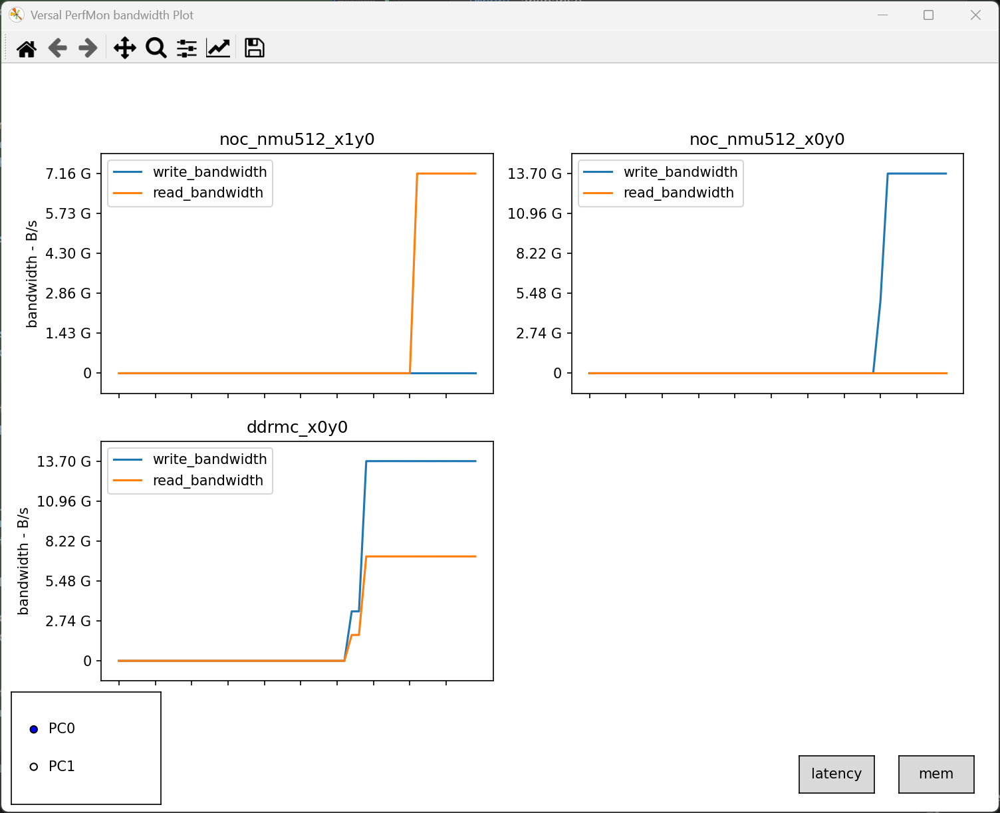
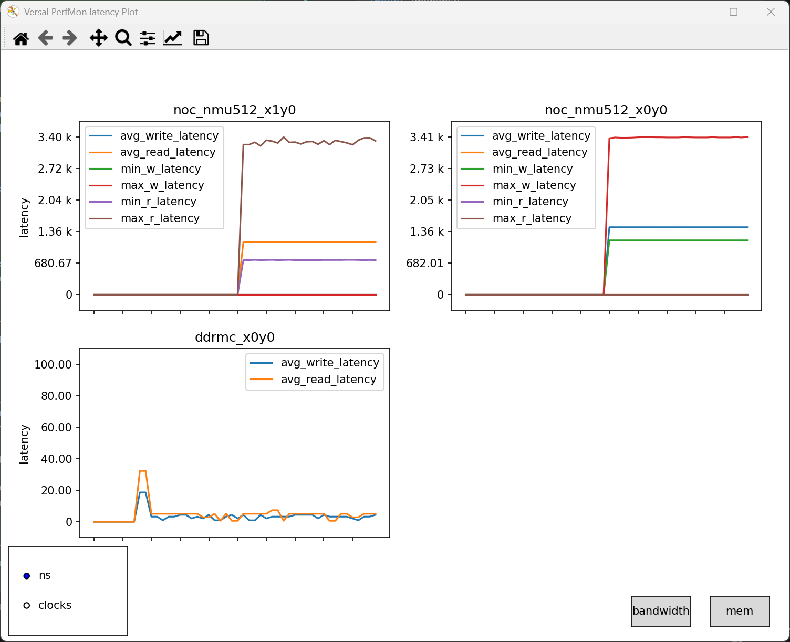
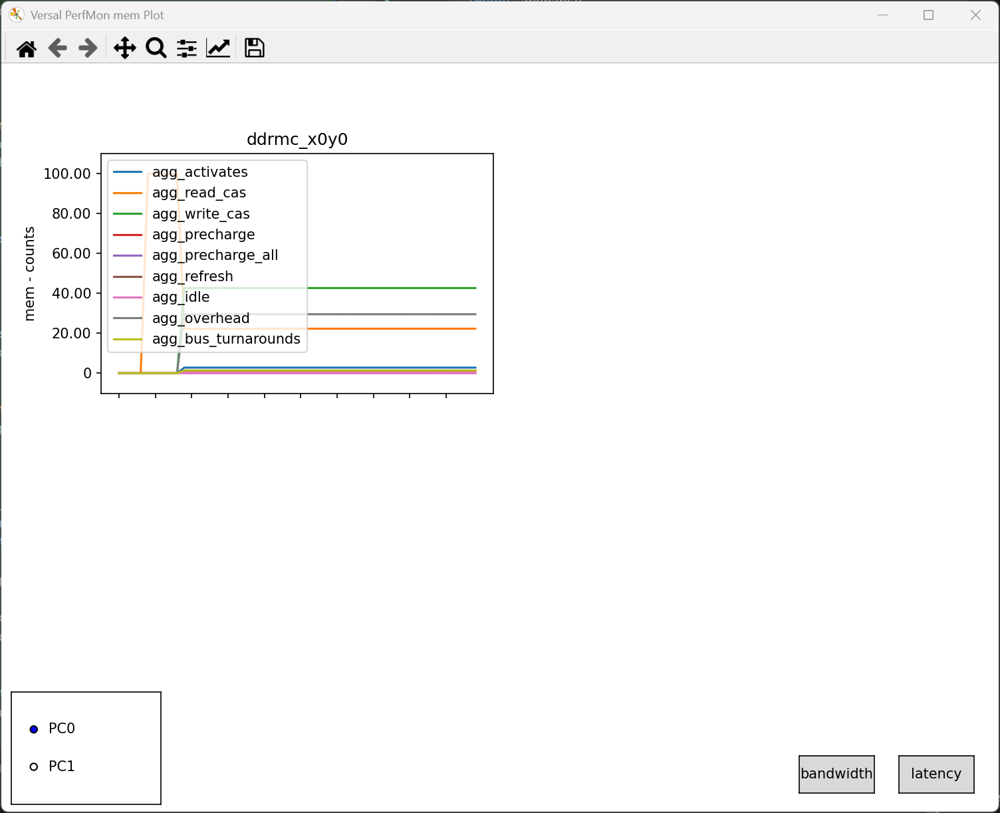

<table class="sphinxhide" width="100%">
 <tr width="100%">
    <td align="center"><h1>Versal™ NoC/DDRMC Design Tutorials</h1>
    <a href="https://www.amd.com/en/products/software/adaptive-socs-and-fpgas/vivado.html">See Vivado™ Development Environment on amd.com</a>
    </td>
 </tr>
</table>

# Performance Measurement using ChipScoPy

***Version: Vivado 2025.2***

## Introduction

This tutorial shows how to use [ChipScoPy](https://xilinx.github.io/chipscopy/) to measure programmable network on chip (NoC) and DDR memory controller (DDRMC) performance on Versal™ adaptive SoC hardware. ChipScoPy is a standalone Python package that does **not** require the full Vivado™ IDE. This provides a higher-level alternative to the register-based approach described in the [Performance Measurement using NoC/DDRMC Performance Monitors](../Performance_Measurement_Using_NoC_DDRMC_Performance_Monitors) tutorial.

Where the register-based tutorial requires manually unlocking NoC programming interface (NPI) registers, configuring timebases, reading counters, and calculating bandwidth with Tcl scripts or C code, ChipScoPy's **NoC PerfMon** feature automates all of that. It handles register setup, data capture, bandwidth calculation, and provides a real-time graphical display — all from a Python script or Jupyter Notebook.

## Background: How NoC PerfMon Works Under the Hood

ChipScoPy's NoC PerfMon leverages the same hardware performance monitors described in the [Performance Measurement using NoC/DDRMC Performance Monitors](../Performance_Measurement_Using_NoC_DDRMC_Performance_Monitors) tutorial. Understanding what happens at the register level is useful context for interpreting the ChipScoPy results.

The NoC contains performance monitors at multiple points in the data path:

- **NMU/NSU Performance Monitors** — Located at each NoC Master Unit (NMU) and NoC Slave Unit (NSU). These monitors count bursts, bytes, and latency in the NPI clock domain. Each NMU/NSU has two monitors (one typically used for reads, one for writes).

- **Memory Controller NoC Agent Performance Monitors** — Located at the NSU ports inside each memory controller. The number of NoC agent ports varies by controller type: DDRMC (DDR4/LPDDR4/4X) has four NSU ports per MC, DDRMC5 (DDR5/LPDDR5/5X) has two NSU ports per MC, and HBM_MC has four HBM_NSU ports per MC (two per pseudo channel). Each port has two monitors operating in the NoC clock domain, tracking traffic entering the controller.

- **Memory Controller Main Performance Monitors** — Located inside the memory controller itself. For DDRMC/DDRMC5, nine counters per channel are clocked on the MC clock and count various DRAM commands (Activate, Read CAS, Write CAS, Precharge, Precharge All, Refresh) plus controller efficiency metrics (queue-empty cycles, overhead cycles, and bus turnaround events), providing visibility into actual memory bus utilization. ChipScoPy reads all nine and displays them as a percentage of total operations on the **mem** plot. For HBM_MC, similar counters track HBM channel activity.

When you call `noc.configure_monitors()` in ChipScoPy, the library:

1. Unlocks the NPI register write protection (PCSR Lock) for each node
2. Configures the timebase registers for the appropriate clock domain
3. Sets up traffic class filters (e.g., Best Effort Read/Write)
4. Enables the monitors
5. Periodically reads the counter registers and computes bandwidth

The `NoCPerfMonNodeListener` then receives the computed metrics and the `MeasurementPlot` renders them in a real-time matplotlib GUI — replacing hundreds of lines of Tcl/C code with a few Python calls.

## Pre-requisites

- A Versal adaptive SoC board (e.g., VCK190, VEK280, VHK158, or VMK180) with a hardware debug connection (Platform Cable USB II, SmartLynq Data Cable, or SmartLynq+ Module)
- Vivado™ 2025.2 or Vivado Lab Edition 2025.2 — ChipScoPy itself does not require the full Vivado IDE, but it needs `hw_server` and `cs_server` running on the machine connected to the board. Vivado Lab Edition is a compact install that includes both.
- Python 3.10 or greater
- Completion of the [Performance Tuning](../Performance_Tuning) tutorial, or any Vivado design with an active NoC

## Step 1: Install Python

You need a Python 3.10+ interpreter. Choose one of the following options.

### Option A: Install from python.org (Recommended)

Download and install Python from [https://www.python.org/downloads/](https://www.python.org/downloads/).

> **Important:** Check the box to **add Python to the PATH** during installation.

### Option B: Use the Vivado-Distributed Python

Beginning in 2025.1, the Vivado installer includes Python 3.13. The location depends on your OS:

**Linux:**
```bash
export PATH=/opt/xilinx/Vivado/2025.2/tps/lnx64/python-3.13.0/bin:$PATH
export LD_LIBRARY_PATH=/opt/xilinx/Vivado/2025.2/tps/lnx64/python-3.13.0/lib:$LD_LIBRARY_PATH
```

**Windows:**

Add the following to your `%PATH%` environment variable (path will vary by Vivado installation):
```
C:\Xilinx\Vivado\2025.2\tps\win64\python-3.13.0
```

> **Note:** Install Python via only one method. Do not install multiple Python versions from different sources.

## Step 2: Set Up a Virtual Environment

A virtual environment isolates ChipScoPy and its dependencies from other Python installations on your system.

**Create the virtual environment:**
```
python -m venv venv
```

**Activate the virtual environment:**

Linux:
```bash
source venv/bin/activate
```

Windows:
```powershell
venv\Scripts\Activate
```

> **Note:** You must re-activate the virtual environment each time you open a new terminal.

**Update pip (if prompted):**
```
python -m pip install --upgrade pip
```

## Step 3: Install ChipScoPy

With the virtual environment active, install ChipScoPy:

```
python -m pip install chipscopy
```

To install a specific version matching your Vivado installation:

Linux:
```bash
python -m pip install 'chipscopy==2025.2.*'
```

Windows:
```powershell
python -m pip install chipscopy==2025.2.*
```

## Step 4: Install Dependencies

The NoC PerfMon example requires additional packages for plotting and Jupyter Notebook support:

```
python -m pip install chipscopy[core-addons]
python -m pip install chipscopy[jupyter]
```

## Step 5: Install ChipScoPy Examples

ChipScoPy provides example scripts and pre-built designs. Install them by running:

```
chipscopy-get-examples
```

This creates a `chipscopy-examples` directory with the following structure relevant to this tutorial:

```
chipscopy-examples/
├── designs/
│   ├── vck190/production/chipscopy_ced/    # Pre-built design files (.pdi, .ltx)
│   ├── vek280/production/chipscopy_ced/
│   ├── vhk158/production/chipscopy_ced/
│   └── vmk180/production/chipscopy_ced/
├── noc_perfmon/
│   ├── noc_perfmon.py                      # Full NoC PerfMon example with GUI
│   ├── noc_perfmon.ipynb                   # Jupyter Notebook version
│   ├── noc_perfmon_basic.py                # Basic example (no GUI, console output)
│   ├── noc_perfmon_basic.ipynb
│   ├── sptg_example.py                    # Example using Soft Programmable TG
│   └── sptg_example.ipynb
└── ...
```

The `designs/` folder contains pre-built Configurable Example Designs (CEDs) with PDI (device image) and LTX (probes) files for supported boards. The `noc_perfmon/` folder contains the Python scripts and Jupyter Notebooks we will use in this tutorial.

## Step 6: Start hw_server and cs_server

The ChipScoPy API communicates with the hardware through two server processes that ship with Vivado (or Vivado Lab Edition):

- **hw_server** — Manages the JTAG connection to the device
- **cs_server** — Translates high-level ChipScope debug requests into register-level operations

Start each server in a separate terminal:

```
hw_server
```

```
cs_server
```

Take note of the ports reported by each server. The defaults are:
- `hw_server`: TCP port 3121
- `cs_server`: TCP port 3042

> **Note:** The hw_server and cs_server must be running on a machine that has a physical debug connection to the Versal board. The Python client can run on the same or a different machine.

## Step 7: Run the NoC PerfMon Example

> **Note:** This step runs the default example. In the next section, we will modify the example to facilitate running with user designs.

Navigate to the `noc_perfmon` directory inside `chipscopy-examples`:

```
cd chipscopy-examples/noc_perfmon
```

### Option A: Run as a Python Script

```
python noc_perfmon.py
```

### Option B: Run as a Jupyter Notebook

```
jupyter notebook noc_perfmon.ipynb
```

### What the Example Does

The `noc_perfmon.py` example walks through the following steps:

**1. Initialize and connect to servers**

```python
CS_URL = os.getenv("CS_SERVER_URL", "TCP:localhost:3042")
HW_URL = os.getenv("HW_SERVER_URL", "TCP:localhost:3121")

session = create_session(cs_server_url=CS_URL, hw_server_url=HW_URL)
```

If your servers are running on a remote machine, set the `CS_SERVER_URL` and `HW_SERVER_URL` environment variables, or modify these values directly in the script.

**2. Program the device**

The example uses the pre-built CED design from the `designs/` directory:

```python
design_files = get_design_files(f"{HW_PLATFORM}/production/chipscopy_ced")
versal_device.program(PROGRAMMING_FILE)
```

> **Note:** If you want to use your own design instead of the CED, set `PROG_DEVICE=False` and program the device separately. Your design must have an active NoC.

**3. Discover debug cores and enumerate NoC elements**

```python
versal_device.discover_and_setup_cores(noc_scan=True, ltx_file=PROBES_FILE)

noc = versal_device.noc_core.get()
scan_nodes = ["DDRMC_X0Y0", "NOC_NMU512_X0Y0"]
enable_list = noc.enumerate_noc_elements(scan_nodes)
```

The `scan_nodes` list specifies which NoC elements to monitor. The node names correspond to the physical NoC sites in the device. `DDRMC_X0Y0` monitors the DDR Memory Controller, and `NOC_NMU512_X0Y0` monitors a 512-bit NMU endpoint.

**4. Configure sampling period and traffic classes**

```python
supported_periods = noc.get_supported_sampling_periods(
    100/3, {'DDRMC_X0Y0': 800.0}
)
noc.configure_monitors(
    enable_list, sampling_intervals, (TC_BEW | TC_BER), num_samples
)
```

The sampling period determines how often the performance counters are read. The traffic class filter `(TC_BEW | TC_BER)` selects Best Effort Write and Best Effort Read traffic. One hardware monitor is dedicated to read traffic classes and the other to write.

**5. Launch the real-time GUI**

```python
node_listener = NoCPerfMonNodeListener(...)
plotter = MeasurementPlot(enable_list, mock=False, figsize=(10, 7.5))
node_listener.link_plotter(plotter)
plotter.build_graphs()

while True:
    session.chipscope_view.run_events()
    plotter.fig.canvas.draw()
    if not plotter.alive:
        break
```

This launches a matplotlib window showing real-time bandwidth measurements for each monitored node. Close the plot window to end the capture.

### The Basic Example (No GUI)

If you don't need the graphical display, or are running in a headless environment, use `noc_perfmon_basic.py` instead. It logs measurements to the console and optionally to a file, without requiring a display or Qt5 backend.

## Modifying the Example for Your Design

The default `noc_perfmon.py` example is designed for the pre-built CED design. It hardcodes the NoC nodes to monitor and requires environment variables for server configuration. To make it easier to use with your own designs, we provide a modified script — `noc_perfmon_tutorial.py` — that adds command-line arguments and automatic node discovery.

### Step 1: Copy the Example

From the `chipscopy-examples/noc_perfmon` directory, copy the original example as a starting point:

```
cp noc_perfmon.py noc_perfmon_tutorial.py
```

Or use the pre-modified `noc_perfmon_tutorial.py` included with this tutorial.

### Step 2: Understand the Changes

The tutorial script makes four key modifications to the original example:

#### Change 1: Command-line arguments for host, PDI, LTX, and programming control

The original example uses environment variables for server URLs and hardcodes the CED design files. The tutorial script replaces this with `argparse`:

```python
import argparse

parser = argparse.ArgumentParser(
    description="NoC PerfMon tutorial — measure NoC and memory controller performance with ChipScoPy"
)
parser.add_argument(
    "--pdi", type=str, default=None,
    help="Path to a custom PDI programming file. If omitted, the default CED design is used.",
)
parser.add_argument(
    "--ltx", type=str, default=None,
    help="Path to a custom LTX probes file. Optional — NoC PerfMon works without one.",
)
parser.add_argument(
    "--no-program", action="store_true",
    help="Skip device programming (use when the device is already loaded).",
)
parser.add_argument(
    "--host", type=str, default="localhost",
    help="Hostname where hw_server and cs_server are running (default: localhost).",
)
args = parser.parse_args()

CS_URL = f"TCP:{args.host}:3042"
HW_URL = f"TCP:{args.host}:3121"
```

This lets you connect to remote boards and use custom designs without editing the script:

```bash
# Connect to a remote board, program with a custom PDI:
python noc_perfmon_tutorial.py --host myserver --pdi path/to/design.pdi

# Skip programming on a device that's already loaded:
python noc_perfmon_tutorial.py --host myserver --no-program
```

#### Change 2: Support running without an LTX file

NoC PerfMon does not require an LTX probes file. The tutorial script makes the LTX optional:

```python
# Determine PDI and LTX paths
if args.pdi:
    PROGRAMMING_FILE = os.path.abspath(args.pdi)
else:
    design_files = get_design_files(f"{HW_PLATFORM}/production/chipscopy_ced")
    PROGRAMMING_FILE = design_files.programming_file

if args.ltx:
    PROBES_FILE = os.path.abspath(args.ltx)
else:
    if args.pdi:
        # Custom PDI without explicit LTX — run without probes
        PROBES_FILE = None
    else:
        design_files = get_design_files(f"{HW_PLATFORM}/production/chipscopy_ced")
        PROBES_FILE = design_files.probes_file
```

When calling `discover_and_setup_cores`, the LTX is only passed if available:

```python
if PROBES_FILE:
    versal_device.discover_and_setup_cores(noc_scan=True, ltx_file=PROBES_FILE)
else:
    versal_device.discover_and_setup_cores(noc_scan=True)
```

#### Change 3: Automatic discovery of NoC and memory controller nodes

The original example hardcodes two nodes (`DDRMC_X0Y0` and `NOC_NMU512_X0Y0`). For a custom design, you would need to know which NoC sites are active and edit the script accordingly.

The tutorial script uses ChipScoPy's built-in `discover_noc_elements()` to scan the device and find all active NoC elements automatically. This API returns a dictionary with `enabled`, `disabled`, and `invalid` keys:

```python
noc = versal_device.noc_core.get()

# Scan the device to find all activated NoC elements.
# Returns a dict with 'enabled', 'disabled', and 'invalid' keys.
scan_result = noc.discover_noc_elements()
enabled_nodes = scan_result.get("enabled", []) if isinstance(scan_result, dict) else scan_result

# Enumerate the discovered nodes to set them up for monitoring.
enable_list = noc.enumerate_noc_elements(enabled_nodes)
```

This approach works with any Versal design without modification. For example, when run against the ChipScoPy CED design on a VCK190, the auto-discovery finds 11 active nodes:

```
Discovered 11 active NoC nodes:
  DDRMC_X0Y0
  NOC_NMU128_X0Y2
  NOC_NMU128_X0Y3
  NOC_NMU128_X0Y6
  NOC_NMU128_X0Y7
  NOC_NMU128_X0Y8
  NOC_NMU128_X0Y9
  NOC_NMU512_X0Y0
  NOC_NSU512_X0Y1
  NOC_NSU512_X1Y2
  NOC_NSU512_X1Y3
```

#### Change 4: Multi-NoC-core support (multi-SLR devices)

Multi-SLR Versal devices have multiple NoC cores (one per SLR). The original example uses `noc_core.get()`, which fails when more than one core exists. The tutorial script handles this:

```python
noc_cores = versal_device.noc_core
if len(noc_cores) == 1:
    noc = noc_cores.get()
else:
    print(f"Device has {len(noc_cores)} NoC cores. Using the first one.")
    noc = noc_cores[0]
```

#### Change 5: Dynamic MC frequency map

The original example hardcodes the MC frequency for `DDRMC_X0Y0`. The tutorial script builds the MC frequency dictionary dynamically from whichever memory controller nodes were discovered. Newer Versal devices use DDRMC5 variants (DDRMC5C, DDRMC5E, DDRMC5X) that support higher data rates (up to 8533 Mb/s for LPDDR5X):

```python
mc_freqs = {}
for node in enable_list:
    if node.startswith("DDRMC5"):
        mc_freqs[node] = 1066.0  # Default DDRMC5 freq; adjust to match your design
    elif node.startswith("DDRMC"):
        mc_freqs[node] = 800.0  # Default DDRMC freq; adjust to match your design
    elif node.startswith("HBM_MC") or node.startswith("HBMMC"):
        mc_freqs[node] = 1600.0  # Default HBM MC freq; adjust to match your design

supported_periods = noc.get_supported_sampling_periods(100 / 3, mc_freqs)
```

On HBM devices, `discover_noc_elements()` returns HBM-specific node types in addition to the standard NoC nodes. For example, on a VHK158:

```
Discovered 17 active NoC nodes:
  DDRMC_X0Y0
  HBM_MC_X0Y0
  NOC_NMU128_X0Y2
  NOC_NMU128_X0Y3
  NOC_NMU128_X0Y12
  NOC_NMU512_X0Y0
  NOC_NMU_HBM2E_X49Y0
  NOC_NMU_HBM2E_X55Y0
  NOC_NSU128_X0Y1
  NOC_NSU128_X0Y7
  NOC_NSU512_X2Y7
  NOC_NSU512_X2Y8
  NOC_NSU512_X2Y11
  ...
```

The `HBM_MC_X0Y0` node monitors the HBM Memory Controller, and the `NOC_NMU_HBM2E_*` nodes are HBM-specific NMU endpoints.

#### Change 6: Versal segmented config support

Versal devices support segmented configuration, which splits the device image into two programmable device images (PDI): a boot PDI (CIPS, NoC, DDRMC initialization) and a PLD PDI (PL configuration). On second-generation Versal devices, segmented configuration is always enabled and the two PDIs are generated automatically. On first-generation Versal devices, it is an optional feature that can be enabled in the Vivado project settings. The boot and PLD PDIs must be programmed sequentially — the boot PDI first (with device reset), then the PLD PDI without resetting the device. The script adds a `--pld-pdi` argument and uses `skip_reset=True` for the second programming step:

```python
versal_device.program(PROGRAMMING_FILE)  # Boot PDI — resets device
if PLD_PDI:
    versal_device.program(PLD_PDI, skip_reset=True)  # PLD PDI — no reset
```

> **Important:** Without `skip_reset=True`, the PLD programming will fail because the device reset wipes the boot configuration that the PLD PDI depends on.

### Step 3: Run the Tutorial Script

**With the default CED design (programs the device):**
```
python noc_perfmon_tutorial.py --host myserver
```

**With a custom PDI (programs the device):**
```
python noc_perfmon_tutorial.py --host myserver --pdi path/to/my_design.pdi
```

**With a custom PDI and LTX:**
```
python noc_perfmon_tutorial.py --host myserver --pdi path/to/my_design.pdi --ltx path/to/my_design.ltx
```

**Skip programming (device already loaded):**
```
python noc_perfmon_tutorial.py --host myserver --no-program
```

**Segmented config (boot PDI + PLD PDI):**
```
python noc_perfmon_tutorial.py --host myserver --pdi boot.pdi --pld-pdi pld.pdi
```

Second-generation Versal devices always use segmented configuration, which splits the device image into a boot PDI and a PLD PDI that must be programmed sequentially. First-generation Versal devices can also use this flow when the segmented configuration project property is enabled. The `--pld-pdi` argument programs the PLD PDI after the boot PDI using `skip_reset=True` to avoid resetting the device between the two stages.

## Understanding the NoC PerfMon GUI

The NoC PerfMon GUI displays real-time performance data in three views, selectable via the buttons in the bottom-right corner of the window: **bandwidth**, **latency**, and **mem** (memory controller). Each monitored node gets its own subplot.

### Bandwidth View



The default view shows **read and write bandwidth** in bytes per second (B/s) for each monitored NoC element. Each subplot is titled with the node name (e.g., `noc_nmu512_x1y0`, `ddrmc_x0y0`). The blue line represents **write bandwidth** and the orange line represents **read bandwidth**. The Y-axis auto-scales to fit the measured data, with units shown in engineering notation (G = GB/s). The X-axis represents time, with each point corresponding to one sampling period.

NMU nodes show traffic entering the NoC from a master (e.g., a traffic generator or the processing system). NSU nodes show traffic exiting the NoC to a slave endpoint. DDRMC and other memory controller nodes show aggregate traffic arriving at the controller. Comparing bandwidth across NMU, NSU, and memory controller nodes helps identify where traffic converges and whether the memory controller is the bottleneck.

The legend at the bottom-left shows **PC0** (filled circle) and **PC1** (open circle). For HBM memory controllers, these select between the two pseudo-channels within each HBM MC.

### Latency View



Click the **latency** button to switch to the latency view. For NMU/NSU nodes, six latency metrics are displayed:

- **avg_write_latency** / **avg_read_latency** — Average latency over the sampling period, computed from the accumulated latency divided by burst count
- **min_w_latency** / **min_r_latency** — Minimum observed latency in the sampling period
- **max_w_latency** / **max_r_latency** — Maximum observed latency in the sampling period

The Y-axis unit can be toggled between **nanoseconds** (ns) and **clock cycles** (clocks) using the legend selector at the bottom-left. Latency is measured from the start of burst at the NMU to the corresponding response. Higher latency typically correlates with higher NoC utilization or longer paths through the network.

For memory controller nodes (DDRMC, DDRMC5, HBM_MC), **avg_write_latency** and **avg_read_latency** are shown, representing the average access latency measured at the memory controller's NoC agent ports.

### Memory Controller View



Click the **mem** button to switch to the memory controller command view. This view is available for all memory controller types (DDRMC, DDRMC5, HBM_MC) and shows the breakdown of memory command types issued during each sampling period as a percentage:

- **agg_read_cas** / **agg_write_cas** — Read and write CAS (Column Address Strobe) commands, representing actual data transfers to/from DRAM
- **agg_activates** — Row activate commands, needed before a CAS when accessing a new row
- **agg_precharge** / **agg_precharge_all** — Precharge commands that close an open row
- **agg_refresh** — Periodic refresh commands required by DRAM to maintain data integrity
- **agg_idle** — Cycles where no commands are issued
- **agg_overhead** — Protocol overhead cycles (e.g., mode register operations)
- **agg_bus_turnarounds** — Cycles spent switching between read and write directions on the data bus

This view provides visibility into how efficiently the memory controller is utilizing the DRAM bus. A high proportion of read/write CAS relative to other commands indicates efficient utilization. High overhead, idle, or bus turnaround percentages may indicate opportunities for traffic pattern optimization.

## Understanding the Relationship to Register-Based Monitoring

The following table maps ChipScoPy API concepts to the register-level operations described in the [Performance Measurement using NoC/DDRMC Performance Monitors](../Performance_Measurement_Using_NoC_DDRMC_Performance_Monitors) tutorial:

| ChipScoPy API | Register-Level Equivalent |
|---|---|
| `noc.enumerate_noc_elements(["NOC_NMU512_X0Y0"])` | Unlock `NPI_NIR_Lock` and `NoC_NMU_PCSR_Lock` registers |
| `noc.get_supported_sampling_periods(npi_freq, mc_freqs)` | Calculate 2^timebase × clock period for NPI, NoC, and MC domains |
| `noc.configure_monitors(..., TC_BEW \| TC_BER, ...)` | Write `REG_PERF_MON0_CTRL` (read enable), `REG_PERF_MON1_CTRL` (write enable), configure `REG_PERF_MON_TBASE` |
| `NoCPerfMonNodeListener` receives bandwidth data | Read `REG_PERF_MON0_BURST_CNT`, compute BW = (burst_count × bytes × freq) / timebase |
| `MeasurementPlot` displays results | Manual printf/puts of calculated values |

## Troubleshooting

**PDI programming fails with `ROM failed to handle config data`**

This error indicates the BootROM could not process the PDI. The ROM State and Error Code values provide diagnostic information (see the BootROM Error Code Table in [AM011](https://docs.xilinx.com/r/en-US/am011-versal-acap-trm/BootROM-Error-Code-Table)). Common causes include:
- Corrupted PDI file (verify the file was copied correctly and is not truncated)
- Board is not in JTAG boot mode (boot mode pins must be `0000`)
- For segmented config designs, the PLD PDI was programmed without `skip_reset=True`, which resets the device and wipes the boot configuration

Use `pdi_dbg_util decode` or `pdi_dbg_util analyze-hw` from the Vivado installation to decode the error. See [UG908](https://docs.xilinx.com/r/en-US/ug908-vivado-programming-debugging/Debugging-PDI-Programming-with-pdi_dbg_util) for details.

**LTX file fails to parse (JSONDecodeError)**

ChipScoPy 2025.2 expects LTX files in JSON format. Older Vivado versions may generate LTX files in a different format. Either regenerate the LTX with Vivado 2025.2, or omit the `--ltx` argument — NoC PerfMon works without it.

**PLM Error Major 0x326 Minor 0x14 (IDCODE mismatch)**

The PDI targets a different Versal part than what is on the board. Verify the PDI was built for the correct device (e.g., `xcvc1902` for VCK190, `xcvh1582` for VHK158). Also check silicon revision — PDIs built for ES silicon will not program production boards.

**No active NoC nodes found**

Ensure the device is programmed with a design that has an active NoC. The auto-discovery scans for NMU, NSU, DDRMC, and HBM MC sites — if none are active, the script will report an error and exit.

**`noc_core.get()` returns multiple objects**

Multi-SLR Versal devices (including HBM-equipped parts) have multiple NoC cores, one per SLR. The tutorial script handles this automatically by using `noc_cores[0]`. If you are modifying the script directly, use `noc_core[0]` instead of `noc_core.get()`.

# Revision History

* June 2026 - Initial Release.

<hr class="sphinxhide"></hr>

<p class="sphinxhide" align="center"><sub>Copyright © 2026 Advanced Micro Devices, Inc.</sub></p>

<p class="sphinxhide" align="center"><sup><a href="https://www.amd.com/en/corporate/copyright">Terms and Conditions</a></sup></p>
