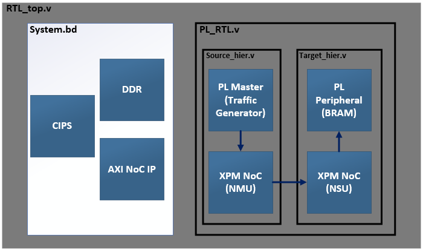
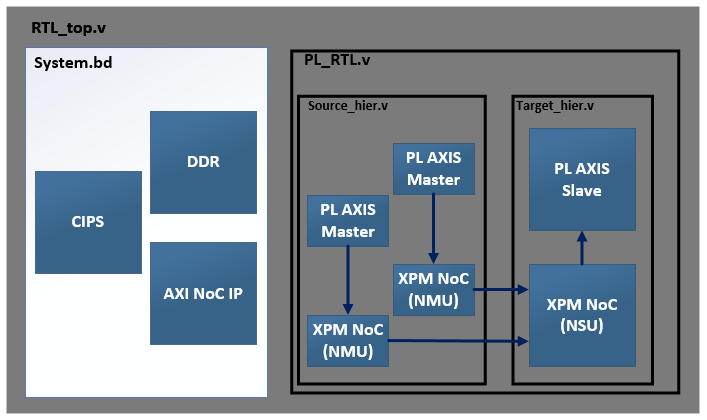

<table class="sphinxhide" width="100%">
 <tr width="100%">
    <td align="center"><h1>AMD Vivado™ Design Suite Tutorials</h1>
    <a href="https://www.amd.com/en/products/software/adaptive-socs-and-fpgas/vivado.html">See Vivado™ Development Environment on amd.com</a>
    </td>
 </tr>
</table>

# Modular NoC Properties : Advanced
<b><i>Version: Vivado 2024.2</b></i><p>

# Introduction

This tutorial demonstrates the use of exclusive routing groups, address remaps, and locking of NMU/NSU sites. These are all features that are included in the IPI flow. 

Address remaps
```bash
# Setting REMAP on PL to PL  AXI-MM NoC path
set_property REMAPS [list {0x0000_0000:0xFFFF_FFFF,0x202_0000_0000:0x202_1FFF_FFFF}] $conn1
```

Exclusive routing groups
```bash
# Setting Exclusive Routing Group to AXI-MM  PL to PL NoC Path.
set_property EXCLUSIVE_ROUTING_GROUP mm_group $conn1
```

Locking of NMU/NSU sites
```bash
#LOCATION constraint for NMUs and NSUs
set_property LOCATION NOC_NMU512_X1Y1 $pl_nmu_to_pl
set_property LOCATION NOC_NSU512_X1Y6 $pl_nsu_from_pl
```

# Building The Design

This design can be built using 3 different flows:
- Project mode
- Non-project mode
- Sim only

To choose one, execute one of:
```bash
make bld_DESIGN
make non_prj_DESIGN
make sim_DESIGN
```

Alternatively, you can choose to build all of these by executing `make` to build them sequentially or `make -j` to build in parallel.

# NoC Topologies

No matter what build option(s) you've chosen, the design will contain examples of the following topologies:

PL NMU (RTL) to PL NSU (RTL) 
<p align="left">
  
</p>

<p align="left">
  
</p>

# Design Flows

## Project and non-project modes

These options source `scripts/build_design.tcl` or `scripts/build_design_non_prj.tcl` respectively, generating all associated files in `build/vivado_prj` or `build/vivado_non_prj`
 
1. Create Project targeted at VCK190 board
2. Add Design sources (RTL/BD/XCI) to the project
3. AXI Performance Traffic Generator Configuration
4. Integration of Debug in the design
5. Generate the Targets for XCI and BDs
6. Adding NoC constraint file
7. Set USED_IN "synthesis_pre" property for NoC constraint file
8. validate_noc command
9. Synthesis, Implementation & Image device generation to create PDI
10. Hardware Validation

## Sim only

This option sources `scripts/sim_design.tcl` and generates all associated files in `build/vivado_sim`
 
1. Create Project targeted at VCK190 board
2. Add Design sources (RTL/BD/XCI) to the project
3. AXI Performance Traffic Generator Configuration
4. Integration of Debug in the design
5. Generate the Targets for XCI and BDs
6. Adding NoC constraint file
7. Set USED_IN "synthesis_pre" property for NoC constraint file
8. validate_noc command
9. Open simulation view

Note that the project and non-project modes also support simulation, they just don't run it as part of the build script.

# Hardware Validation
 
We’ve set up an Integrated Logic Analyzer (ILA) with trigger functionality within the design. The Virtual Input/Output (VIO) modules are connected to the AXI Traffic Generator to control the reset and start signals for the traffic generator. We’ve attached the captured ILA waveforms, which are triggered when the “AWVALID” signal of the AXI interface is set to 1. After a successful transfer of write data followed by a read operation, we verify data integrity using the “done” signal, which is monitored through VIOs. 


<p class="sphinxhide" align="center"><sub>Copyright © 2024 Advanced Micro Devices, Inc.</sub></p>
<!-- # SPDX-License-Identifier: X11 -->  