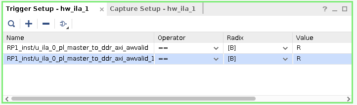
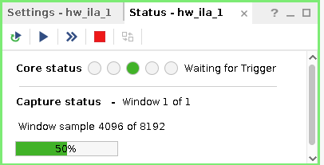
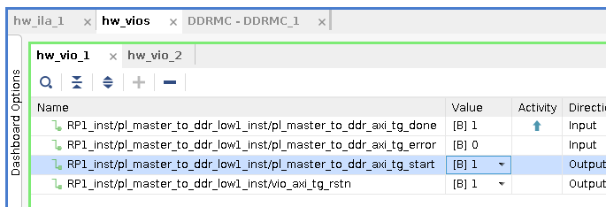
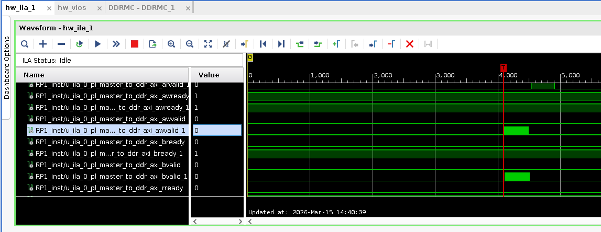
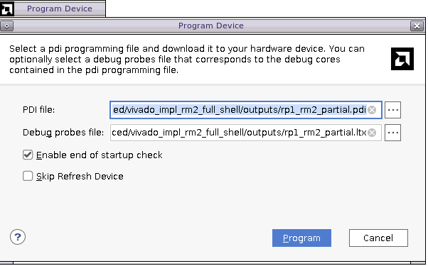
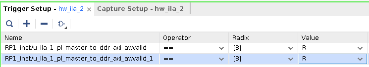
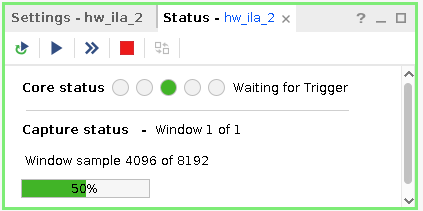
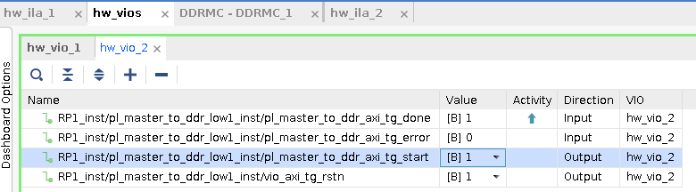
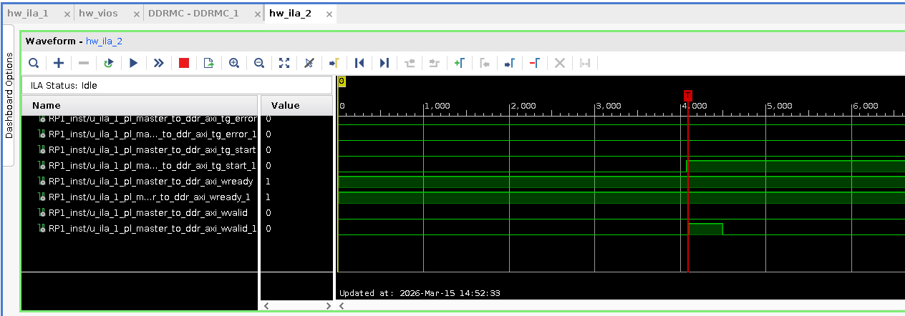

<table class="sphinxhide" width="100%">
 <tr width="100%">
    <td align="center"><h1>AMD Vivado™ Design Suite Tutorials</h1>
    <a href="https://www.amd.com/en/products/software/adaptive-socs-and-fpgas/vivado.html">See Vivado™ Development Environment on amd.com</a>
    </td>
 </tr>
</table>

# Modular NoC DFX: Advanced
<b><i>Version: Vivado 2025.2</b></i><p>

# Introduction
Many NoC parameters (BW, traffic class, etc.) are defined on the connection or path between a NMU(s) and NSU(s). In DFX designs, the path is segmented between the static and dynamic regions. Path ownership defines where these parameters are defined, for example in the static or dynamic region. If the path ownership is in the static, no changes to the NoC path can be made in the dynamic region. If the path ownership is in the dynamic region, no changes to the NoC path can be made in the static region. This tutorial demonstrates the changes in the NoC compiler result between parent and child implementations depending on where the path ownership is defined. 

# Building The Design

This design has the following build options:
- all (executes builds sequentially)
- fast_compile (executes builds in parallel)
- synth_static
- synth_rm1
- impl_static_with_rm1
- create_shells
- synth_rm2
- impl_rm2_full_shell
- impl_rm2_abs_shell

To choose one, execute:
```bash
make <build option>
```

# Design Flow

1. Static Region Synthesis
2. Out of Context Synthesis of First Reconfigurable Module
3. Parent Implementation
4. Shell Creation
5. Out of Context Synthesis of Second Reconfigurable Module
6. Child Implementation 

# Hardware Validation

The following steps can be carried out: 
 1. Program the device using the PDI located at:  DFX_Advanced/vivado_impl_static_with_rm1/outputs/design_1_wrapper_with_rm1.pdi (Note: This design targets the VCK190 Evaluation Kit)
2. In the trigger setup for hw_ila_1, add the nets ending in awvalid, set the value to 'R' for each, and then Set the trigger condition to 'Global OR'
<p align="left">
  
</p>
3. Start the capture
<p align="left">
  
</p>
4. In the hw_vios->hw_vio_1 tab add all the nets, set _rstn to '1', and then set _start to '1'. You will observe the _done net changing to a value of '1'
<p align="left">
  
</p>
6. This validates the functionality of static region with the first reconfigurable module.
<p align="left">
  
</p>
7. Return the _start & _rstn nets to '0', and program the partial PDI: DFX_Advanced/vivado_impl_rm2_full_shell/outputs/rp1_rm2_partial.pdi
<p align="left">
  
</p>
8. Add the nets ending in _awvalid to the hw_ila_2 Trigger setup, and set the Value to 'R', and set the trigger condition to 'Global OR'
<p align="left">
  
</p>
10. Start the capture
<p align="left">
  
</p>
11. In the hw_vios->hw_vio_2 tab add all the nets, then set _rstn to '1', followed by _start_1 to '1'. You will observe the _done net changing to a '1'
<p align="left">
  
</p>
<p align="left">
  
</p>


<p class="sphinxhide" align="center"><sub>Copyright © 2024 Advanced Micro Devices, Inc.</sub></p>
<!-- # SPDX-License-Identifier: X11 -->  
