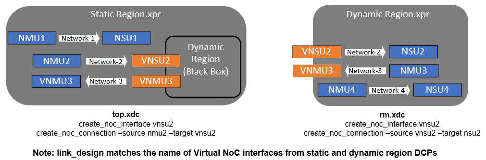
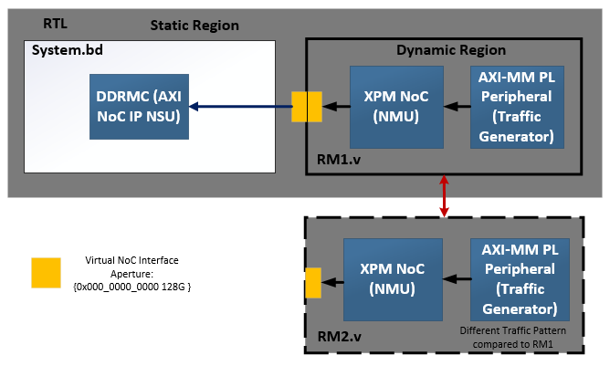
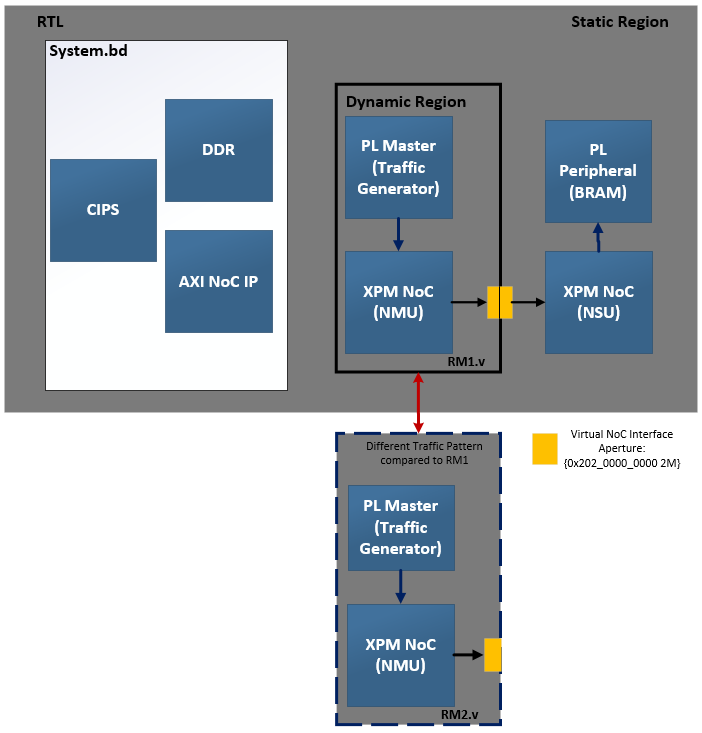
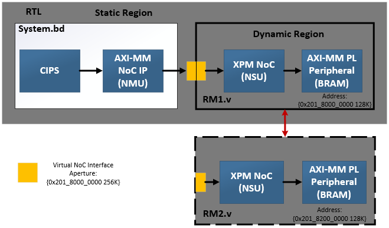
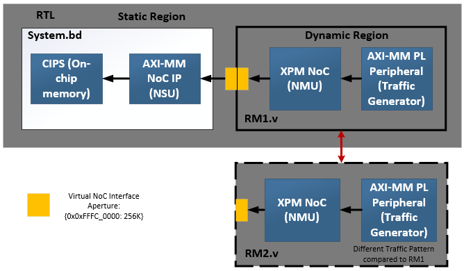

<table class="sphinxhide" width="100%">
 <tr width="100%">
    <td align="center"><h1>AMD Vivado™ Design Suite Tutorials</h1>
    <a href="https://www.amd.com/en/products/software/adaptive-socs-and-fpgas/vivado.html">See Vivado™ Development Environment on amd.com</a>
    </td>
 </tr>
</table>

# Modular NoC DFX Foundational Tutorial
<b><i>Version: Vivado 2024.2</b></i><p>

# Introduction

This tutorial demonstrates the use of the modular NoC solution with DFX. The fundamental modular NoC principles defined in Sl.No.1 still apply, however a new virtual NoC interface concept is added to the flow. This virtual NoC interface allows for NoC connections to be segmented from a design entry point of view between the static and dynamic regions.

<p align="left">
  
</p>

# Building The Design

This design has the following build options:
- all (executes builds sequentially)
- fast_compile (executes builds in parallel)
- synth_static
- synth_rm1
- impl_static_with_rm1
- create_shells
- synth_rm2
- impl_rm2_full_shell
- impl_rm2_abs_shell

To choose one, execute:
```bash
make <build option>
```

# NoC Topologies

The modular NoC with DFX flow supports the following topologies (Topology 1 and 2 are covered in this tutorial):

1. PL NMU (RTL DFX module) to DDR NSU (Static region BD)
<p align="left">
  
</p>

2. PL NMU (RTL DFX module) to PL NSU (Static region BD) 
<p align="left">
  
</p>

3. CIPS NMU (Static region BD) to PL NSU (RTL DFX module) 
<p align="left">
  
</p>

4. PL NMU (RTL DFX module) to CIPS NSU (Static region BD) 
<p align="left">
  
</p>

# Design Flow

1. Static Region Synthesis
2. Out of Context Synthesis of First Reconfigurable Module
3. Parent Implementation
4. Shell Creation
5. Out of Context Synthesis of Second Reconfigurable Module
6. Child Implementation 

# Hardware Validation

The following steps can be carried out: 

- Download full PDI from first implementation and ensure that it works in the hardware. This validates the functionality of static region with the first reconfigurable module. 
- Keep the peripherals in reset to disable the traffic impacting reconfigurable partition and download partial PDI from the child implementation. This validates that partial PDI from child implementation continues to work with the static region from parent implementation. 


<p class="sphinxhide" align="center"><sub>Copyright © 2024 Advanced Micro Devices, Inc.</sub></p>
<!-- # SPDX-License-Identifier: X11 -->  