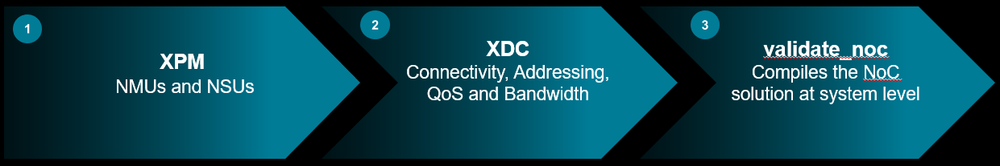
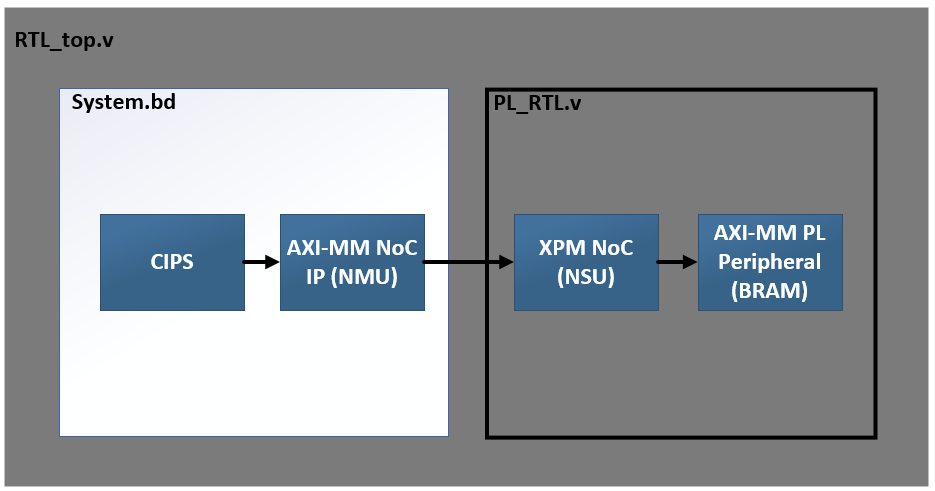
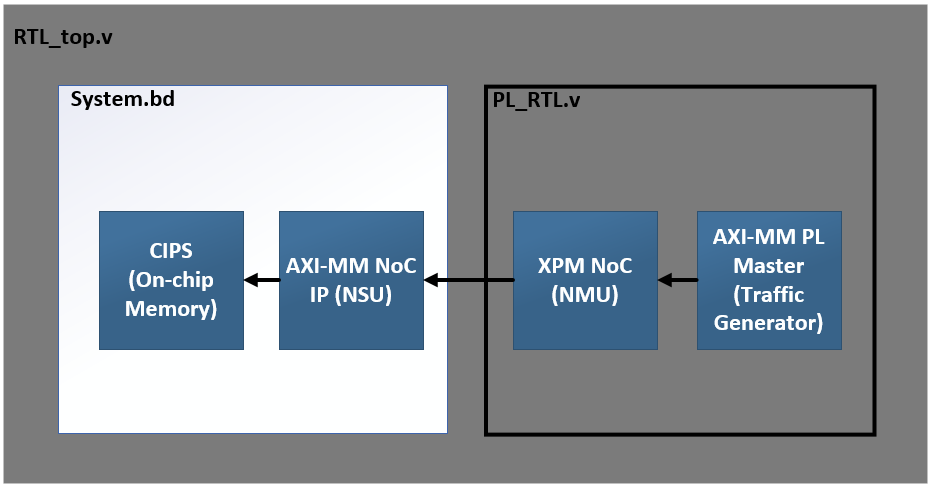
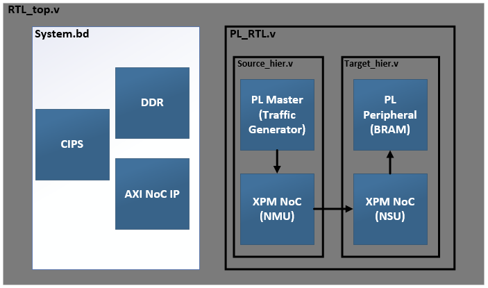
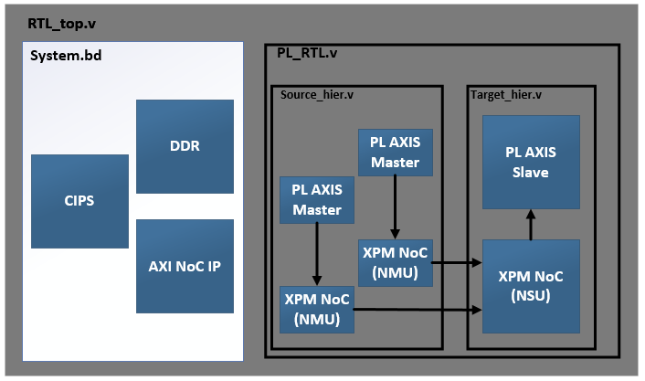
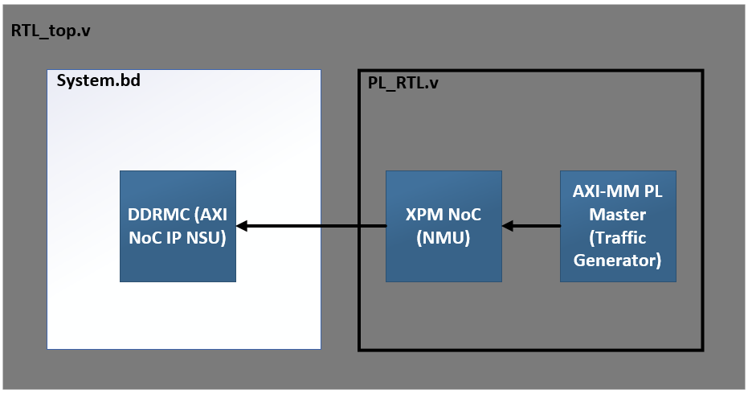
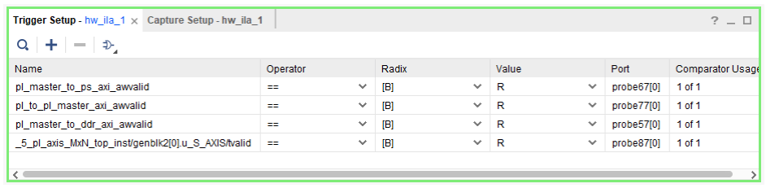

<table class="sphinxhide" width="100%">
 <tr width="100%">
    <td align="center"><h1>AMD Vivado™ Design Suite Tutorials</h1>
    <a href="https://www.amd.com/en/products/software/adaptive-socs-and-fpgas/vivado.html">See Vivado™ Development Environment on amd.com</a>
    </td>
 </tr>
</table>

# Modular NoC Foundational Tutorial
<b><i>Version: Vivado 2024.2</b></i><p>

# Introduction

This tutorial demonstrates the use of the modular NoC solution which is comprised of three main steps.

<p align="left">
  
</p>

Step 1 is to connect all RTL AXI busses that want to utilize the NoC to Xilinx parameterizable macros or XPMs. The master XPM contains the NMU to get on the NoC and the slave XPM contains the NSU to exit the NoC. These XPMs are stitched into the RTL manually anywhere in the design hierarchy. 

Step 2 of the process is to add constraint files (or XDCs) to the design that define connectivity and quality of service parameters for each individual NoC connection. Connectivity, QoS, and BW are defined in XDC whenever there is a NoC connection that will traverse HDL hierarchy (For example, a XPM NMU in RTL connected to a DDRMC NSU in a block design).

Step 3 is to execute the validate_noc command. This new command ensures full connectivity between all NoC instances (BD and XPMs), runs DRCs, and executes the NoC compiler to generate the NoC solution for the design. This can be called explicitly by the user to check their design or will be called implicitly by the flow. 


# Building The Design

This design can be built using 3 different flows:
- Project mode
- Non-project mode
- Sim only

To choose one, execute one of:
```bash
make bld_DESIGN
make non_prj_DESIGN
make sim_DESIGN
```

Alternatively, you can choose to build all of these by executing `make` to build them sequentially or `make -j` to build in parallel.

# NoC Topologies


No matter what build option(s) you've chosen, the design will contain examples of the following topologies:

1. CIPS NMU (BD) to PL NSU (RTL)
<p align="left">
  
</p>

2. PL NMU (RTL) to CIPS NSU (BD)
<p align="left">
  
</p>

3. PL NMU (RTL) to PL NSU (RTL) 
<p align="left">
  
</p>

<p align="left">
  
</p>

4. PL NMU (RTL) to DDR NSU (BD)
<p align="left">
  
</p>

# Design Flows

## Project and non-project modes

These options source `scripts/build_design.tcl` or `scripts/build_design_non_prj.tcl` respectively, generating all associated files in `Foundational/build/vivado_prj` or `Foundational/build/vivado_non_prj`
 
1. Create Project targeted at VCK190 board
2. Add Design sources (RTL/BD/XCI) to the project
3. AXI Performance Traffic Generator Configuration
4. Integration of Debug in the design
5. Generate the Targets for XCI and BDs
6. Adding NoC constraint file
7. Set USED_IN "synthesis_pre" property for NoC constraint file
8. validate_noc command
9. Synthesis, Implementation & Image device generation to create PDI
10. Hardware Validation

## Sim only

This option sources `scripts/sim_design.tcl` and generates all associated files in `Foundational/build/vivado_sim`
 
1. Create Project targeted at VCK190 board
2. Add Design sources (RTL/BD/XCI) to the project
3. AXI Performance Traffic Generator Configuration
4. Integration of Debug in the design
5. Generate the Targets for XCI and BDs
6. Adding NoC constraint file
7. Set USED_IN "synthesis_pre" property for NoC constraint file
8. validate_noc command
9. Open simulation view

Note that the project and non-project modes also support simulation, they just don't run it as part of the build script.

# Hardware Validation
 
We’ve set up an Integrated Logic Analyzer (ILA) with trigger functionality within the design. The Virtual Input/Output (VIO) modules are connected to the AXI Traffic Generator to control the reset and start signals for the traffic generator. We’ve attached the captured ILA waveforms, which are triggered when the “AWVALID” signal of the AXI interface is set to 1. After a successful transfer of write data followed by a read operation, we verify data integrity using the “done” signal, which is monitored through VIOs. 

<p align="left">
  
</p>

<p class="sphinxhide" align="center"><sub>Copyright © 2024 Advanced Micro Devices, Inc.</sub></p>
<!-- # SPDX-License-Identifier: X11 -->  