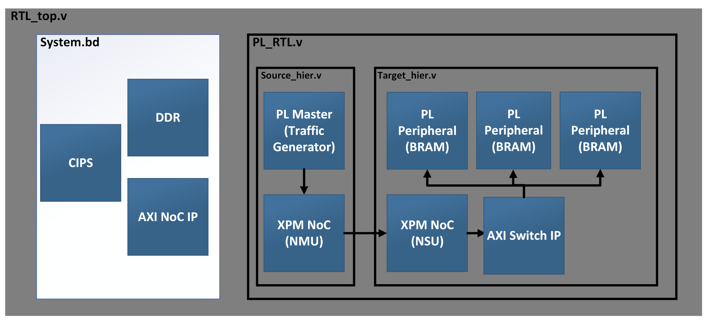
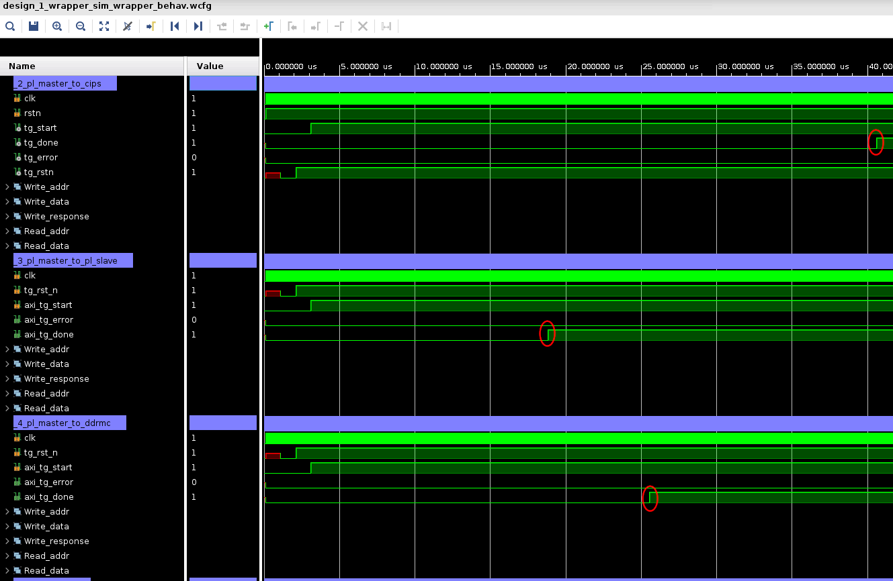
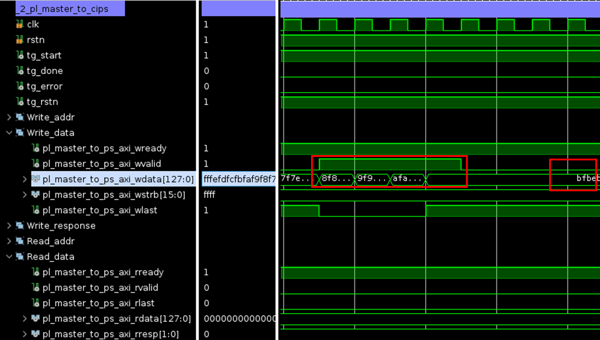
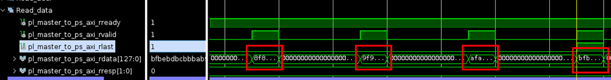
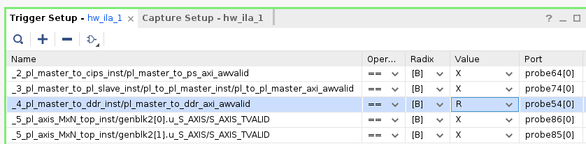
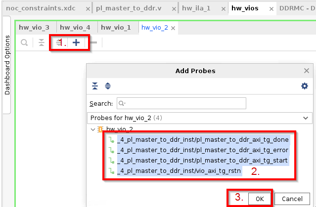
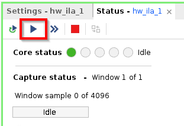
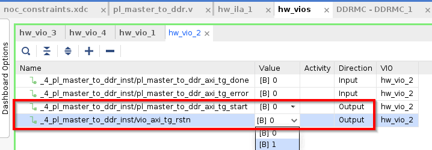
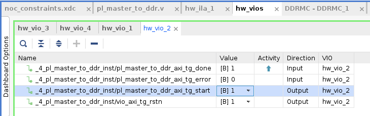
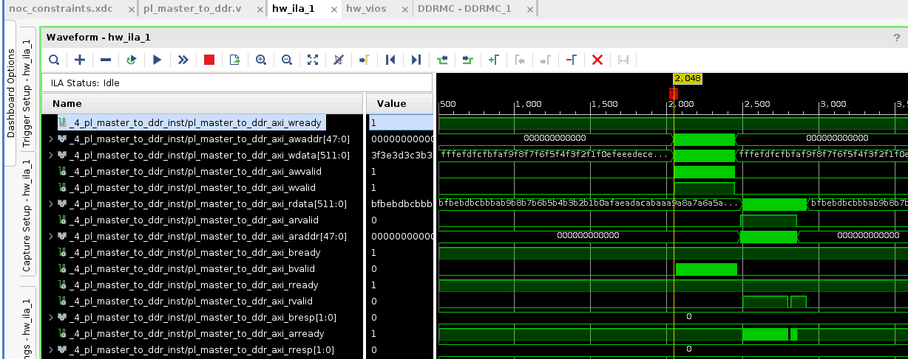

<table class="sphinxhide" width="100%">
 <tr width="100%">
    <td align="center"><h1>AMD Vivado™ Design Suite Tutorials</h1>
    <a href="https://www.amd.com/en/products/software/adaptive-socs-and-fpgas/vivado.html">See Vivado™ Development Environment on amd.com</a>
    </td>
 </tr>
</table>

# Modular NoC Foundational Tutorial
<b><i>Version: Vivado 2025.1</b></i><p>

# 1\. Introduction

This tutorial demonstrates the use of the modular NoC solution which is comprised of three main steps.

<p align="left">
  
</p>

Step 1 is to connect all RTL AXI busses that want to utilize the NoC to Xilinx parameterizable macros or XPMs. The master XPM contains the NMU to get on the NoC and the slave XPM contains the NSU to exit the NoC. These XPMs are stitched into the RTL manually anywhere in the design hierarchy. 

Step 2 of the process is to add constraint files (or XDCs) to the design that define connectivity and quality of service parameters for each individual NoC connection. Connectivity, QoS, and BW are defined in XDC whenever there is a NoC connection that will traverse HDL hierarchy (For example, a XPM NMU in RTL connected to a DDRMC NSU in a block design).

Step 3 is to execute the validate_noc command. This new command ensures full connectivity between all NoC instances (BD and XPMs), runs DRCs, and executes the NoC compiler to generate the NoC solution for the design. This can be called explicitly by the user to check their design or will be called implicitly by the flow. 

For additional insights into the Modular NoC, we recommend watching the series "RTL for Programmable NoC (Modular NoC) Parts 1 to 5." You can begin by clicking the link below: [](https://www.youtube.com/watch?v=TvfY4jGbi2s&list=PLx15eYqzJifdm1uagbJVEr5h7UV53ZAvM&index=9)

# 2\. Building The Design

This design can be built using 4 different flows:
- Walkthrough mode
- Project mode
- Non-project mode
- Sim only

To choose walkthrough mode, skip this section and proceed directly to the NoC Topologies section.
To choose between the remaining 3, execute one of the following:
```bash
make bld_DESIGN
make non_prj_DESIGN
make sim_DESIGN
```

Alternatively, you may build all components (excluding Walkthrough mode) by running `make` to build them sequentially or `make -j` to build in parallel.

# 3\. NoC Topologies

No matter what build option(s) you've chosen, the design will contain examples of the following topologies:

1. CIPS NMU (BD) to PL NSU (RTL)
<p align="left">
  
</p>

2. PL NMU (RTL) to CIPS NSU (BD)
<p align="left">
  
</p>

3. PL NMU (RTL) to PL NSU (RTL) to AXI Switch (RTL) 
<p align="left">
  
</p>

4. PL NMU (RTL) to DDR NSU (BD)
<p align="left">
  
</p>

5. PL NMU Streaming (RTL) to PL NSU Streaming (RTL) 
<p align="left">
  
</p>


Walkthrough mode offers a detailed, step-by-step guide to assist you in creating your design with the Modular NOC solution. In this mode, the tutorial will guide you through the process of building a Modular NOC solution for Topologies 1, 4, and 5. The design has pre-built solution for Topology 2 and 3.

# 4\. Design Flows
## 4.1 Walkthrough mode

This mode is independent of the Project, Non-Project Mode and Sim only that can be run using the Makefile. The Makefile uses the completed source files available in Foundational/sources folder. 

### 4.1.1 Create Project targeted at VCK190 board

Ensure you are in the folder: Vivado-Design-Tutorials/Versal/Memory_and_NoC/NoC_Design_Flows/RTL/Foundational.

```bash
mkdir build
cd build
vivado &
```
In the Tcl Console of Vivado, execute the following commands to create your project.
```bash
#Create the project in the output directory
create_project project_1 -force  -part xcvc1902-vsva2197-2MP-e-S

#Set the board part
set_property board_part xilinx.com:vck190:part0:3.2 [current_project]
```

### 4.1.2 Add/Create Design sources (RTL/BD/XCI) to the project  
1. Read all sources required for building the project for Topologies #2 and #3.  

      ```bash
      #Generate the system BD that has only CIPS and DDR NOCs
      source ../sources/bd/bd.tcl

      #Read the RTL files that has XPM NMUs and NSUs instantiated along with traffic generators and BRAM 
      import_files ../sources/rtl/design_1_wrapper.v
      import_files ../sources/rtl/pl_master_to_cips.v
      import_files ../sources/rtl/pl_master_to_pl_slave.v
      import_files ../sources/rtl/pl_to_pl_master.v
      import_files ../sources/rtl/pl_to_pl_slave.v
      import_files ../sources/rtl/validate_ip_M_AXIS.v
      import_files ../sources/rtl/validate_ip_S_AXIS.v
      
      #Generate the XCI files for BRAMs
      source ../sources/ip/axi_bram_ctrl_pl_slave_from_pl_master.tcl
      source ../sources/ip/axi_bram_ctrl_pl_slave_from_ps.tcl
      
      #Read the simulation testbench files to sim_1 fileset only
      import_files -fileset sim_1 ../sources/testbench
      ```
  
2. Import PL RTL files that instantiate the BRAM, AXI Traffic Generator and MxN switch for Topologies 1, 4 and 5 respectively as illustrated in the NoC topologies section. These files will also be used to instantiate the NoC XPMs in the next step.
      ```bash
      import_files ../template/axis_MxN_top.v
      import_files ../template/pl_slave_from_cips.v
      import_files ../template/pl_master_to_ddr.v
      ```
      
3. Instantiate XPMs in the PL RTL to connect AXI Buses on BRAM, AXI Traffic Generator and MxN switch for Topologies #1, #4, and #5 to NOC.       
    1. For Topology 1, follow these steps to instantiate the XPM NOC (NSU) within the RTL, allowing connections from CIPS to RTL:  
        1. Open the Language Templates and navigate to: Templates -> Verilog -> Xilinx Parameterized Macros (XPM) -> XPM -> NOC -> AXI Memory Mapped NOC Slave Unit.  
        2. Copy template into the pl_slave_from_cips.v module between lines 138 and 140. Remaining steps apply only to the newly instantiated module.      
        3. Modify the parameters to take the RTL parameter: connect DATA_WIDTH to S0_AXI_WDATA_WIDTH and ADDR_WIDTH to S0_AXI_AWADDR_WIDTH, and set DUSER_WIDTH to 0.  
        4. Rename the instance to xpm_nsu_mm_pl_slave_from_cips.  
        5. Connect m_axi_aclk to clk, set nsu_usr_interrupt_in to 4'b0, disconnect m_axi_out, and remove the m_axi_aregion port.  
        6. Connect the NSU to BRAM by replacing “(m_axi_” with “(s_axi_”.  
    2. For Topology 4, follow these steps to instantiate the XPM NOC (NMU) within the RTL, allowing connections from RTL to the DDRMC channel:  
        1. Copy template **AXI Memory Mapped NOC Master Unit** into pl_master_to_ddr.v between lines 161 and 163. Remaining steps apply only to the newly instantiated module.  
        2. Modify the parameters to take the RTL parameter: connect DATA_WIDTH to M0_AXI_WDATA_WIDTH and ADDR_WIDTH to M0_AXI_AWADDR_WIDTH, and set DUSER_WIDTH to 0.  
        3. Rename the instance to xpm_nmu_pl_master_to_ddr.  
        4. Connect s_axi_aclk to clk, set nmu_usr_interrupt_in to 4'b0, and both s_axi_wuser and s_axi_aruser to 16'b0. Disconnect s_axi_wid, s_axi_buser, and s_axi_ruser.  
        5. Connect the NMU to the Traffic Generator by replacing “(s_axi_” with “(pl_master_to_ddr_axi_”.    
    3. For Topology 5, follow these steps to instantiate both the Streaming XPM NOC (NMU) and Streaming XPM NOC (NSU) within the RTL, enabling connections from RTL Master to RTL Slave:  
        1. Copy template **AXI Streaming NOC Master Unit** into axis_MxN_top.v between lines 82 and 84. Remaining steps apply only to the newly instantiated module.    
        2. Modify the parameters to take the RTL parameter: connect DATA_WIDTH to DATA_WIDTH and change ID_WIDTH to 4.  
        3. Rename the instance to xpm_nmu_strm_pl_to_pl.  
        4. Connect s_axi_aclk to clk, and disconnect dst_id_err.  
        5. Connect the NMU to the Traffic Generator by replacing “(s_axis_” with “(AXIS_0_” in the XPM instantiation.  
        6. Copy template **AXI Streaming NOC Slave Unit** into axis_MxN_top.v between lines 150 and 152.  
        7. Modify the parameters to take the RTL parameter: connect DATA_WIDTH to DATA_WIDTH and change ID_WIDTH to 4.  
        8. Rename the instance to xpm_nsu_strm_pl_to_pl.    
        9. Connect m_axi_aclk to clk.  
        10. Connect the NMU to the Traffic Generator by replacing “(m_axis_” with “(AXIS_0_” in the XPM instantiation.    

This concludes the first critical step in connecting all RTL AXI buses that require NoC access to the XPMs.  
Note: Completed source files are available in Foundational/sources folder.

### 4.1.3 AXI Performance Traffic Generator (PTG) and AXI Switch Configuration  

This tutorial emphasizes the use of the Modular NOC, hence tutorial provides AXI traffic generator and AXI Switch IP configurations for various topologies. Users can open the traffic generator and observe the IP instantiations.  
Run the following commands in the Tcl Console to add these IPs to your design:  
```bash
#Generate the XCI files for Performance Traffic Generators
source ../sources/ip/perf_axi_tg_pl_to_pl.tcl
source ../sources/ip/perf_axi_tg_pl_to_ps.tcl
source ../sources/ip/perf_axi_tg_pl_master_to_ddr.tcl
source ../sources/ip/axi_switch_0.tcl
```

### 4.1.4 Integration of Debug in the design  
The Virtual Input/Output (VIO) modules are linked to the AXI Traffic Generator, allowing control over the reset and start signals for the traffic generator. Users can open the VIO IPs and observe their instantiations.  
Run the following commands in the Tcl Console to add these IPs to your design:  

```bash
#Generate the XCI files VIO IPs
source ../sources/ip/axis_vio_pl_master_to_ddr.tcl
source ../sources/ip/axis_vio_pl_master_to_pl_slave.tcl
source ../sources/ip/axis_vio_pl_master_to_ps.tcl
source ../sources/ip/axis_MxN_vio.tcl
```

### 4.1.5 Generate the Targets for XCI and BDs  
Execute the following command to generate the source file for IP cores (.xci) instantiated in the design. These are the files necessary to support the IP or block design and are required to be generated before running the validate_noc command:  
```bash
generate_target {synthesis instantiation_template} [get_files { axis_MxN_vio.xci axi_bram_ctrl_pl_slave_from_pl_master.xci axi_bram_ctrl_pl_slave_from_ps.xci axis_vio_pl_master_to_ddr.xci axis_vio_pl_master_to_pl_slave.xci axis_vio_pl_master_to_ps.xci perf_axi_tg_pl_master_to_ddr.xci perf_axi_tg_pl_to_pl.xci perf_axi_tg_pl_to_ps.xci axi_switch_0.xci design_1.bd}]
```
### 4.1.6 Adding constraints file   

1. Read the XDC files    
Load the XDC files containing constraints for creating ILAs and connecting them to the debug hub in the design. These constraints are auto-generated by the tool during the "Set up Debug" process.  
    ```bash
    import_files -fileset constrs_1 ../sources/xdc/design_1_wrapper_debug.xdc
    ```
2. Create NoC constraints XDC file    
To create NoC constraints for establishing connections, setting QoS parameters, BW and defining the aperture of XPM NSUs, follow these steps:  
    1. Import the file that defines the NoC constraints for topologies #2 and #3.  

    ```bash
    import_files -fileset constrs_1 ../template/noc_constraints.xdc
    ```
    
    2. To create NoC constraints for Topologies #1, #4, #5, first execute the following command in the Tcl Console to retrieve a list of available NoC interfaces:  
    
    ```bash
    join [get_noc_interfaces] \n
    ```
    3. For Topology 1, PMC interface from CIPS (bd) drives the BRAM in PL RTL. Follow the steps below to update the section **AXI4** of the .xdc file
        1. Among the available NoC interfaces, determine the two endpoints for Topology 1. They are: **design_1_i/axi_noc_0/S05_AXI_nmu** and **_1_pl_slave_from_cips_inst/xpm_nsu_mm_pl_slave_from_cips/M_AXI_nsu**. Add the first endpoint in the "Get NoC Interfaces" section as detailed below. The second endpoint has already been created:
 
            ```bash
            set pmc_nmu [get_noc_interfaces design_1_i/axi_noc_0/S05_AXI_nmu]
            ```   
        2. Create NoC connection in the "Create NoC Connections" section as detailed below:   
            ```bash
            set conn7 [create_noc_connection -source $pmc_nmu -target $pl_nsu_from_cips]
            ```    
        3. Set QoS, BW for NoC connections in the "Set QoS for NoC Connections" section as detailed below:
            ```bash
            set_property -dict [list READ_BANDWIDTH 600 READ_AVERAGE_BURST 4 WRITE_BANDWIDTH 600 WRITE_AVERAGE_BURST 4] $conn7
            ```    
        4. Set Aperture for NoC NSUs in the "Set Aperture for NoC NSUs" section as detailed below:  	
            ```bash
            set_property APERTURES [list {0x203_0000_0000:0x203_001F_FFFF}] $pl_nsu_from_cips
            ```  
    9. For Topology 4, PL Master drive Port0 of DDRMC. Repeat the steps for Topology 1 to update the section **AXI4** of the .xdc file as described below:

       ```bash
       # Get NoC Interfaces. 
       set nmu_to_ddr [get_noc_interfaces _4_pl_master_to_ddr_inst/xpm_nmu_pl_master_to_ddr/S_AXI_nmu]  
       set ddrmc_nsu [get_noc_interfaces design_1_i/axi_noc_0/PORT0_ddrc]
       
       # Create NoC Connections
       set conn0 [create_noc_connection -source  $nmu_to_ddr -target  $ddrmc_nsu]
       
       # Set QoS for NoC Connections
       set_property -dict [list READ_BANDWIDTH 400 READ_AVERAGE_BURST 4 WRITE_BANDWIDTH 400 WRITE_AVERAGE_BURST 4] $conn0
       ```    

    10. For Topology 5, any master can drive any slave. Repeast the steps for Topology 5 to update the section **AXIS** of the .xdc file:
    
        ```bash
        # Get NoC Interfaces
        set pl_axis_nmu_0 [get_noc_interfaces _5_pl_axis_MxN_top_inst/genblk1[0].xpm_nmu_strm_pl_to_pl/S_AXIS_nmu]
        set pl_axis_nmu_1 [get_noc_interfaces _5_pl_axis_MxN_top_inst/genblk1[1].xpm_nmu_strm_pl_to_pl/S_AXIS_nmu]
        set pl_axis_nsu_0 [get_noc_interfaces _5_pl_axis_MxN_top_inst/genblk2[0].xpm_nsu_strm_pl_to_pl/M_AXIS_nsu]
        set pl_axis_nsu_1 [get_noc_interfaces _5_pl_axis_MxN_top_inst/genblk2[1].xpm_nsu_strm_pl_to_pl/M_AXIS_nsu]
        
        # Create NoC Connections
        set conn_00 [create_noc_connection -source $pl_axis_nmu_0 -target $pl_axis_nsu_0]
        set conn_01 [create_noc_connection -source $pl_axis_nmu_0 -target $pl_axis_nsu_1]
        set conn_10 [create_noc_connection -source $pl_axis_nmu_1 -target $pl_axis_nsu_0]
        set conn_11 [create_noc_connection -source $pl_axis_nmu_1 -target $pl_axis_nsu_1]
        
        # AXIS MxN TDEST IDs (BASE:HIGH)
        set_property TDEST_ID 0x0:0x0 $pl_axis_nsu_0
        set_property TDEST_ID 0x1:0x1 $pl_axis_nsu_1
        ```

This concludes Step 2 of the process, which involves adding constraint files (or XDCs) to the design. These files define the connectivity, quality of service (QoS) parameters and bandwidth for each individual NoC connection.  
Note: Completed source files are available in Foundational/sources folder.

### 4.1.7 Set the USED_IN "synthesis_pre" Property for NoC Constraint File  
In the Tcl Console, execute the following command to ensure validate_noc command is able to locate the NoC constraints.
```bash
set_property USED_IN {synthesis_pre} [get_files ./project_1.srcs/constrs_1/imports/template/noc_constraints.xdc]
```

### 4.1.8 Validate NoC Command  
In the Tcl Console, execute the following command to compile the NoC solution at the system level:  
```bash
validate_noc
```
If the validate_noc fails, reset the output products for all IP and BD, regenerate targets for XCI and BD, and run **validate_noc -force**.

This completes Step 3 of the Modular Noc solution.  

### 4.1.9 Run Simulation  
1. Go to SIMULATION -> Run Simulation -> Run Behavioral Simulation  
2. Once the simulator opens, run the simulation for 50us by typing the following command in Tcl Console.  
```bash
run 50us 
```
3. The simulation waveform after successful run will look like this:    

Observe the done signal high  
<p align="left">
  
</p>

The last write should match the last read  
<p align="left">
  
</p>
<p align="left">
  
</p>

The above is applicable for Topology 2 through 4. For Topology 5, error signal should be 0. For Topology 1, simulation is not available.  

### 4.1.10 Synthesis, Implementation & Device Image Generation for PDI  
To create the PDI, click on "Generate Device Image."  

### 4.1.11 Hardware Validation  
Proceed directly to the section on Hardware Validation.  

## 4.1.2\. Project and non-project modes

These options source `scripts/build_design.tcl` or `scripts/build_design_non_prj.tcl` respectively, generating all associated files in `Foundational/vivado_prj` or `Foundational/vivado_non_prj`  
 
1. Create Project targeted at VCK190 board  
2. Add Design sources (RTL/BD/XCI) to the project  
3. AXI Performance Traffic Generator Configuration  
4. Integration of Debug in the design  
5. Generate the Targets for XCI and BDs  
6. Adding NoC constraint file  
7. Set USED_IN "synthesis_pre" property for NoC constraint file  
8. validate_noc command  
9. Synthesis, Implementation & Image device generation to create PDI  
10. Hardware Validation  

## 4.1.3\. Sim only

This option sources `scripts/sim_design.tcl` and generates all associated files in `Foundational/vivado_sim`  
 
1. Create Project targeted at VCK190 board  
2. Add Design sources (RTL/BD/XCI) to the project
3. AXI Performance Traffic Generator Configuration
4. Integration of Debug in the design
5. Generate the Targets for XCI and BDs
6. Adding NoC constraint file
7. Set USED_IN "synthesis_pre" property for NoC constraint file
8. validate_noc command
9. Open simulation view

Note that the project and non-project modes also support simulation, they just don't run it as part of the build script.

# 5\. Hardware Validation

We have incorporated an Integrated Logic Analyzer (ILA) with trigger functionality into the design. The Virtual Input/Output (VIO) modules are linked to the AXI Traffic Generator, allowing control over the reset and start signals for the traffic generator. Attached are the captured ILA waveforms for Topology 4, which trigger when the “AWVALID” signal of the AXI interface is asserted (set to 1).  
After successfully transferring write data and performing a read operation, data integrity is verified by monitoring the “done” signal via the VIOs. For Topology 5, only the LSBs of the “done” signal are activated for two master and slave connections, allowing users to confirm data integrity when the “done” signal is set to “0003.”  

1. Connect to and program it.

2. In the trigger setup for hw_ila_1, configure the settings and set the "Value" for the _4 instance to R.
<p align="left">
  
</p>

3. In the hw_vios tab, configure hw_vio_2 for the _4 instance.
<p align="left">
  
</p>

4. Execute the ILA trigger
<p align="left">
  
</p>


5. In the hw_vios section, go to hw_vio_2. First, set rstn to 1 and then set *_start to 1.
<p align="left">
  
</p>

You will notice that the "done" signal will be set high, indicating that the hardware validation has been successful.

<p align="left">
  
</p>

The ILA waveform after successful validation, will look like this.
<p align="left">
  
</p>

Repeat Steps 2 to 5 for perform hardware validation of _2 and _3 instance. For _5 instance, done signal should be 3. For _1 instance, hardware validation is not available


<p class="sphinxhide" align="center"><sub>Copyright © 2024 Advanced Micro Devices, Inc.</sub></p>
<!-- # SPDX-License-Identifier: X11 -->  
