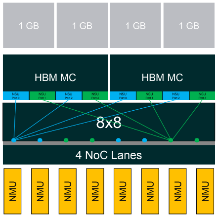
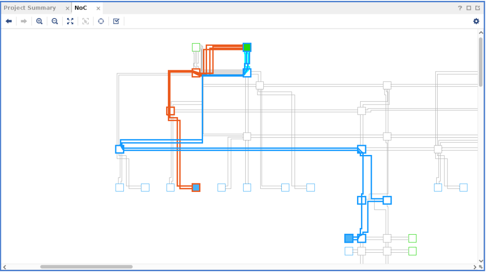
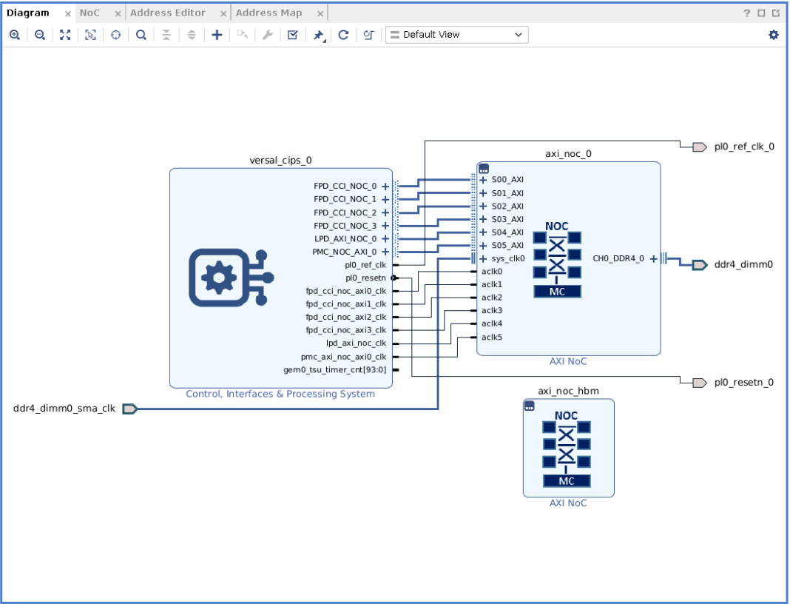
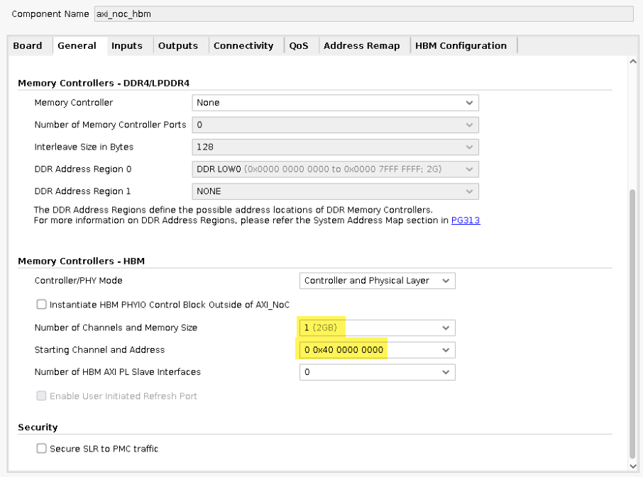
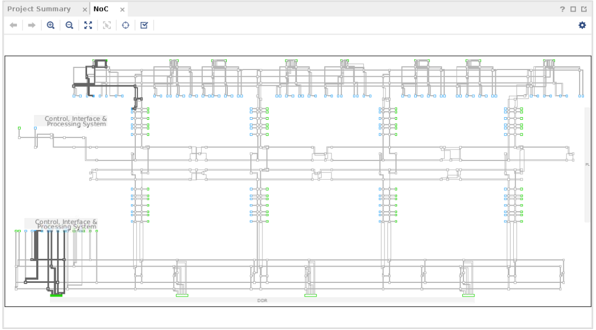
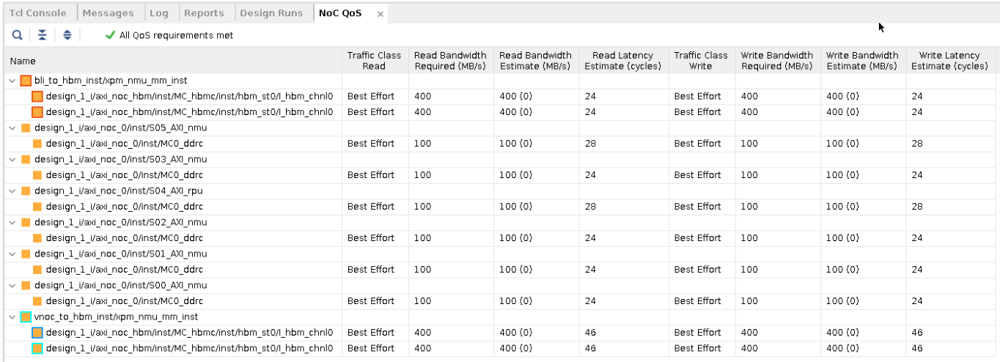
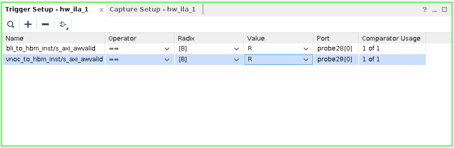
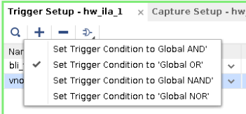
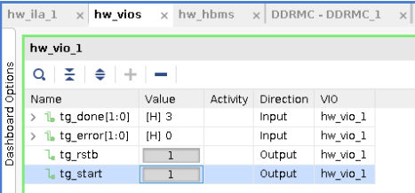
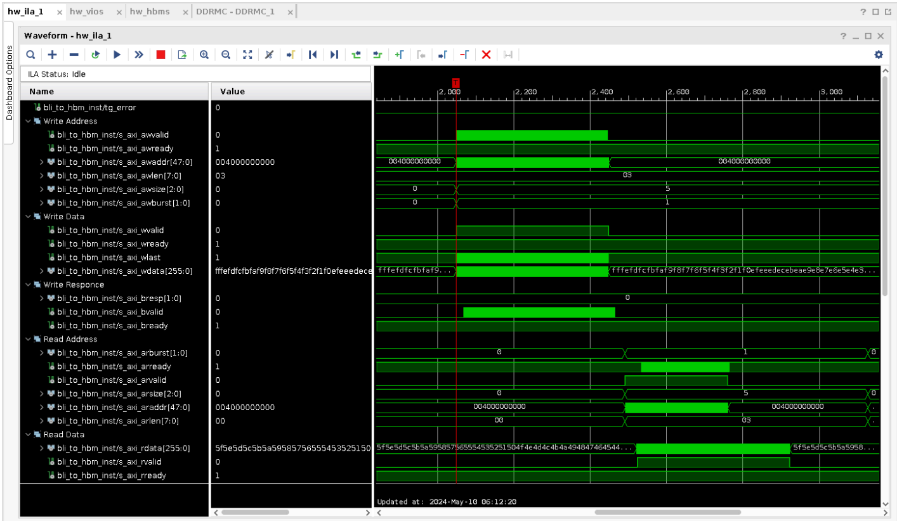

<table class="sphinxhide" width="100%">
 <tr width="100%">
    <td align="center"><h1>AMD Vivado™ Design Suite Tutorials</h1>
    <a href="https://www.amd.com/en/products/software/adaptive-socs-and-fpgas/vivado.html">See Vivado™ Development Environment on amd.com</a>
    </td>
 </tr>
</table>

# Modular NoC HBM Design
<b><i>Version: Vivado 2024.2</b></i><p>

# Introduction

This tutorial demonstrates HBM memory accesses vs NoC RTL XPMs (NMU). There are 2 AXI performance traffic generators where each is connected their own NMU. One NMU utilizes the vertical NoC column (VNOC) and the other utilizes the horizontal NoC row or HBM NMU (BLI). Each NMU connects to 2 HBM NSUs which allows full memory space access of the HBM MC.
<p align="center">
  
  
</p>

# Building The Design

This design has the following build options:
- all
- bld_DESIGN (builds design in project mode)
- non_prj_DESIGN
- sim_DESIGN

To choose one, execute:
```bash
make <build option>
```

# Design Flow

1. Create project targeted at VHK158 board 

Create the Vivado project. This tutorial project is targeted at VHK158 board. User is free to choose different board as the modular NoC works across all versal devices. 

```bash
#Create the project in the output directory
create_project project_1 -force  -part xcvh1582-vsva3697-2MP-e-S


#Set the board part
set_property board_part xilinx.com:vhk158:part0:1.1 [current_project]
``` 

2. Add design sources (RTL/BD/XCI) to the project

```bash
#####Read all sources for building the project#####

#Generate the system BD that has only CIPS and DDR NOCs
source ../sources/bd/bd.tcl

#Read the RTL files that has XPM NMUs and NSUs instantiated along with traffic generators and BRAM 
import_files ../sources/rtl

#Generate the XCI files for BRAMs, Performance Traffic Generators and VIO IPs
source ../sources/ip/perf_axi_tg_pl_bli_to_hbm.tcl
source ../sources/ip/perf_axi_tg_pl_vnoc_to_hbm.tcl
source ../sources/ip/vio_pl_master_to_hbm.tcl

#Read the simulation testbench files to sim_1 fileset only
import_files -fileset sim_1 ../sources/testbench
```

The final BD will look like:
<p align="center">
  
</p>

axi_noc_hbm shows no connections in the IPI since all of its connections are handled via RTL.

Here is a snapshot showing the aperture settings for the HBM:
<p align="center">
  
</p>

3. Import debug and NoC XDC and set USED_IN property

```bash
#Read the XDC files for creating NoC connection, setting its QoS settings and the aperture of XPM NSUs. 
import_files -fileset constrs_1 ../sources/xdc/noc_constraints.xdc

#Read the XDC files that has constraints for creating ILAs and for connecting them to debug hub in the design. This constraint is auto-generated by the tool based on "Set up Debug" flow.
import_files -fileset constrs_1 ../sources/xdc/top_debug.xdc

######Set the USED_IN {synthesis_pre} for NoC constraints#####
set_property USED_IN {synthesis_pre} [get_files ./project_1.srcs/constrs_1/imports/xdc/noc_constraints.xdc]
```

4. Generate targets and validate NoC connections

```bash
######Generate all targets : XCI/BD######
generate_target {synthesis instantiation_template} [get_files {vio_pl_master_to_hbm.xci perf_axi_tg_pl_bli_to_hbm.xci perf_axi_tg_pl_vnoc_to_hbm.xci design_1.bd}]

###Updating the sourcefile set 
update_compile_order -fileset sources_1

###### Validate the NoC to see the project level NoC endpoints and paths
validate_noc
```

Once NoC validation completes, you will be able to observe the following:

a. Global overview of HBM NoC connections
<p align="center">
  
</p>

b. BLI NoC to HBM (Orange) and VNoC to HBM (Blue) connections
<p align="center">
  
</p>

<p align="center">
  
</p>

5. Generate device image
```bash
###Launch Synthesis/Implementation and WDI. 
launch_runs impl_1 -to_step write_device_image -jobs 16
```

# Hardware Validation

1. Connect to and program the device

2. Set the following in the trigger setup for hw_ila_1:
<p align="center">
  
</p>

<p align="center">
  
</p>

3. Run the ILA trigger

4. In the hw_vios tab, set hw_vio_1 to the following:
<p align="center">
  
</p>

5. Open the ILA waveform viewer, you should see the following:
<p align="center">
  
</p>

<p class="sphinxhide" align="center"><sub>Copyright © 2024 Advanced Micro Devices, Inc.</sub></p>
<!-- # SPDX-License-Identifier: X11 -->  