<table class="sphinxhide" width="100%">
 <tr width="100%">
    <td align="center"><h1>AMD Vivado™ Design Suite Tutorials</h1>
    <a href="https://www.amd.com/en/products/software/adaptive-socs-and-fpgas/vivado.html">See Vivado™ Development Environment on amd.com</a>
    </td>
 </tr>
</table>

# Modular NoC Multiphase Tutorial
<b><i>Version: Vivado 2025.2</b></i><p>

# 1\. Introduction

This tutorial demonstrates how to use the multiphase feature of the modular NoC solution.
 
By default, a NoC instance’s bandwidth requirement is assumed to be needed continuously (100% of the time). When multiple paths share NoC resources, this assumption can lead to oversubscription, resulting in a design unable to be implemented.
 
In many designs, bandwidth demands vary over time: some paths are active during one phase while others are idle, and the roles may reverse in later phases. In such cases, defining multiple phases and assigning bandwidth requirements only to the phases in which a path is active can prevent oversubscription and enable a valid solution. 
 
# 2\. Prerequisites

To build and run this tutorial the user needs:
 - Vivado 2025.2
 - Versal License

 To run on hardware:
 - VCK190 Development Kit

# 3\. Design Description
 
The included design has 3 AXI-Stream masters, all with a single destination. 
<p align="left">
  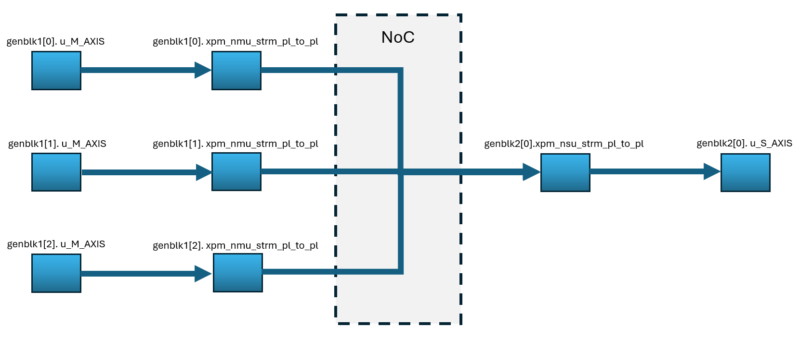
</p>
Each path has been set to have a maximum bandwidth of 7000Mbps. By default, assuming all paths are each used 100% of the time, this will exceed the available bandwidth of the NoC along the path to the single destination. The solution is to replace those bandwidth definitions with the required phase details. 


# 4\. Defining the Phases 
There are two sets of constraints that need to be added to the build script (already present) and the NoC XDC file (uncommented during the walkthrough in section 6) that are required to enable the multiphase feature and define the phases when using the modular NoC (this example specifies 3 distinct phases):

In the build script:
```tcl
set_property noc_phases "phase0, phase1, phase2" [current_project]
``` 
In the xdc defining the NoC connections:
```tcl
set noc_phases "{ phase0 { write_bw {7000} write_avg_burst {4} } phase1 { write_bw {1} write_avg_burst {4} } phase2 { write_bw {1} write_avg_burst {4} }}"
set_property PHASE_SETTINGS $noc_phases $conn_00

set noc_phases "{ phase0 { write_bw {0} write_avg_burst {4} } phase1 { write_bw {7000} write_avg_burst {4} } phase2 { write_bw {0} write_avg_burst {4} }}"
set_property PHASE_SETTINGS $noc_phases $conn_01

set noc_phases "{ phase0 { write_bw {0} write_avg_burst {4} } phase1 { write_bw {0} write_avg_burst {4} } phase2 { write_bw {7000} write_avg_burst {4} }}"
set_property PHASE_SETTINGS $noc_phases $conn_10

```  
# 5\. Building the Design
To bypass the Tutorial walkthrough and simply build or sim the design:

To build, execute the following command:
```bash
make bld_DESIGN
```
To build in non-project mode, execute the following command:
```bash
make non_prj_DESIGN
```
Output is written to ./vivado_non_prj/outputs/.

To view a simulation, execute the following command (which opens the GUI):
```bash
make sim_DESIGN
```

Proceed to section #7 for hardware validation if desired.

# 6\. Tutorial Walkthrough

To begin, first we demonstrate what occurs when a NoC path is over subscribed.
 
Execute the following command:
```bash
make bld_DESIGN_WALKTHROUGH
```
After a short period of time, the compile will fail, with the following error message:

<p align="left">
  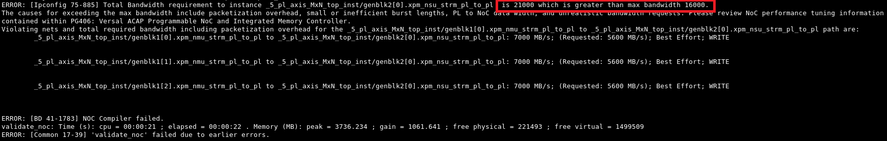
</p>

As given, the required bandwidth exceeds that available. To resolve the error, we must replace the current bandwidth definitions of the relevant paths with ones that detail the phase information:

Step 1. Open the following file for edit:
```bash
./sources/xdc/noc_constraints.xdc
```
Step 2. Find the following series of constraints, which specify the bandwidth of the 3 paths leading to the streaming destination, and comment them out:
<p align="left">
  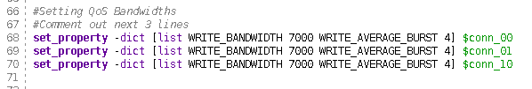
</p>

Step 3. Find the following series of commented out constraints, which specify the required bandwidth of the 3 paths during each phase, and uncomment them:
<p align="left">
  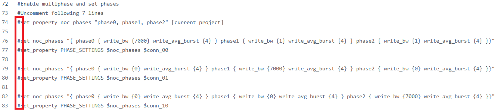
</p>

Step 4. Clean the directory and restart the compile:
```bash
make clean_prj_walk
make bld_DESIGN_WALKTHROUGH
```

The compile will run and complete without errors. 

Step 5. Open the following log file to observe the bandwidth statistics of the NoC:
 ```bash
./vivado_prj_walk/noc_qos.log
```
<p align="left">

  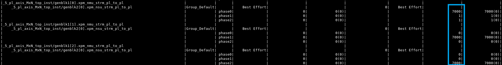
</p>

Step 6. Execute the following command to run a simulation of the system:
```bash
make sim_DESIGN_WALKTHROUGH
```

Step 7: When the simulator opens, run the simulation for 75us and observe the result:

<p align="left">
  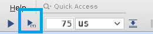
</p>
<p align="left">
  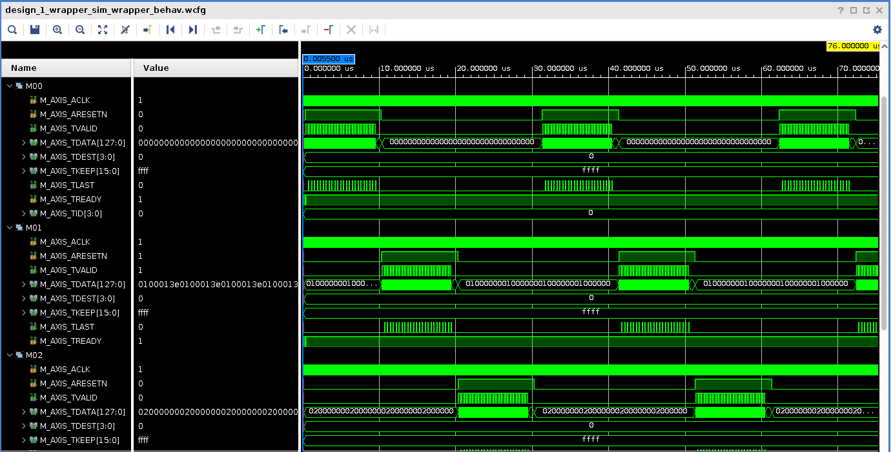
</p>

# 7\. Hardware Validation

We have incorporated an Integrated Logic Analyzer (ILA) with trigger functionality into the design. The Virtual Input/Output (VIO) module is linked to the AXI-Stream Traffic Generators, allowing control over their reset. Attached are the captured ILA waveforms which trigger when the “S_AXIS_TVALID” signal of the AXI receiver rises.  


1. Connect to and program the development board with the PDI generated by the relevant flow:

bld_DESIGN:
```bash
./vivado_prj/project_1.runs/impl_1/design_1_wrapper.pdi
```
bld_DESIGN_WALKTHROUGH:
```bash
./vivado_prj_walk/project_1.runs/impl_1/design_1_wrapper.pdi
```
non_prj_DESIGN:
```bash
./vivado_non_prj/outputs/design_1_wrapper.pdi
```

2. In the trigger setup for hw_ila_1, add the net 'S_AXIS_TVALID' and set the "Value" for the signal to R.
<p align="left">
  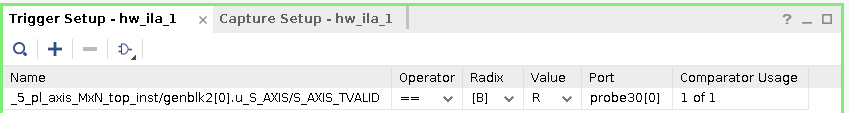
</p>

3. In the hw_vios tab, add the following nets in hw_vio_1:
<p align="left">
  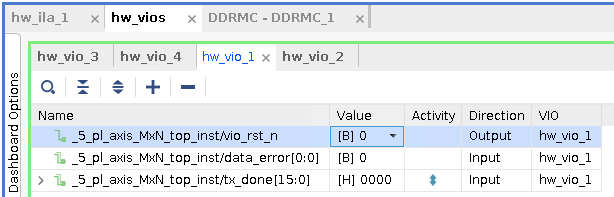
</p>

4. Execute the ILA trigger
<p align="left">
  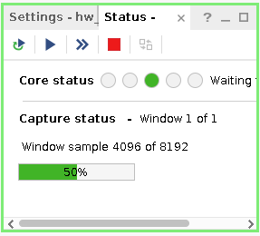
</p>

5. In the hw_vios section, go to hw_vio_1. Set vio_rst_n to 1.
You will notice that the "tx_done" signal is toggling
<p align="left">
  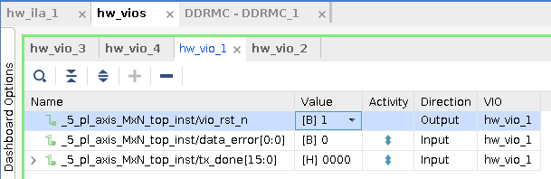
</p>


The ILA waveform after successful validation, will look like this.
<p align="left">
  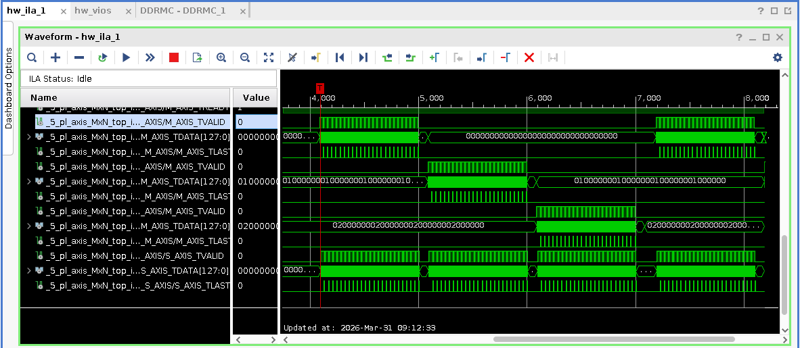
</p>

<p class="sphinxhide" align="center"><sub>Copyright © 2025 Advanced Micro Devices, Inc.</sub></p>
<!-- # SPDX-License-Identifier: X11 -->  
