<table class="sphinxhide" width="100%">
 <tr width="100%">
    <td align="center"><h1>Versal™ Adaptive SoC Architecture Tutorials</h1>
    <a href="https://www.amd.com/en/products/software/adaptive-socs-and-fpgas/vivado.html">See Vivado™ Development Environment on amd.com</a>
    </td>
 </tr>
</table>

# LPDDR5/5x Read and Write Simulation Flows

Simulate Versal LPDDR5/5x memory interfaces.

## Introduction

Read and Write flows are documented, including eye mask definitions. Schematic screenshots were taken from Keysight ADS, but the concepts are similar to many SI simulation tools.

## Read Simulation Flow

The read simulation flow is shown in the diagram below, which each section subsequently explained.

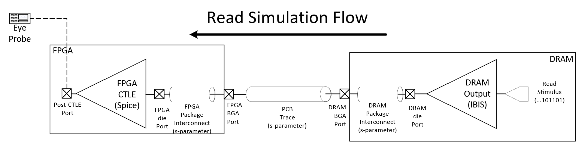

The simulation flows as follows:

- Read Stimulus fed to DRAM output IBIS
- IBIS output travels through DRAM package interconnect to the PCB
- The PCB connects the DRAM to the BGA pin of the FPGA
- The FPGA pin connects to the FPGA package interconnect, which connects to the FPGA die
- The FPGA die connects to the SPICE CTLE block
- The output of the CTLE block is where the eye diagram is measured

## Read Stimulus

The read stimulus is best modeled with a PRBS pattern generator. An example is shown below with the following recommended parameters:

VtPRBS Ads Primitive

- Maximal Length LFSR
- RegisterLength: Between 0 and 24

Instantiate one PRBS generator for each DQ bit.

RDQS can be created with an oscillator primitive.

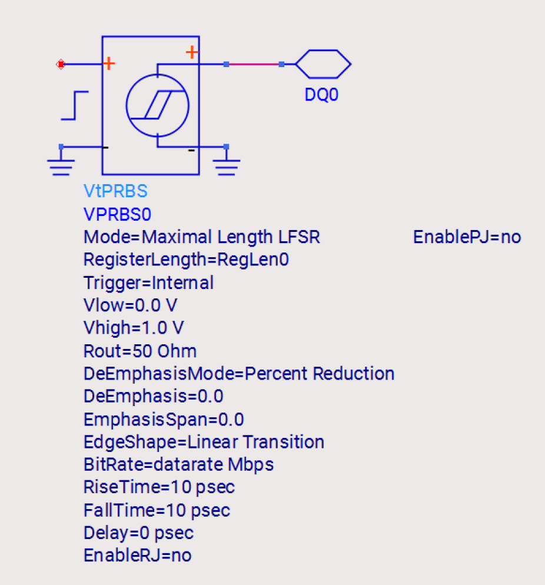

## DRAM Output IBIS

The read stimulus is fed into the DRAM IBIS output model.

The output model should be instantiated for each DQ bit and RDQS signal. The models for Micron devices are shown below:

- DQ: DQ_PD40_SOC-ODT40_8533
- RDQS: RDQS_PD40_SOC-ODT40_8533

Ensure "UsePkg" has "no" selected, as s-parameter interconnect (provided by the DRAM vendor) should be used instead.

Connect the "E" pin to a 1.0 V supply (used only for simulation; not an actual DRAM rail).

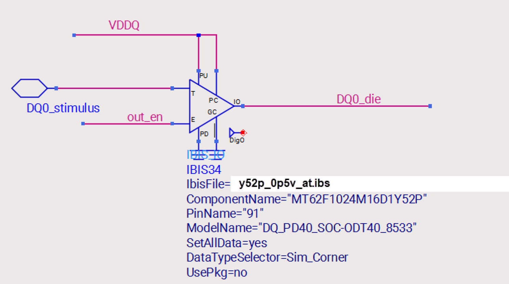

## DRAM S-Parameter Package Interconnect

The model(s) will also be provided by the vendor (Byte 0/A DQ Micron shown):

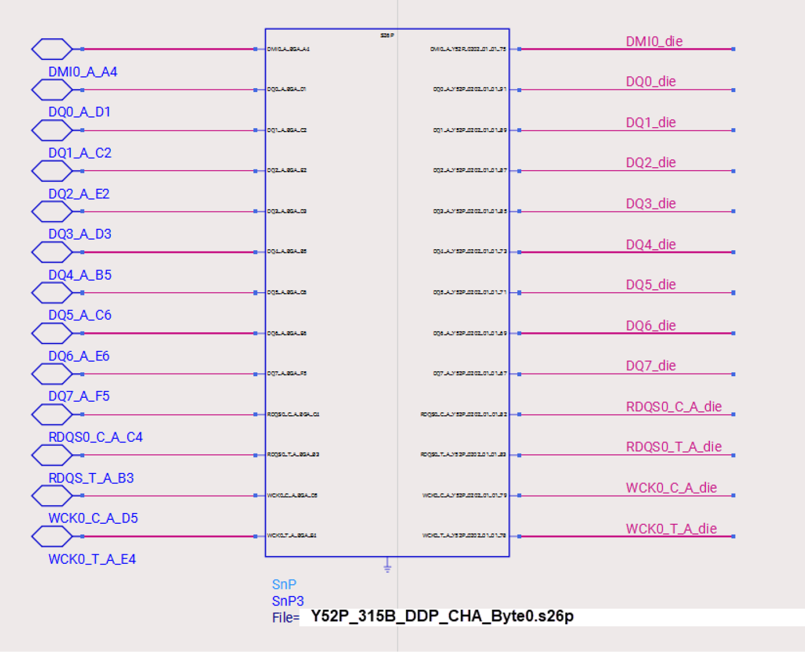

## PCB Trace Models

The PCB trace models are unique to each design and should be extracted into s-parameter models for each signal, with ports provided for the DRAM BGA side and the FPGA BGA side.

For highest accuracy, the entire DRAM interface (Address, Command, Clock, Data, Strobes) should be included as one full extraction. However, as there are a large number of ports, the s-parameter file can become very large and slow down the simulation. While a bit less accurate, each portion of the interface can be extracted separately (such as each byte lane). An example of one PCB byte lane extraction, with ports, is shown below.

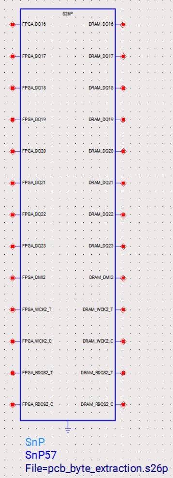

## FPGA Package S-parameter Interconnect models

AMD provides package interconnect models for each device. Models can be requested to AMD and connect from the FPGA BGA pin to the corresponding X5IO die pin.

The models are provided for each X5IO bank (for example, 700). An example is shown below:

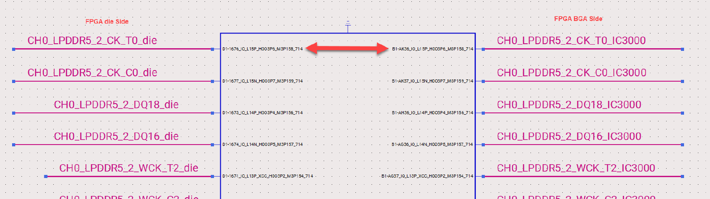

## FPGA Read CTLE Model

AMD provides CTLE SPICE models. The CTLE model should be connected as shown below.

- vss_io: Ground
- vccaux_io: Connect to a valid VCCAUX voltage (Typical 1.50 V)
- in2: Connect to a source that is 1/8 of VCCO (example: 0.125 V)
- in1: Connect this to the die side of the FPGA s-parameter interconnect
- out1: This is the post-CTLE port. Place the eye probe here.
- out2: Leave unconnected
- out3: Leave unconnected

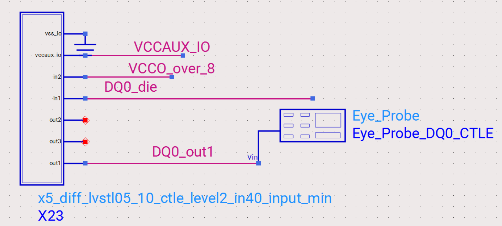

## Post-CTLE Read Eye Mask

The Post-CTLE read eye mask is shown below. The eye mask y-axis represents the voltage, with a swing of ± 40mV around the center point. The FPGA calibration routine will adjust the y-axis of the mask, so the mask can be adjusted to fit in the y-direction after the simulation is complete.

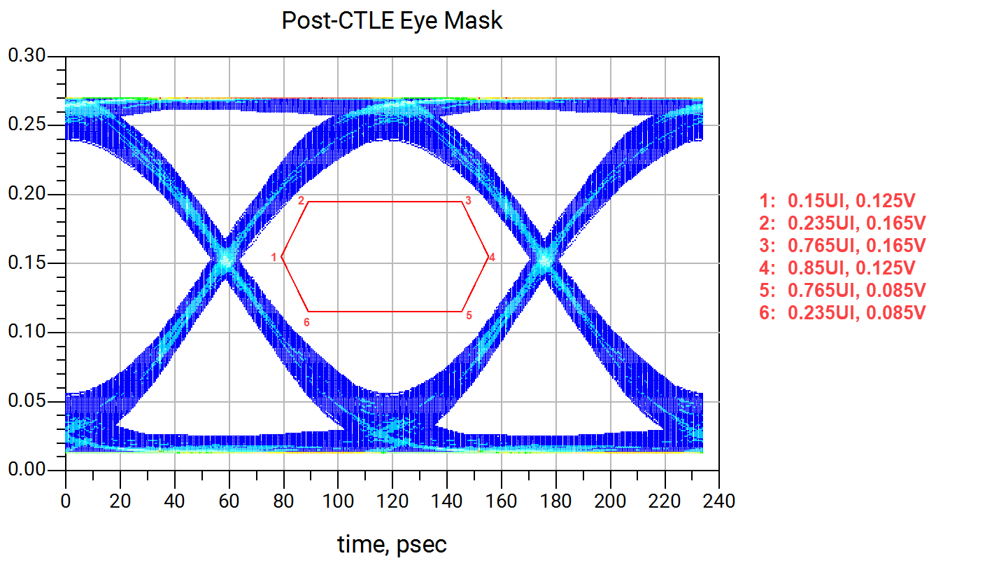

## Write Simulation Flow

The write simulation flow is shown in the diagram below, which each section subsequently explained.

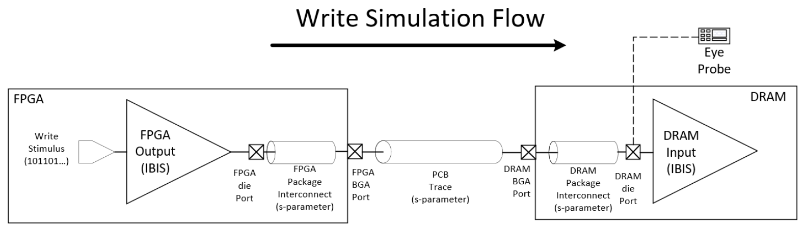

The simulation flows as follows:

- Write Stimulus fed to FPGA output IBIS
- IBIS output travels through FPGA package interconnect to the PCB
- The PCB connects the FPGA to the BGA pin of the DRAM
- The DRAM pin connects to the DRAM package interconnect, which connects to the DRAM die
- The DRAM die port connects to the IBIS input
- The DRAM die port is where the eye diagram is measured

## Write Stimulus

The write stimulus is best modeled with a PRBS pattern generator. An example is shown below with the following recommended parameters:

VtPRBS Ads Primitive

- Maximal Length LFSR
- RegisterLength: Between 0 and 24

Instantiate one PRBS generator for each DQ and DM bit.

WCK can be created with an oscillator primitive.

## FPGA Output IBIS

The write stimulus is fed into the FPGA IBIS output model. For instructions on how to create the IBIS models, see [Jump to the write_ibis section](#using-write_ibis-in-vivado-to-create-fpga-ibis-model).

The output model should be instantiated for each DQ bit, DM bit, and WCK signal. The model's name is the same for DQ, DM, and WCK.

- DQ: X5_LVSTL05_10_F_OUT40
- DM: X5_LVSTL05_10_F_OUT40
- WCK: RDQS_PD40_SOC-ODT40_8533

Ensure "UsePkg" has "no" selected, as s-parameter interconnect (provided by AMD) should be used instead.

Connect the "E" pin to ground.

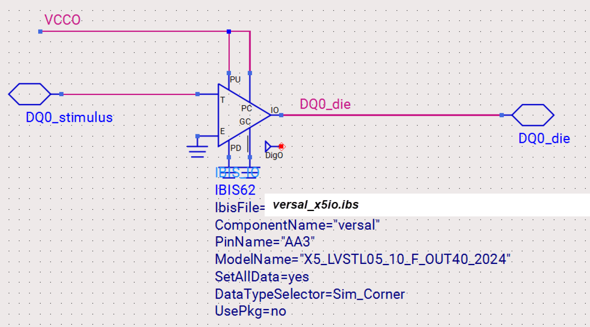

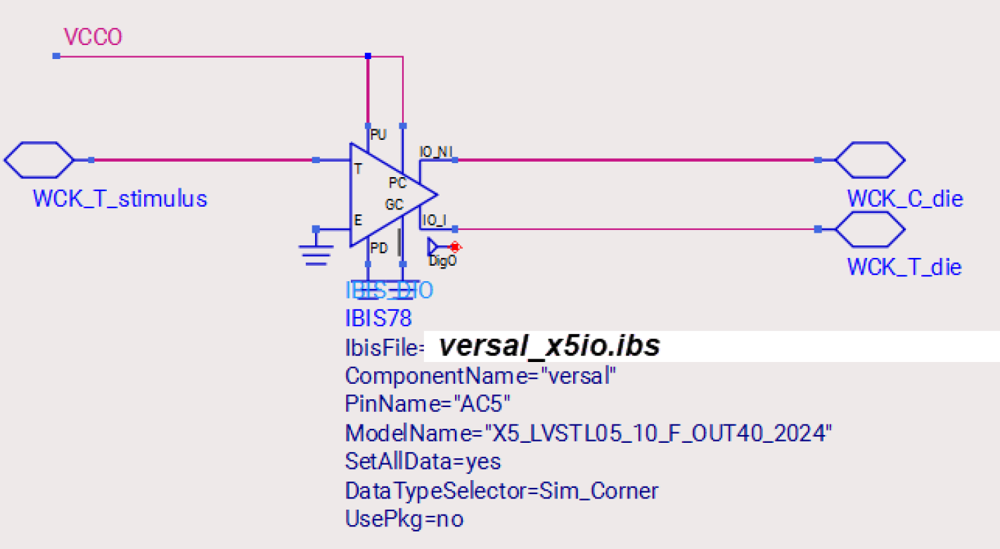

## FPGA Package S-parameter Interconnect models

AMD provides package interconnect models for each device. Models can be requested to AMD and connect from the FPGA BGA pin to the corresponding X5IO die pin.

The models are provided for each X5IO bank (for example, 700). An example is shown below:

## PCB Trace Models

The PCB trace models are unique to each design and should be extracted into s-parameter models for each signal, with ports provided for the DRAM BGA side and the FPGA BGA side.

For highest accuracy, the entire DRAM interface (Address, Command, Clock, Data, Strobes) should be included as one full extraction. However, as there are a large number of ports, the s-parameter file can become very large and slow down the simulation. While a bit less accurate, each portion of the interface can be extracted separately (such as each byte lane). An example of one PCB byte lane extraction, with ports, is shown below.

## DRAM S-Parameter Package Interconnect

The model(s) will also be provided by the vendor (Byte 0/A DQ Micron shown):

## DRAM IBIS Model

The DRAM package interconnect will connect to the DRAM input IBIS model.

The models for DQ, DM, and WCK are as follows:

- DQ: DQ_IN_ODT40
- DM: DQ_IN_ODT40
- WCK: WCK_INPUT_ODT40

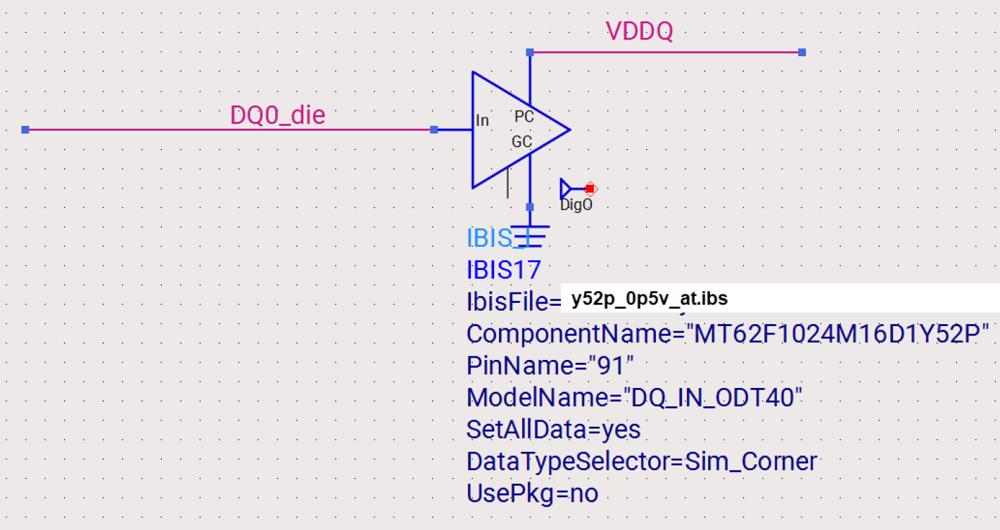

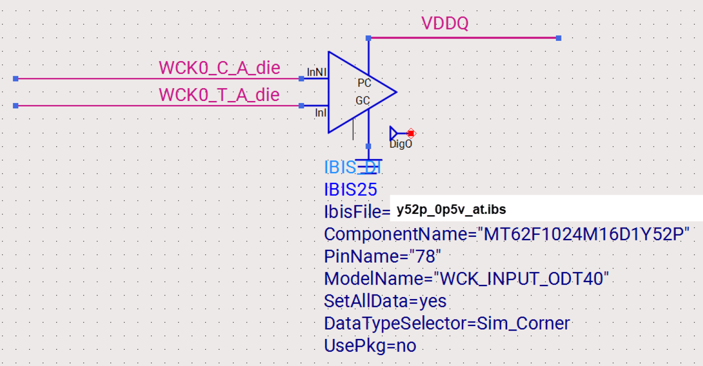

Probe the eye at the DRAM die ports, as shown:

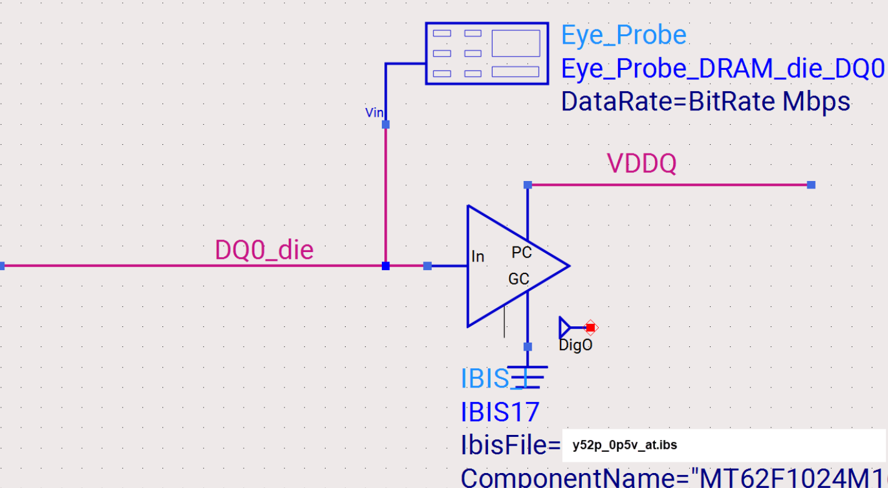

## DRAM Die Eye Mask

The DRAM die write eye mask is shown below. The eye mask y-axis represents the voltage, with a swing of ± 40mV around the center point. The FPGA calibration routine adjusts the y-axis of the mask, so the mask can be adjusted to fit in the y-direction after the simulation is complete.

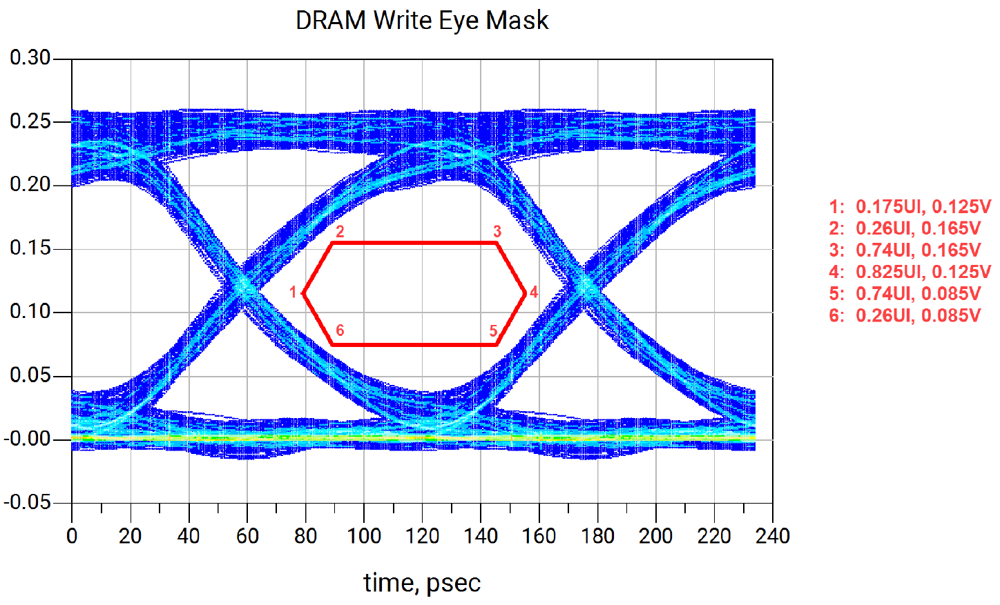

## Using `write_ibis` in Vivado to Create FPGA IBIS Model

In Vivado, the `write_ibis` command helps facilitate IBIS simulations in an SOC design. With an implemented design open, you can use the GUI to initiate using the FILE->EXPORT->Export IBIS Model menu options. Similarly, the `write_ibis` command in TCL could be used.

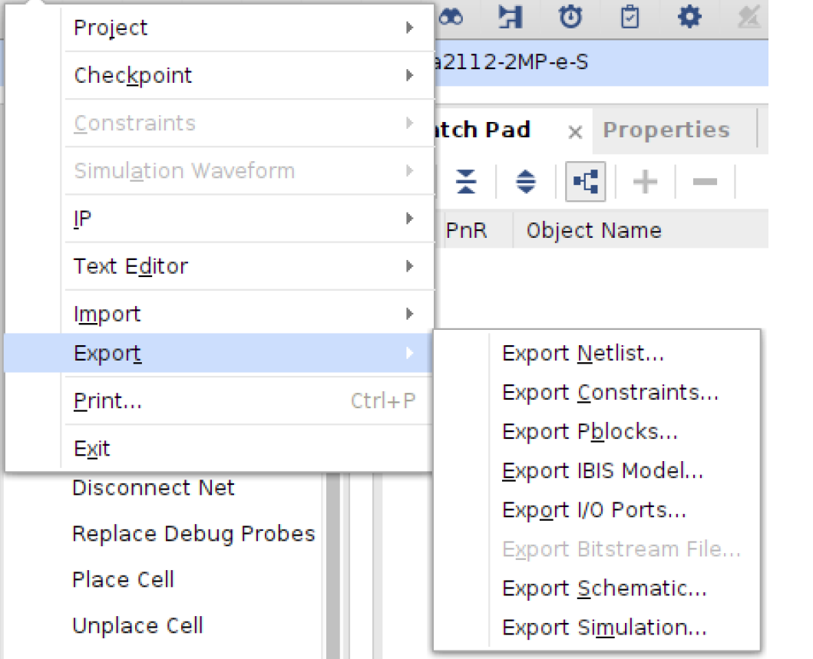

When exporting an IBIS model, it is best NOT to include the package in your export, as S-parameter models should be used for high performance simulation. The package included provides lumped sparse matrix representation of the package, which do not support the bandwidth required for memory interface simulations. As described below, S-parameter models should be used to represent the package. If the simulation parameters are still under review, the "include all models" option will provide all models, while turning this option off will include only models in the design and create a much smaller IBIS model.

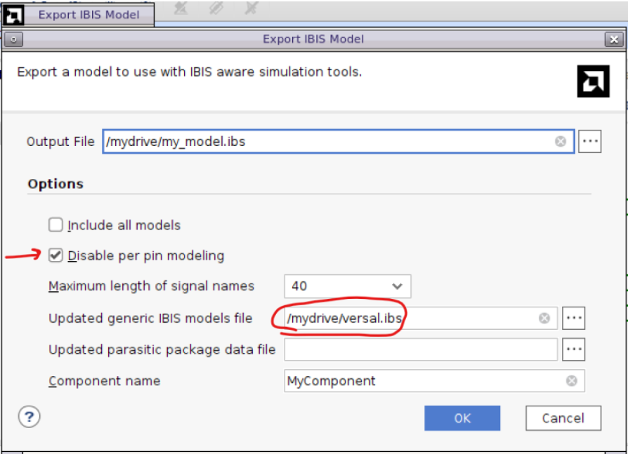

It is best to define the IBIS model taken from the Downloads section on amd.com to ensure the latest models are used:

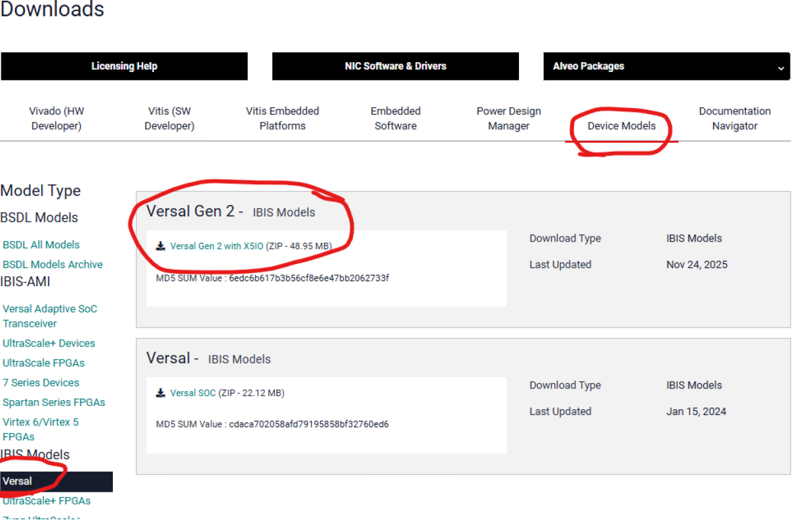

The resulting IBIS model maps pin usage to the package:

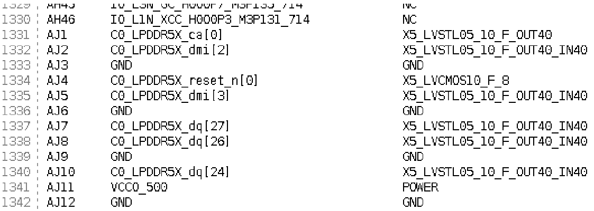

## LPDDR5/5x Hyperlynx Timing Models

Hyperlynx DDRx Wizard timing models for 8533 Mb/s can be found in this tutorial directory. This file can be imported during the DDRx simulation setup process.

## References

[1]: https://www.xilinx.com/support/download.html/content/xilinx/en/downloadNav/device-models/ibis-models/ultrascale-series-fpgas.html "Downloads"
[[1]]: IBIS Downloads

Copyright © 2020–2026 Advanced Micro Devices, Inc.

<a href="https://www.amd.com/en/corporate/copyright">Terms and Conditions</a>

