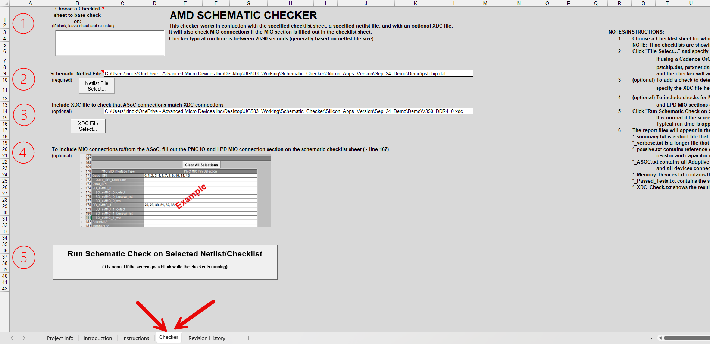
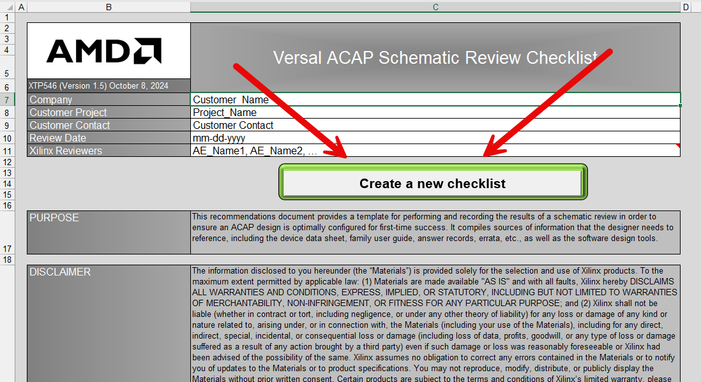
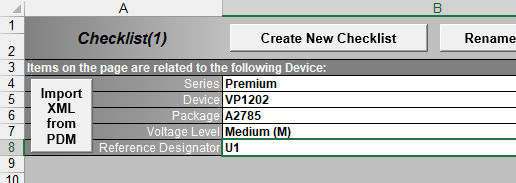
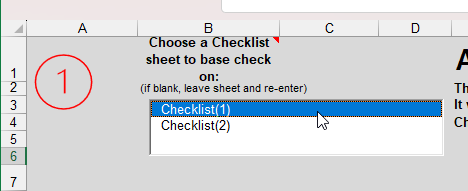
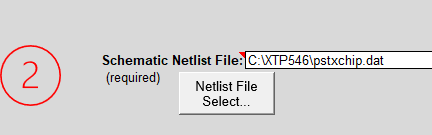
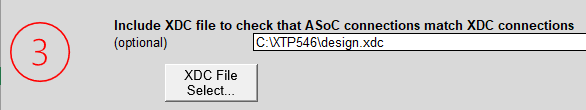
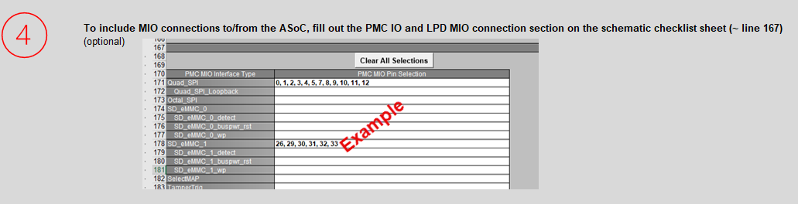
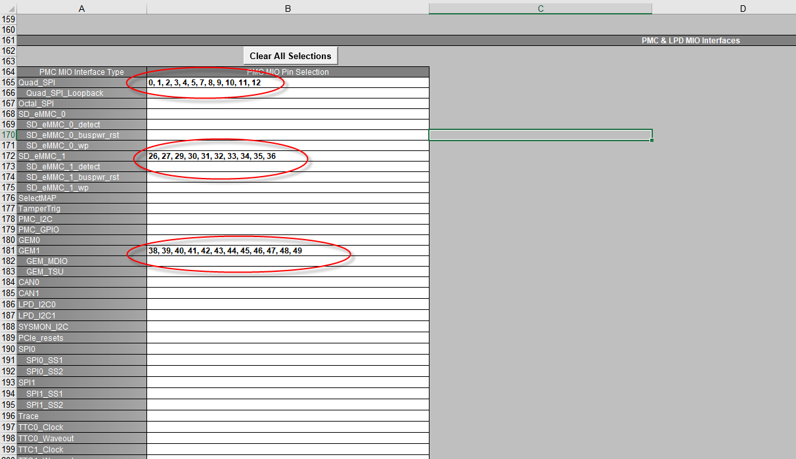

<table class="sphinxhide" width="100%">
 <tr width="100%">
    <td align="center"><h1>Versal™ Adaptive SoC PCB Design Tutorials</h1>
    <a href="https://www.amd.com/en/products/software/adaptive-socs-and-fpgas/vivado.html">See Vivado™ Development Environment on amd.com</a>
    </td>
 </tr>
</table>

# Schematic Checker Tool

***Version: Vivado 2024.2***

## Introduction

The Versal&trade; Schematic Checker tool is a subset of the [Versal Adaptive SOC Schematic Review Checklist (XTP546)](https://www.xilinx.com/member/forms/download/design-license.html?cid=90f995d8-c517-4adc-a95c-13a8994d6618&filename=xtp546-versal-schematic-review-checklist.zip). It is available as a separate tab, allowing users to specify the netlist and optionally include a Vivado XDC file. The Checker generates a suite of report files, including a summary file that highlights the most important notes, warnings, and errors.

 

The currently supported netlist types are:

+ Cadence OrCAD (pstchip.dat, pstxnet.dat, and pstxprt.dat)
+ Cadence Allegro (.tel)
+ Cadence Concise
+ Mentor Graphics Pads (.asc)
+ Pads Logic
+ Altium ORCAD2PCB
+ Intel Schematic Connectivity Format (.iscf)

The checker outputs six text-based report files:

+ *_summary.txt: A concise file that includes warnings, errors, and other important information.
+ *_verbose.txt: A detailed file containing comprehensive information about all completed checks.
+ *_passive.txt: Lists reference designators, values, node connections, and primitives for each resistor, capacitor, and inductor in the schematic. It also includes all identified DNP components.
+ *_ASOC.txt: Provides details about all Adaptive SoC pins, including their names, the nets connected to them, and all associated devices.
+ *_Memory_Devices.txt: Lists the memory devices that were checked.
+ *_Passed_Tests.txt: Contains a record of all successfully completed checks.
+ *_XDC_Check.txt: Includes the results of the "Schematic vs. XDC" pinout checks.

## Obtaining the Schematic Checklist and Checker

Download the [Versal Adaptive SOC Schematic Review Checklist (XTP546)](https://www.xilinx.com/member/forms/download/design-license.html?cid=90f995d8-c517-4adc-a95c-13a8994d6618&filename=xtp546-versal-schematic-review-checklist.zip).

## Running the Checker

1. Open the Schematic Checklist.
2. On the Project Info tab and click **Create New Checklist**.
 
3. A new "Checklist(1)" tab will open.

## Device Details

1. In the "Checklist(1)" tab, enter the device details in the beginning of the cell B4.
2. Provide the reference designator used for the Adaptive SoC in the schematic.
3. Optional: If you have an exported XML file from the Power Design Manager (PDM), use the **Import XML from PDM** button to populate device details automatically. The Adaptive SoC reference designator must still be entered manually.**

4. Navigate to the Checker tab and select the appropriate checklist for the schematic check.
5. If multiple checklists are available in this copy of XTP546, choose one from the list. (As shown in the following figure)

## Specify Netlist

1. Enter the location of the netlist file(s).
2. Use the **Netlist File Select...** button to locate the netlist file.
   - For Cadence OrCAD schematics, there are three .dat files, select one file ensuring all three are in the same directory.**

## Specify a validated XDC Pinout file (Optional)

1. To check memory signal connections, specify an XDC file validated with Vivado&trade; tools.
2. Use the **XDC File Select...** button to enter the XDC file name.

## Specify MIO Interfaces (Optional)

1. To validate MIO interface pins (e.g., pull-ups, pull-downs, series resistors), define the interfaces in the checklist tab.
2. Navigate to the PMC & LPD MIO Interfaces section in the selected checklist and specify the MIO pin locations for each interface (e.g., QSPI, OSPI, eMMC, SD).

## Run the Checker

After specifying the checklist, netlist location, XDC, and MIO interfaces, click the **Run Schematic Check on Selected Netlist/Checklist** button.

The Checker takes approximately 30–60 seconds to run, though this may vary from 20 seconds to 2 minutes.

Upon completion, a window will display the run time. Click **OK** to proceed.

## Versal Adaptive SOC Schematic Checker Feature List

<b>Pin Count Match:</b>  Checks the number of package pins in the Adaptive SOC schematic and matches the pin count of the corresponding package, uncovering any potential errors in the schematic symbol creation.

<b>Voltage Values Within Datasheet Spec:</b>  Ensures inferred voltage values are within the datasheet limits for each Adaptive SoC rail.

<b>Voltage rail value mismatch/power rail shorts:</b>  Identifies if any Adaptive SoC rails have inconsistent voltage levels despite being on the same schematic net.

<b>Adaptive SOC Power/Ground Pin Match:</b>  Confirms the number of voltage and ground pins in the schematic matches the Adaptive SoC package file.

<b>All Adaptive SOC power/ground pins connect to same net:</b>  Checks that all power/ground pins on the Adaptive SOC connect to one single net name.  While, connection to the same net do not specify an error (i.e., sense lines), any warnings are still valuable.

<b>VCCAUX_SMON/GND_SMON filters:</b>  Verifies the presence of filters between VCCAUX and VCCAUX_SMON, and between GND and GND_SMON.

<b>Decoupling Capacitor Reporting:</b>  Lists decoupling capacitors for each Adaptive SoC power rail. These can be manually compared against PDM recommendations.

<b>IO_VR properly connected:</b>  Ensures each IO_VR pin is properly connected with a 240Ω resistor to IO_700/IO_800.

<b>GTY RREF connection:</b>  Checks for 100Ω resistor between GTY_RREF and GTY_AVTTRCAL.

<b>GTY signals AC Coupling Check:</b>  Validates the presence of proper series AC capacitors on each GTY TX/RX/CLK pin.

<b>Dedication Pin Connection Check:</b>  Checks proper terminations for all dedicated pins (e.g., Bank 503).

+ <b>MODE pins:</b> Tied directly or 4.7 kΩ to VCC_503 or < 1 kΩ to GND
+ <b>ERROR_OUT:</b> Pull-up to VCCO_503
+ <b>PUDC_B:</b> Tied directly or by < 1 kΩ to GND or VCCO_503
+ <b>DONE:</b> 4.7 kΩ to VCCO_503
+ <b>JTAG pins:</b> TCK/TMS/TDI connected to header and/or to ground
+ <b>POR_B:</b> 4.7 kΩ to VCCO_503

 <b>MIO Pin check:</b>
Checks whether MIO pins are properly connected/termination based on how they are defined in the checklist:
+ <b>QSPI:</b> clock, cs, loop, IO_pull-up/down
+ <b>OSPI:</b> clock, data, strobe, cs, reset
+ <b>SD_eMMC:</b> clock, cmd, data
+ <b>SelectMap:</b> clock, IO, cs, rdwr, busy
+ <b>Tamper Trigger</b>
+ <b>I2C:</b> scl, sda
+ <b>GEM Ethernet:</b> clock, ctl, data
+ <b>CAN:</b> tx, rx
+ <b>PCIe Reset</b>
+ <b>SPI:</b> clock, cs, so, mo
+ <b>Trace:</b> clock, ctl, data
+ <b>Triple-Time Counter (TTC):</b> clock, out
+ <b>UART:</b> tx, rx
+ <b>USB2:</b> clock, data, reset
+ <b>Windowed-Watchdog Timer (WWDT):</b> clock, reset, int, ws

 <b>Memory Pin Check:</b>
Checks all supported memory types for proper terminations (address to VTT, clock to RC, etc.,) based on how they are defined in the checklist.

**NOTE**: This tool will not verify legal pinouts. For pinout validations, it is highly recommended to verify the pinouts through the Vivado tools. Vivado is the only trusted source for up-to-date pinout verifications.

<b>DDR5:</b> 
+ <b>Data:</b> point-to-point
+ <b>Strobe:</b> point-to-point
+ <b>Address:</b> Fly-by
+ <b>Clock:</b> Fly-by
+ <b>Reset:</b> 4.7 kΩ to GND
+ TEN,CAI,ALERT,MIR
 

<b>LPDDR5:</b>
+ <b>Data:</b>  point-to-point
+ <b>Strobe:</b>  point-to-point
+ <b>Address:</b>  point-to-point
+ <b>Clock:</b>  point-to-point
+ <b>Reset:</b> 4.7k to GND
+ <b>CS,ZQ:</b>pull-up
 

<b>DDR4:</b> 
+ <b>Data:</b> point-to-point
+ <b>Strobe:</b> point-to-point
+ <b>Address:</b> With VTT check (as appropriate)
+ <b>Clock:</b> With R/R/C check
+ <b>Reset:</b> 4.7 kΩ to GND
 

<b>LPDDR4:</b>
+ <b>Data:</b>  point-to-point
+ <b>Strobe:</b>  point-to-point
+ <b>Address:</b>  point-to-point
+ <b>CKE:</b>  Totem-Pole Termination
+ <b>Clock:</b>  point-to-point
+ <b>Reset:</b> 4.7k to GND
 

<b>RLD3:</b> data, DK, QK, QVLD, Reset (4.7k to GND)

<b>QDR-IV:</b> address, command, reset (4.7k to GND)
+ <b>Reset:</b> 4.7 kΩ to GND
 

<b>ALL:</b>  Checks address pins and if the net name matches the memory device pin name (for example, C0_DDR4_A10 matches pin A10 on the memory device).

+ VTT pins/termination are checked to see if it connects to an IC that also connects to VCCO (assumed VTT regulator).
+ VREFCA pins (as applicable) on each memory device are checked for proper connection (including resistor divide) and voltage.
+ ZQ pins (as applicable) on each memory device are checked for proper resistor value and connection to either ground or power (as required).
+ Automatic memory interface pin checking using a user-specified XDC file. This is optional.

 
<b>Signal Polarity Check:</b>   Verifies P/N swaps based on the Adaptive SoC package file and the known external device pinout. It also attempts to determine potential swaps based on net names.

 
<b>NoC Pinout Check:</b>   Compares the schematic pinout with the pinouts specified in the XDC file, if provided.
 

## Important Notes

+ Subtle variations in some netlist formats may cause issues with the Checker. If you notice any unusual errors, contact AMD to address them promptly. 
+ If the checker tool does not support a netlist format, contact AMD to request a parser for it. 
+ The Checker does not compare the recommended decoupling in PDM with the schematic because multiple decoupling schemes can be used. Instead, it lists the decoupling found in the schematic, allowing you to manually compare it with the PDM recommendations. 
+ The Checker does not validate memory pinouts. It assumes you have already validated the pinouts specified in the optional XDC file in the Vivado

## Planned Improvements

Automatic detection of MIO interfaces (QSPI, OSPI, Ethernet, etc) or through optional Vivado output file imports (cips.xio). 

Licensed under the Apache License, Version 2.0 (the "License");
you may not use this file except in compliance with the License.

You may obtain a copy of the License at

    http://www.apache.org/licenses/LICENSE-2.0

Unless required by applicable law or agreed to in writing, software
distributed under the License is distributed on an "AS IS" BASIS,
WITHOUT WARRANTIES OR CONDITIONS OF ANY KIND, either express or implied.
See the License for the specific language governing permissions and
limitations under the License.

XD057 | Copyright&copy; 2024 Xilinx, Inc.
