<table class="sphinxhide" width="100%">
 <tr width="100%">
    <td align="center"><h1>Versal™ PCI Express&reg; Design Tutorials</h1>
    <a href="https://www.amd.com/en/products/software/adaptive-socs-and-fpgas/vivado.html">See Vivado™ Development Environment on amd.com</a>
    </td>
 </tr>
</table>

# Migrate a Design with PCI Express to Use the New Versal Adaptive SoC Transceivers Wizard <ins>Subsystem</ins> IP

***Version: AMD Vivado&trade; 2024.2***

# Introduction
This tutorial is intended to show how to replace the older (Legacy) Versal Transceivers Wizard IP core with the new **Versal Adaptive SoC Transceivers Wizard <ins>Subsystem</ins> IP** core (introduced in AMD Vivado&trade; 2024.2) in designs which use **PCI Express** (PCIe&reg;). [PG442](https://docs.amd.com/r/en-US/pg442-gtwiz-versal) highlights the key capabilities of the new IP and the older IP will eventually be deprecated in a future Vivado release. This tutorial provides step-by-step instructions showing how to upgrade a design with PCIe created in an older version of Vivado (prior to 2024.2) and leverages a Tcl script to automate replacement of the old IP with the new IP in the design.
<p>

[//]: # (Replace second sentence above with "AR 0000XXXXX highlights numerous benefits of using the new IP...")

### Features
The Tcl script ([migrate_to_gtwiz_subsystem.tcl](./migrate_to_gtwiz_subsystem.tcl)) used in this tutorial to automate migration has the following features:

- The script is currently only meant to be used with PCIe designs and does not work with other Transceiver protocols.
  - The reason for this is because it specifically removes connections from the PCIe PHY to the Legacy Versal Transceivers Wizard IP and replaces them with connections to the new **Versal Adaptive SoC Transceivers Wizard <ins>Subsystem</ins> IP**.
- The script works with PCIe interfaces spread across one Transceiver quad (x1, x2, or x4), two Transceiver quads (x8), or four Transceiver quads (x16).
- The script supports the following Versal PCIe IP cores:
  - Queue DMA Subsystem for PCI Express (QDMA Subsystem for PL PCIE4 and PL PCIE5 - qdma_v5_0)
  - DMA/Bridge Subsystem for PCI Express (XDMA Subsystem for PL PCIE4 - xdma_v4_1)
  - Versal Adaptive SoC Integrated Block for PCI Express (pcie_versal_v1_0)
  - Versal Adaptive SoC PHY for PCI Express (pcie_phy_versal_v1_0)
- The script offers two modes of operation:
  - **auto**: This mode is intended to be used in a block design which has a single PCIe PHY IP instance (that is, one PCIe interface in the entire block design). This tutorial demonstrates how to use auto mode.
  - **manual**: This mode can be used in a block design which has two or more PCIe PHY IP instance to update one PHY interface at a time. Refer to the manual mode usage details documented in the comments of the Tcl script ([migrate_to_gtwiz_subsystem.tcl](./migrate_to_gtwiz_subsystem.tcl)).  

- The script does not currently support designs where the PCIe interface is sharing a Transceiver quad with another PCIe or non-PCIe Transceiver protocol (for example, the script does not work if two PCIe x2 interfaces are implemented in the same Transceiver quad or if one PCIe x2 interface and a different Transceiver protocol are implemented using the remaining two Transceivers in the same Transceiver quad).
- The script and the following tutorial are not applicable to designs that use the CPM4 or CPM5 blocks to implement PCIe in Versal (which do not require migration).
<p>

### Starting Point
The steps in this tutorial can be applied to your own PCIe project created in an older version of Vivado, though your project should first be upgraded to Vivado 2024.1.

Before walking through the steps below to migrate your own project, become familiar with the migration process using the QDMA Example Design project which this tutorial was based on. Here is a link from [PG344](https://docs.amd.com/r/en-US/pg344-pcie-dma-versal), which explains this Example Design: [AXI Memory Mapped and AXI4-Stream with Completion Default Example Design](https://docs.amd.com/r/en-US/pg344-pcie-dma-versal/AXI-Memory-Mapped-and-AXI4-Stream-With-Completion-Default-Example-Design). Provided below are steps to recreate this project:

1. Create a new Vivado 2024.1 project with no source files targeting the VCK190 Eval Kit.

2. Open **IP Catalog** and search for QDMA. Double-click the **Queue DMA Subsystem for PCI Express IP** to launch the QDMA IP Wizard. Customize the IP as follows:
    - In the Basic tab:
      - Change the Mode from Basic to Advanced
      - Set the PCIe Interface Lane Width to X8
      - Set the Maximum Link Speed to 16.0 GT/s (PCIe Gen 4)
      - Set the DMA Interface Selection to AXI MM and AXI Stream with Completion
      - Set the Number of Queues to 2048
      - Check the Enable Bridge Slave Mode option
    - In the Capabilities tab:
      - Check the SRIOV Capability option
    - The remaining options can be left as default (Click **OK**)

3. When prompted, click on **Generate** to Generate the IP Output Products (Out of context per IP). Also, click **OK** when the following dialog box appears: Out-of-context module run was launched for generating output products. It could take around 15 minutes to complete this step.

4. Once the IP Output Products have been generated, select the `qdma_0.xci` file under Design Sources, right-click and choose **Open Example Design...**. It launches another instance of Vivado where [the Example Design project is generated](https://docs.amd.com/r/en-US/pg344-pcie-dma-versal/Customizing-and-Generating-the-Example-Design?tocId=39mP~VpnoogCIkkfJCzDJQ). It takes a few minutes for this step to be completed.

5. Once the new instance of Vivado has completed generation of the block design for the Example Design, a green prompt should appear with a *Run Block Automation* link. Click on this link.

6. In the Run Block Automation dialog that appears, the default options can be used. Click **OK**. Block Automation should complete quickly.

7. Right-click in open white space on the block design canvas and choose **Validate Design**. A Validation successful message should appear, click **OK**. Also, save the project at this point.

8. Click on **Generate Device Image**. A prompt appears to launch synthesis and implementation, click **Yes**.

9. Allow the project to be run through synthesis and implementation. It takes a while to complete this step. Once completed, a prompt appears to open the Implemented Design, click **OK**.

10. At this point, the project is ready to be run through the tutorial steps below. You can now exit Vivado.

<p>

### Tutorial Sections
This tutorial is organized as follows:
- [Step Zero: Review the Existing Project](#step-zero-review-the-existing-project-optional) 
- [Step One: Upgrade the Existing Project from Vivado 2024.1 to 2024.2](#step-one-upgrade-the-existing-project-from-vivado-20241-to-20242)
- [Step Two: Migrate from the Legacy IP to the new IP](#step-two-migrate-from-the-legacy-ip-to-the-new-ip)
<p>

# Step Zero: Review the Existing Project (Optional)

This step is optional, it just highlights the old IP in the existing project which is updated in this tutorial.

1. The existing PCIe Design should have already been upgraded to Vivado 2024.1. Open this design using Vivado 2024.1 and have a look at the block design in IP Integrator. In the QDMA Example Design project, you will see that there is a QDMA Subsystem IP block (**<span style="color:blue">qdma_0</span>**) and a corresponding QDMA Support IP block (**<span style="color:green">qdma_0_support</span>** with the Example Design logic):

&nbsp;&nbsp;&nbsp;&nbsp;&nbsp;&nbsp;&nbsp;&nbsp;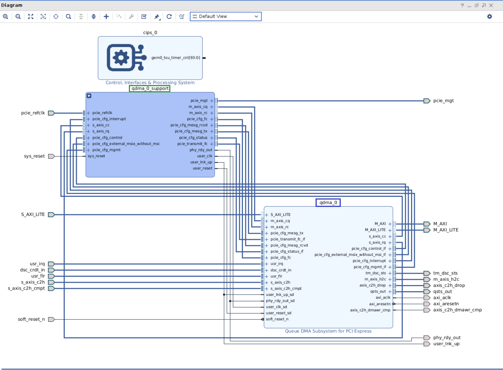

2. If you double-click to open the QDMA Support IP block (**<span style="color:green">qdma_0_support</span>**), you will see the Legacy Transceivers Wizard IP core mapping to two Transceiver quads (**gt_quad_0** and **gt_quad_1**) since this is an x8 design. Prior to 2024.2, the name of this IP core was **Versal ACAPs Transceivers Wizard**:

&nbsp;&nbsp;&nbsp;&nbsp;&nbsp;&nbsp;&nbsp;&nbsp;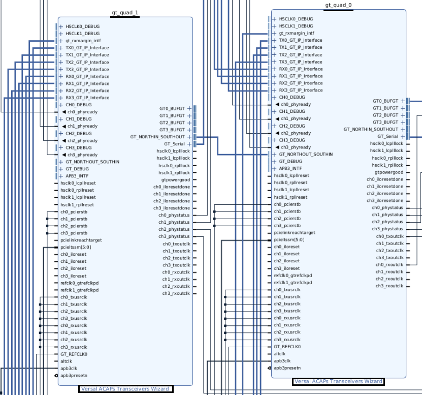

3. You can now close this project and exit the older version of Vivado it was created in. The steps which follow will demonstrate how to update this IP using Vivado 2024.2 to the new **Versal Adaptive SoC Transceivers Wizard <ins>Subsystem</ins> IP**.

<p>

# Step One: Upgrade the Existing Project from Vivado 2024.1 to 2024.2

1. Open the existing Vivado 2024.1 PCIe Design using Vivado 2024.2. Vivado displays the following message (referencing [AR#000036830](https://adaptivesupport.amd.com/s/article/000036830?language=en_US)). Click on the **Upgrade** button.

&nbsp;&nbsp;&nbsp;&nbsp;&nbsp;&nbsp;&nbsp;&nbsp;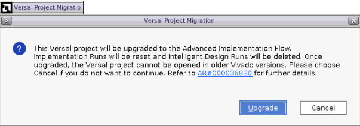

2. The following message appears indicating that newer versions of some of the IP cores in the design are available in Vivado 2024.2. Click on the **Report IP Status** button.

&nbsp;&nbsp;&nbsp;&nbsp;&nbsp;&nbsp;&nbsp;&nbsp;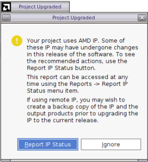

3. Vivado provides a report of all the IP cores, which need to be upgraded in the design. Click on the **Upgrade Selected** button. In the prompt which follows, click **OK**.

&nbsp;&nbsp;&nbsp;&nbsp;&nbsp;&nbsp;&nbsp;&nbsp;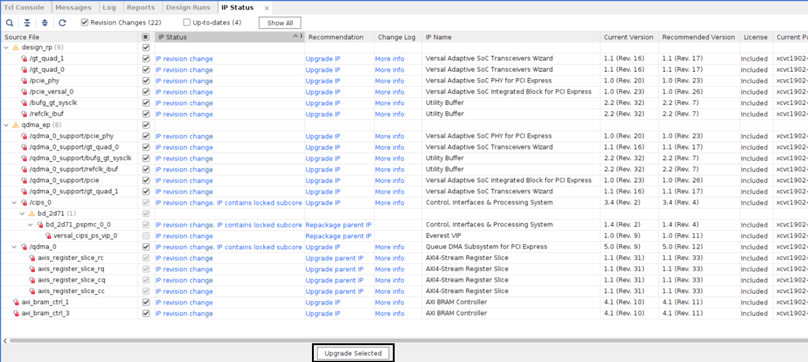

4. The following prompt is displayed asking to proceed with Upgrading the IP cores. Click **OK**. The IP cores are then upgraded - this process could take a few minutes and a progress bar appears as the IP cores are updated.

&nbsp;&nbsp;&nbsp;&nbsp;&nbsp;&nbsp;&nbsp;&nbsp;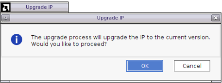

&nbsp;&nbsp;&nbsp;&nbsp;&nbsp;&nbsp;&nbsp;&nbsp;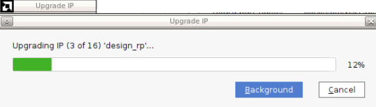

The following three points are optional instructions, just to familiarize yourself further with the IP which is migrated.

5. Once upgrading of all the IP cores has been completed, the upgraded block design should look similar to the one shown below. As was the case in [Step Zero](#step-zero-review-the-existing-project-optional) with the 2024.1 QDMA Example Design Project, you will see that there is a QDMA Subsystem IP block (**<span style="color:blue">qdma_0</span>**) and a corresponding the QDMA Support IP block (**<span style="color:green">qdma_0_support</span>** with the Example Design logic):

&nbsp;&nbsp;&nbsp;&nbsp;&nbsp;&nbsp;&nbsp;&nbsp;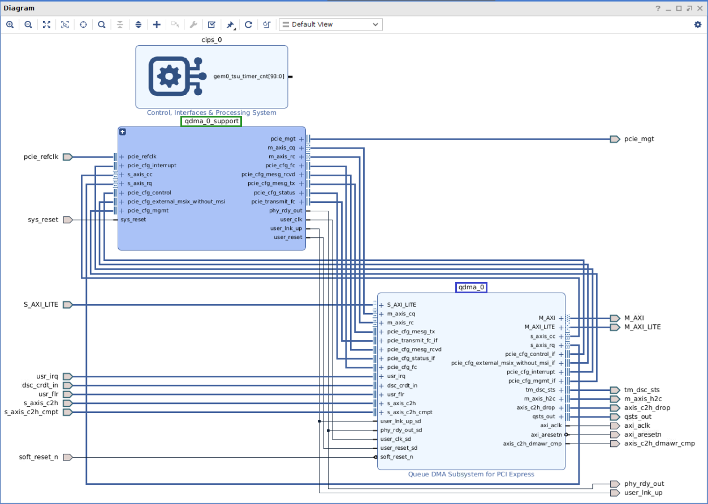

6. If you double-click to open the QDMA Support IP block (**<span style="color:green">qdma_0_support</span>**), you will see the Legacy Transceivers Wizard IP core again mapping to two Transceiver quads (**gt_quad_0** and **gt_quad_1**) since this is an x8 design. In 2024.2, the Legacy IP core has been renamed to **Versal Adaptive SoC Transceivers Wizard**:

&nbsp;&nbsp;&nbsp;&nbsp;&nbsp;&nbsp;&nbsp;&nbsp;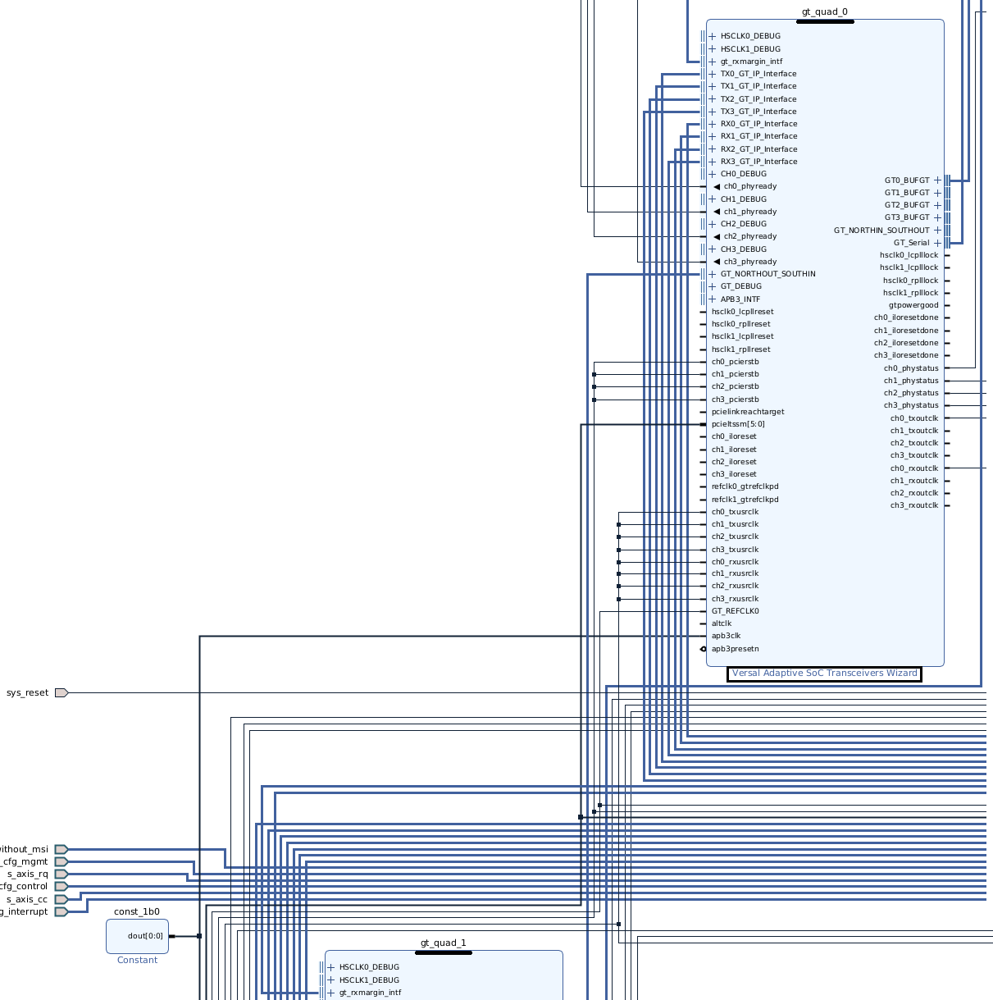

7. Close the **<span style="color:green">qdma_0_support</span>** block. You are now ready to migrate from the Legacy **Versal Adaptive SoC Transceivers Wizard** to the new **Versal Adaptive SoC Transceivers Wizard <ins>Subsystem</ins> IP**.

<p>

# Step Two: Migrate from the Legacy IP to the new IP

1. Double-click on the QDMA Subsystem IP block (**<span style="color:blue">qdma_0</span>**) in the upgraded block design. This will bring up the QDMA IP Wizard showing the option to Re-customize the IP. Note how the GT Wizard Implementation is set to **Legacy GT Wizard**:

&nbsp;&nbsp;&nbsp;&nbsp;&nbsp;&nbsp;&nbsp;&nbsp;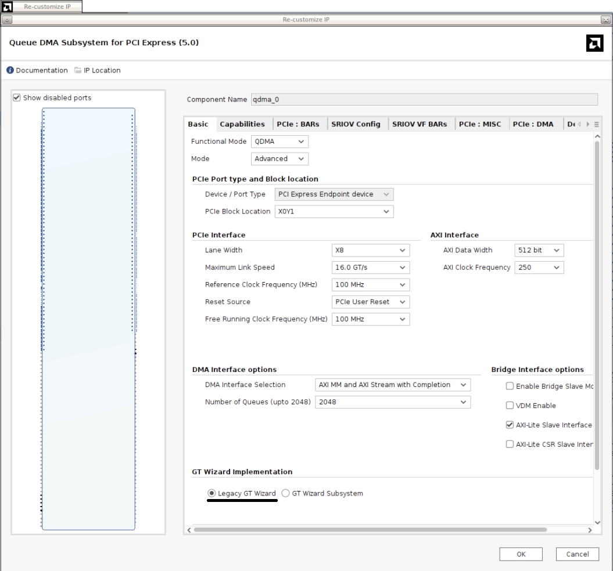

2. Change the GT Wizard Implementation to **GT Wizard Subsystem** and click **OK**:

&nbsp;&nbsp;&nbsp;&nbsp;&nbsp;&nbsp;&nbsp;&nbsp;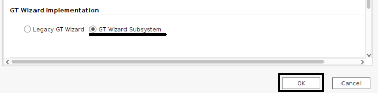

3. Copy the Tcl script ([migrate_to_gtwiz_subsystem.tcl](./migrate_to_gtwiz_subsystem.tcl)) to the project directory (where the .xpr file resides). 

4. Enter the following command in the Tcl Console: 

```
source migrate_to_gtwiz_subsystem.tcl
```

&nbsp;&nbsp;&nbsp;&nbsp;&nbsp;&nbsp;&nbsp;&nbsp;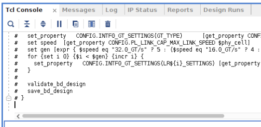

5. Enter the following command in the Tcl Console to run the script in auto mode: 

```
migrate_to_gtwiz_subsystem auto
```


6. Once the script has completed, open the QDMA Support IP block (**<span style="color:green">qdma_0_support</span>**) in the block design. gt_quad_0 and gt_quad_1 (from the Versal Adaptive SoC Transceivers Wizard IP) have been replaced by just a single **gtwiz_versal_0** block (**Versal Adaptive SoC Transceivers Wizard <ins>Subsystem</ins> IP**) as shown below, <ins>thus completing the migration process</ins>.

&nbsp;&nbsp;&nbsp;&nbsp;&nbsp;&nbsp;&nbsp;&nbsp;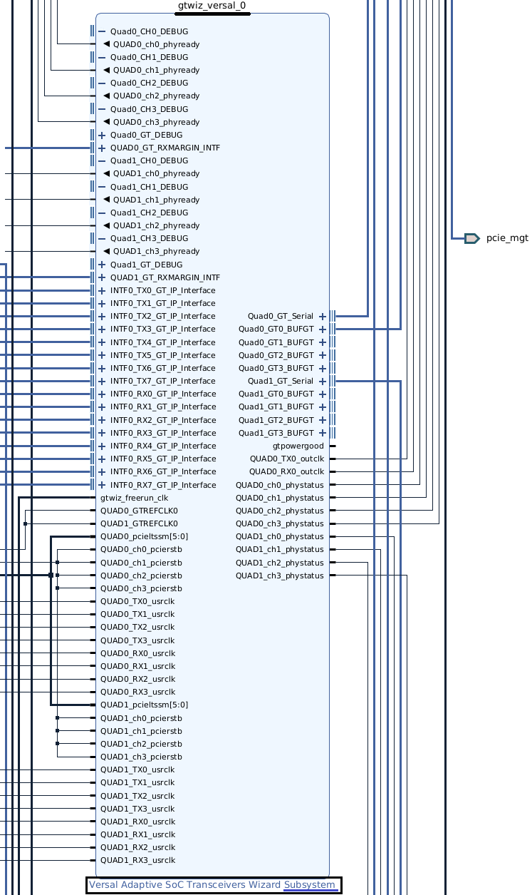

7. For the QDMA Example Design used in this tutorial, if desired, it should now be possible to successfully run through synthesis and implementation on this upgraded and migrated project using Vivado 2024.2.
<p>

<br>
<br>
<hr style="border:1px solid gray">
<p align="center" dir="auto">
<sub>Copyright © 2024 Advanced Micro Devices, Inc.</sub><br><br>
<sub>PCI Express&reg and PCIe&reg are trademarks or registered trademarks of PCI-SIG&reg Corporation</sub></p>
<p align="center" dir="auto"><sup><a href="https://www.amd.com/en/corporate/copyright" rel="nofollow">Terms and Conditions</a></sup></p>
